# Keycloak Authentication and SSO

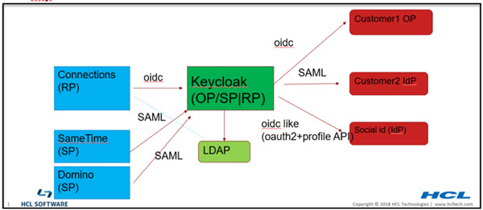

**Note:** The dotted line from connections to LDAP is not required for authentication. It may be used for group support from application level. Although it should really be done using keycloak APIs, the existing code may be doing a direct LDAP call.


In MT, most of customers have their own IdP to authenticate users so Connections can SSO to customers own applications that use the same IdP.

We can use Keycloak to connect to customer Idp either via SAML or OIDC.

Identity Providers

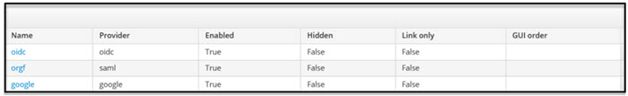

By default, user would have to pick which login to use. However we can remove this page by redirect the user to their org's IdP.

This can be done by using [kc_idp_hint](https://www.keycloak.org/docs/latest/server_admin/#_client_suggested_idp). 

Because redirect URL contains org url, so we can create rewrite rule to map between org to their own IdP.

```
https://\

{KK}/realms/{RM}/protocol/openid-connect/auth?xxxxx&redirect_uri=https%3A%2F%2Fmtdemo1- orgc.cnx.cwp.pnp-hcl.com%3A443%2Foidcclient_apps%2Fkeycloak&yyyyy

```

to

```
https://\{KK}

/realms/{RM}/protocol/openid-connect/auth?xxxxx&redirect_uri=https%3A%2F%2Fmtdemo1-orgc.cnx.cwp.pnp-
hcl.com%3A443%2Foidcclient_apps%2Fkeycloak&yyyyy&kc_idp_hint=mtdemo1-orgc

```

Example implementation:

```
if ($arg_redirect_uri ~ ^(https.*connmt-orge.*)){
rewrite ^(/auth/.*)/Azure-OIDC/(\w+\.?.*$) $1/Azure-OIDC/$2?kc_idp_hint=google break;
}
if ($arg_redirect_uri ~ ^(https.*connmt-orgf.*)){
rewrite ^(/auth/.*)/Azure-OIDC/(\w+\.?.*$) $1/Azure-OIDC/$2?kc_idp_hint=connmt-orgf break;
     }

```

## Configure KeyCloak as OIDC provider for Connections

**Create client for Connections web client**

- Create a realm
- Connect to the LDAP that contains all Connections users Create an OIDC client, type: confidential
- In Mapper add properties name: realmName, hardcode the value as your realm name

  **Note:** You can add the mapper in the client scope so it will be available to all clients in the same realm including web, mobile, desktop, conn-ee, conn-rte, and 3rd party clients.

   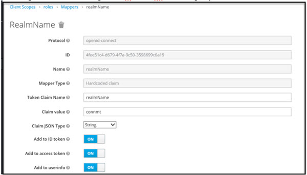

- call back urls
   
  - https://<connections host>/oidcclient/<provider_1.identifier value> 
  - For MT also add each org's url:

    - https://<connections host>_orga/oidcclient/<provider_1.identifier value> 
    - https://<connections host>_orgb/oidcclient/<provider_1.identifier value>

**Create client for Connections Mobile client**

In the same realm, create another client for Connections Mobile

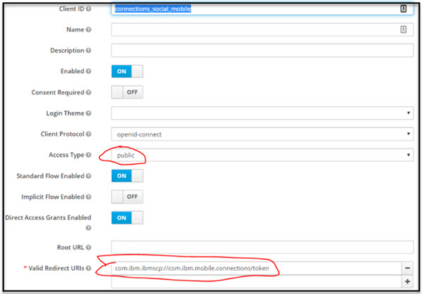

**SSO between Connections, SameTime and Domino can be done via Keycloak**

All apps should be in the same realm 

Create a client for each app

The client for SameTime: use IdP initiated Post binding with signed assertion:

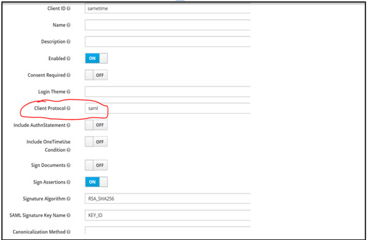
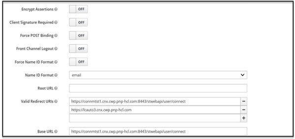

**Configure KeyCloak to connect to an LDAP**

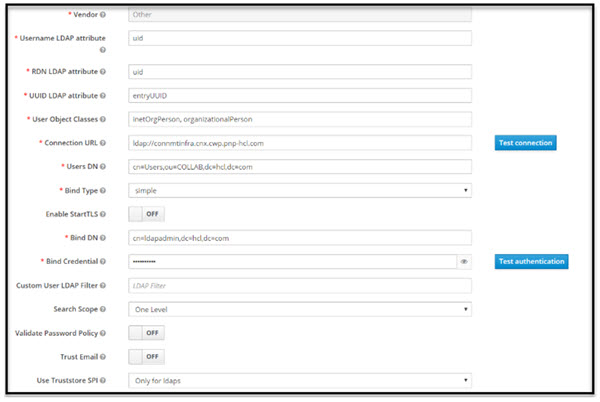

**Configure WAS as OIDC RP**

- Install OIDC RP via WAS admin command follow websphere 
- Documentation configure OIDC TAI properties

excludedpathFilter: 
/ibm/console,/ibm/console/.*,/profiles/dsx/.*,/communities/dsx/.*,/dm,/dm/atom/seedlist,/dm/atom/communities/feed,/activities/service/atom2/forms/communityEvent,/communities/recomm/handleEvent,/communities/calendar/handleEvent,/profiles/seedlist/myserver	

**Note:** the services path may not be the same per deployment.

To support JWT as access token for oauth add the following: 

provider_1.verifyIssuerInIat=true

connmt is the client id for Connections web.

Connections_social_mobile is the client id for Connections Mobile

To support Mobile/oauth2 client also be able to use session cookie, added:

provider_1.setLtpaCookie=true

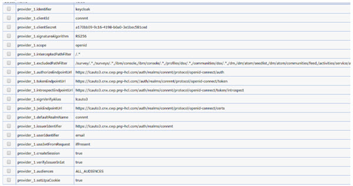

**Configure WAS as OIDC RP in multi-clusters env**

Connections medium and large deployment consists of multiple clusters (JVMs) and each contain a number of applications. 

Due to limitation of WebSphere OIDC RP, the RP stores the state in local JVM, hence the callback has to return to the same JVMs where application login started. We have the following request into IBM to fix this issue: https://www.ibm.com/developerworks/rfe/execute?use_case=viewRfe&CR_ID=104320 
Please help by voting for it.

Here is the workaround:

1. Deploy OIDC_RP ear to each JVM/cluster with unique context root.
   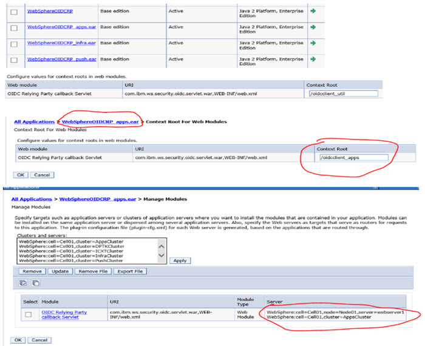
2. Configure OIDC RP TAI with a provider for each cluster and intercept the apps with the corespondent provider. (note: all properties values are the same for each provider except the interceptedPathFilter and callbackServletContextPath)
   - intercept path: (note in your environment the app may be deployed on different cluster and please adjust accordingly)
     - provider_1..interceptedPathFilter: /push/.*
     - provider_2.interceptedPathFilter:

       /connections/bookmarklet/.*,/connections/oauth/.*,/connections/resources/.*,/connections/config/.*,/communities/.*,/connections/proxy/.*,/help/.*,/xcc/.*,/selfservice/.*,/news/.*,/profiles/.*,/search/.*,/socialsidebar/.*,/touchpoint/.*,/connections/thumbnail/.*,/connections/opengraph/.*,/oauth2/.*,/connections/opensocial/.*

     - provider_3..interceptedPathFilter: /homepage/.*,/moderation/.*,/connections/rte/.*,/connections/webeditors/.*

     - provider_4..interceptedPathFilter: /activities/.*,/blogs/.*,/dogear/.*,/files/.*,/forums/.*,/metrics/.*,/metricssc/*,/mobile/.*,/connections/filesync/.*,/connections/filediff/.*,/mobileAdmin/.*,/storageproxy/.*,/wikis/.*
       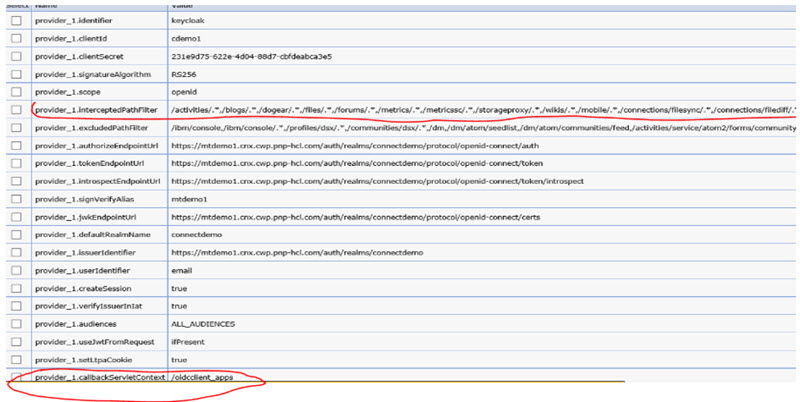
3. Enable custom dynacache.
   - In oidc RP TAI properties add: jndiChaneName:
   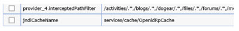
   - Create a new object cache instance with the JNDI name match the one use in the TAI property above. replication Domain: ConnectionsReplicationDomain
     
     replication Type: both push and pull
     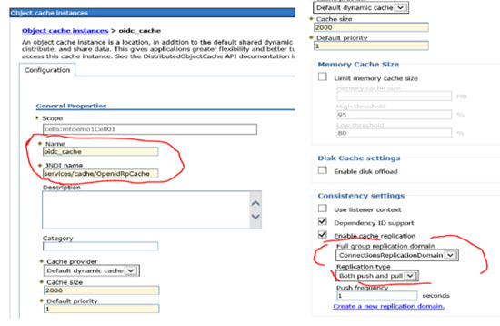
   -  In each cluster (Apps, Infra, util, push) Dynamic chache service make sure cache replication is enabled and is using ConnectionsReplicaitonDomain.
      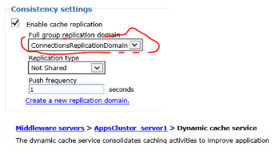   
4.  Update callbacks in keycloak with content root. 
  
5.  Custom properties, make sure remove both

    com.ibm.websphere.security.DeferTAItoSSO 

    com.ibm.websphere.security.InvokeTAIbeforeSSO

6. Set oauth2 tai filter to some dummy value so it won't intercept any request. e.g.
   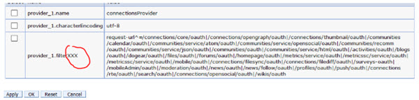


