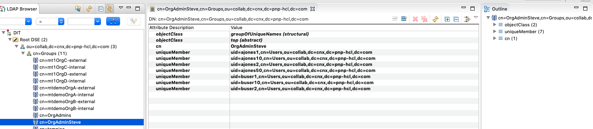
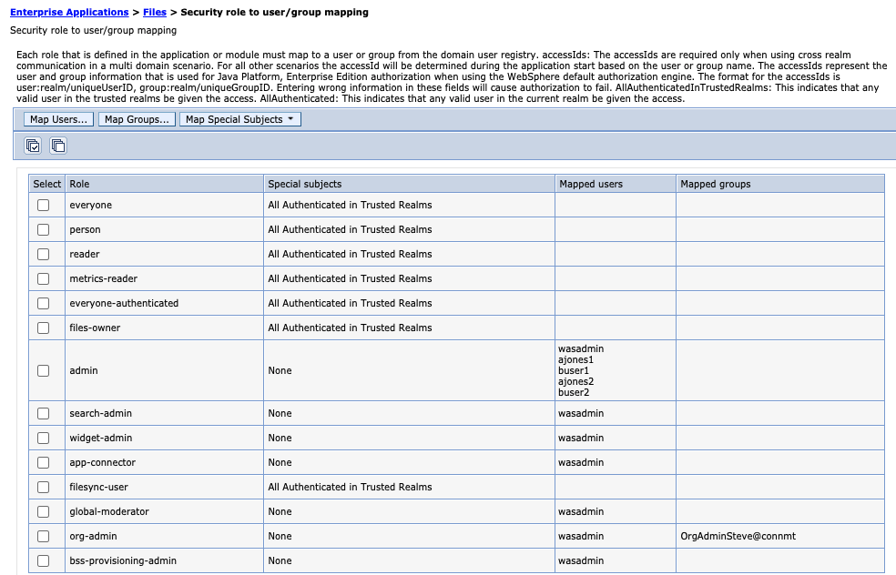
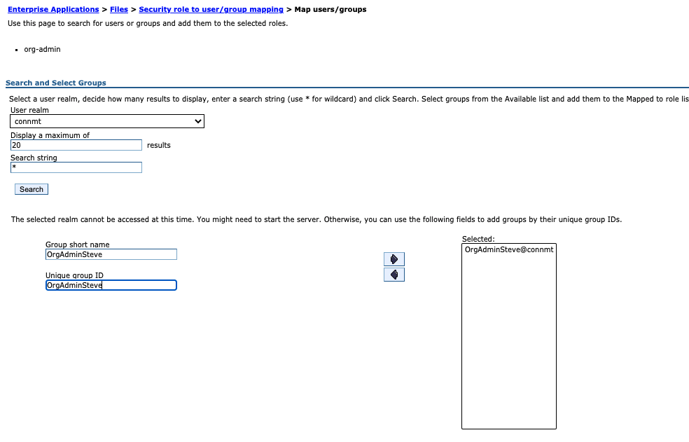
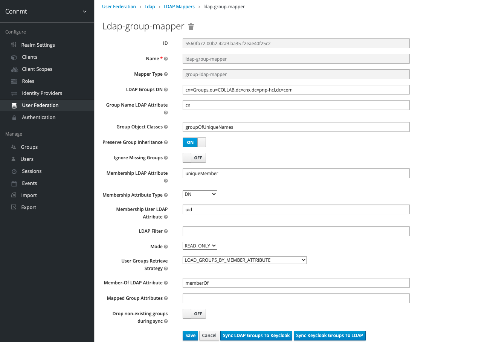

# Providing LDAP Group Support for the org-admin role in MT

This information allows MSPs to create an LDAP group that contains the individuals with org admin privileges.

## LDAP
    
1. Create a group in LDAP that MSP manages for their customers, that consists solely of those users that would be designated  as the organization administrator by their company.  
2. Use the “flat” DN from the overall list of users when using a tool like apache directory studio

## WebSphere

1. In WebSphere for each application (applications->websphere enterprise applications->files (activities, forums, mobile, etc)->Security Roles to User/Group Mappings
2. Select the check box next to org-admin and select the **map groups** button.
3. Select the realm (Keycloak realm that you are using, for example, connmt.
4. Search for the group name in your LDAP

   **Note:** If the search does not find your group name then type in the group name as it is defined in the LDAP into the two text boxes.
5. Select **Save**

## Keycloak
1. Log into your keycloak server to sync the group with keycloak.
2. Select your realm. For example, connmt.
3. Select **User Federation**
4. Select the LDAP you are using (mtdemo=ldapmtdemo, mtdemo1=ldap)
5. Select Mappers and select ldap-group-mapper
6. Select **Sync LDAP Groups To Keycloak**

## Additional Information

1. Create a group in LDAP that MSP manages for their customers, that consists solely of those users that would be designated  as the organization administrator by their company. The following screen capture displays an example of an LDAP group.  In the left panel, a group called OrgAdminSteve is displayed and in the right panel the members of that group are displayed. The group consists of users across all organizations.  When adding users to the group, they are added as uniqueMembers and the value is the the user's DN as it comes from the flat list of all users.
   
      **Note:**  Use the “flat” DN from the overall list of users when using a tool like apache directory studio
2.  Add the group that you  created in the LDAP via the WebSphere Admin Console to each application that requires org-admin access.  For example, Communities, Blogs, Files, Wikis, Forums, etc.   
    
3.  Select **Map Groups**, you may or may not be able to select the group from the picker, but you will need to insure that you select or enter the groups that belong to the realm that you have configured via Keycloak. For this example, **connmt**.
    
4.  Before your group will be operational, you will need to synchronize the new group via Keycloak.
    
 
