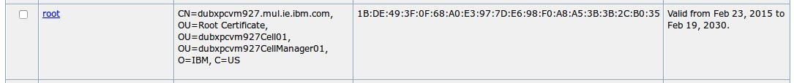

# Installing type-ahead search with Solr {#inst_post_typeahead_with_solr .task}

Deploy the type-ahead search feature with Solr if you do not plan to use Elasticsearch in your HCL Connections deployment.

The Solr-based type-ahead search feature requires a Linux server. Make sure that you've installed Java 1.8.0\_60 or higher on that system. If you're unsure, you can download the latest Java SDK from java.com.

**Attention:** Elasticsearch is the recommended search engine for type-ahead search as of Connections 6.0 CR3, and the Solr option is only retained for customers who are upgrading with an existing type-ahead search index in Solr.

If you did not install Solr, you can set up the type-ahead feature using the Elasticsearch service instead, as explained in [Setting up type-ahead search](inst_tasearch_intro.md).

1.  Visit IBM Fix Central and download the package 6.0.0.0-IC-TypeAhead-20170331.zip, which contains all of the Solr code necessary for installing type-ahead.

2.  From the download package, copy solr\_ssl.V2.tar.gz to your server.

3.  Extract the file to /opt/IBM/solr by running the following command in a command line.

    ```
    tar -zxvf solr_ssl_V2.tar.gz -C /opt/IBM/solr
    ```

4.  Run the following command to change the owner and group of the solr directory to the IBM user and group to be used to run Solr.

    For example, if Solr is to run as root, the command is as follows:

    ```
    chown -R root:root /opt/IBM/solr/solr-4.7.2
    ```

5.  Change to the working folder directory. Enter the command cd /opt/IBM/solr/solr-4.7.2.

6.  Set JAVA\_HOME to the appropriate Java Runtime Environment instance. That is, if you have multiple Java installations, you must provide the path to the location of one that meets the Solr requirement \(Java 8 or later\), or you could have issues loading Solr.

    1.  Open a text editor and from your home directory \(that is /home/username\), and open the shell script file to which you want to add the variable. For example, open bash\_profile.

        **Note:** By default, shell scripts are stored as hidden files. To view hidden files, run the `ls -la` command.

    2.  Type the command to add the variable that you want and then save the file. For example, if the Java installation that you want is the folder that is named jre1.8.0\_60, type export JAVA\_HOME=/usr/java/jre1.8.0\_60

    3.  To put your changes into effect, exit the command session and then start a new session.

7.  Log in to the IBM WebSphere Application Server administrative console and navigate to **Security** \> **SSL certificate and key management** \> **Key stores and certificates** \> **CellDefaultTrustStore** \> **Signer certificates**. \(Do not use the certificates from the nodedefault truststore\). Extract the root certificate \(not the webServer certificate\). Rename this file to root.crt and save it to the /opt/IBM/solr/solr-4.7.2 folder.

    

8.  From the same session in which you set JAVA\_HOME in step 1, run ./import-cert.sh to make sure that the certificate is configured correctly.

    The command returns the keystore contents. The results resemble the following example.

    solrtest, Feb 13, 2013, PrivateKeyEntry,
Certificate fingerprint \(SHA1\): 7C:F2:F3:FA:1B:C9:08:27:C6:E2:79:34:D7:10:6B:F7:50:47:FA:20
connections, Oct 22, 2015, trustedCertEntry,

9.  From the cell default keystore, import the certificate that is called key.p12 to your browser, as follows:

    1.  In the Deployment Manager, navigate to Deployment\_Manager\_Profile/config/cells/cell, and copy the key.p12 file to your client system.

    2.  Import the key.p12 file using the commands that are appropriate for your browser.

        For example, in Firefox:

        1.  Click **Options** \> **Privacy & Security** \> **View Certificates**.
        2.  Click the **Your Certificates** tab.
        3.  Click the **Import** button.
        4.  When prompted for a password, type WebAS.
        5.  Click **OK**.
10. Run ./start-solr.sh to start the service. Check that solr-start.log was created and that it contains output. You can access Solr \(from the Firefox client from step 7b\) at https://<connections\_server\>:8984/solr. When prompted, you must identify yourself with a client certificate.

    **Note:** The server is working properly when the following output starts to display in the logs after searches are made:

    org.apache.solr.core.SolrCore; \[quick-results-collection\] Registered new searcher Searcher@64d597c9\[quick-results-collection\] main\{StandardDirectoryReader\(segments\_9:38:nrt \_a\(4.7\):C8/1:delGen=1 \_b\(4.7\):C4/3:delGen=2 \_c\(4.7\):C2 \_d\(4.7\):C1 \_f\(4.7\):C1\)\}

    org.apache.solr.core.SolrCore; \[quick-results-collection\] webapp=/solr path=/select params=\{q=\*:\*&hl=true&hl.q=test&start=0&fq=\{!q.op%3DAND+df%3Dtitle\}title:test&fq=user\_id:60B70466-8EAD-C812-8525-7BE90078A509&fq=org\_id:00000000-0000-0000-0000-000000000000&fq=+-source:PROFILES&hl.fl=title&sort=date+desc&rows=7&wt=javabin&version=2&\_route\_=60B70466-8EAD-C812-8525-7BE90078A509!\} hits=0 status=0 QTime=71


-   **[Enabling type-ahead with Solr](../install/t_inst_solr_type_ahead_enable.md)**  
To enable type-ahead search with Solr, you must enable Solr by editing the LotusConnections-config.xml file.

**Parent topic:**[Setting up type-ahead search](../install/inst_tasearch_intro.md)

