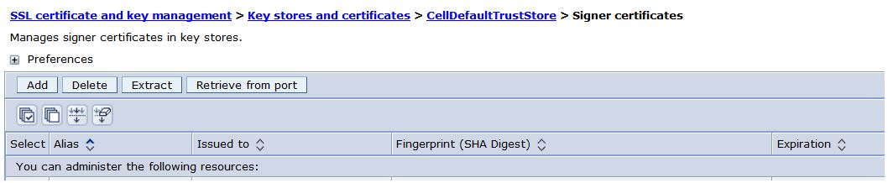

# Enabling type-ahead with Solr {#task_hwr_jx2_qv .task}

To enable type-ahead search with Solr, you must enable Solr by editing the LotusConnections-config.xml file.

Elasticsearch is the recommended search engine for type-ahead search as of Connections 6.0 CR3, and the Solr option is only retained for customers who are upgrading with an existing type-ahead search index in Solr.

If you did not install Solr, you can set up the type-ahead feature using the Elasticsearch service instead, as explained in [Setting up type-ahead search](inst_tasearch_intro.md).

1.  Edit the LotusConnections-config.xml file in the Deployment Manager profile configuration folder, adding the following line to the end of the file in the <properties\> section:

    ```
    <genericProperty name="quickResultsEnabled">true</genericProperty>
    ```

2.  Edit the search-config.xml in the Deployment Manager profile configuration folder. Add the following line to the `<propertySettings>` section.

    ```
     <property name="quickResults">
                  <propertyField name="quick.results.connections" value="hostname:9984"/>
              </property>
    ```

3.  From the Solr working directory, opt/IBM/solr/solr-4.7.2, copy the certificate localhost.crt to the Connections server.

4.  Import localhost.crt into the Trusted store of your Connections cluster by completing the following steps:

    1.  Log in to the IBM WebSphere Application Server Integrated Solutions Console and navigate to **Security: SSL certificate and key management** \> **Key stores and certificates**.

    2.  Click **CellDefaultTrustStore** and then click **Signer certificates**.

        

5.  Click **Add** and select the copy of localhost.crt \(from step 3\) to import it.

    **Note:** Importing multiple certificates causes SSL between Solr and Connections to fail.

6.  Synchronize your changes to all nodes and restart the servers or clusters of Connections that are running Search and Common applications.


To collect results, start by performing a search in Communities, which will begin to create a collection of the search data. Check the Solr logs to ensure that there are no errors.

**Parent topic:**[Installing type-ahead search with Solr](../install/t_inst_solr_type_ahead.md)

