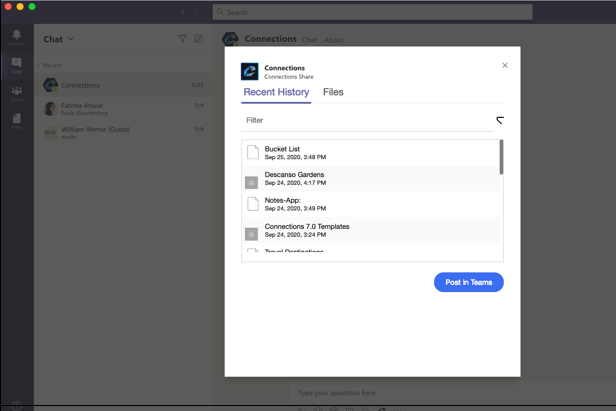
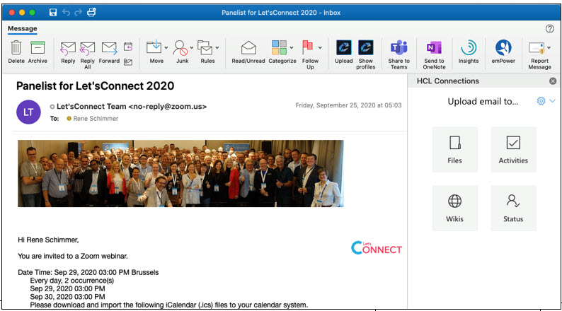

# What's new in HCL Connections {#i_ovr_r_whats_new .reference}

Find out about features that are new or updated in this release of HCL Connections.

## Updates to HCL Connections 7.0 Server and Component Pack 7.0.0.0 {#section_v3x_hgd_l4b .section}

See the article [Update Strategy for HCL Connections v7.0](https://support.hcltechsw.com/csm?id=kb_article&sysparm_article=KB0086997) on the HCL Support site to obtain the latest updates for both Connections Server and Component Pack, including required critical updates.

Refer to the following for additional information.

-   **The user interface now supports 18 languages.** Refer to the [Supported languages in Connections 7.0](i_ovr_c_supported_langs.md) for additional information.
-   **Download** [Connections 7.0 Server and Component Pack 7.0.0.0 updates from the HCL License & Download Portal](https://hclsoftware.flexnetoperations.com/flexnet/operationsportal/DownloadSearchPage.action?search=HCL_Connections_7.0_Updates&resultType=Packages&sortBy=relevance&listButton=Search)
-   **Enhanced HCL Connections 7.0 Update Wizard** \(Available in the HCL Connections 7.0 download link above\)

    **Note:** Make sure to download the latest version of the HCL Connections 7.0 Update Wizard. The latest version of the Update Wizard is required to install the cumulative interim fixes \(Cfix\).

## What's New in HCL Connections 7.0 and Component Pack 7.0.0.0 {#section_hgz_3dy_clb .section}

**[Download Connections 7.0 and Component Pack 7.0.0.0 updates from the HCL License & Download Portal](https://hclsoftware.flexnetoperations.com/flexnet/operationsportal/DownloadSearchPage.action?search=HCL_Connections_7.0_Updates&resultType=Packages&sortBy=relevance&listButton=Search)**

**Technical Optimization**

-   **System Requirements**
    -   Refer to the [HCL Connections 7.0 System Requirements](https://support.hcltechsw.com/csm?id=kb_article&sysparm_article=KB0073654).
    -   Refer to the [Prerequisites for Component Pack](https://help.hcltechsw.com/connections/v7/admin/install/cp_prereqs.html).
-   **Connections and Component Pack - automating your install and sizing your delpoyment**
    -   HCL's open-source GitHub documents provide details on setting up end to end automation to install Connections and Component Pack. The respective Git locations are:
        -   [Quickstart for Setting Up HCL Connections and Component Pack Using Ansible Automation](https://github.com/HCL-TECH-SOFTWARE/connections-automation/blob/main/documentation/QUICKSTART.md)
        -   [HCL Connections and Component Pack Automation Scripts](https://github.com/HCL-TECH-SOFTWARE/connections-automation/blob/main/README.md)
    -   [HCL Connections 7.0 Sizing Guide](https://help.hcltechsw.com/connections/v7/pdfs/connections7_sizing_guide.pdf): Provides sizing and deployment recommendations for both Connections and Component Pack, based on HCL performance tests and best practices learned and confirmed by multiple customers through time.
-   **Component Pack now supports**
    -   The three latest major versions of Kubernetes.
    -   Official support for Helm v3
    -   Amazon EKS for Component Pack deployments. Use native Amazon ECR as your image registry, Amazon EKS as your Kubernetes cluster, Amazon EFS for your automatic volume claims, seamlessly integrate with Amazon ELB by using native Nginx ingress controller, and much more.
    -   RedHat OpenShift 4 for Component Pack deployments, either on-premises or in the cloud.
    -   Using provided automation, Component Pack was never easier to deploy, upgrade and monitor using Prometheus and Grafana, end to end, either in cloud or on your own server\(s\).
    -   Easy integration of Prometheus JMX exporter with your Connections 7 stack and monitoring by Prometheus and Grafana running on your Kubernetes platform.
-   **Roadmap to Connections 7.0**
    -   This road map is intended to provide a high level description about upgrading Connections 4.0 to 7.0 Refer to the [Road map for Upgrading Connections 4.0 to 7.0](https://support.hcltechsw.com/csm?id=kb_article&sysparm_article=KB0076286) Knowledege Base Article for additional information.
    -   Component Pack for HCL Connections introduces several offerings that enhance collaboration and boost productivity. Refer to [Installing and upgrading Component Pack for Connections](../install/cp_install_config_intro.md).

**The initial release of HCL Connections 7.0 is only available in English.**

Multiple language support for the Connections 7.0 user interface will be added to a future release. Refer to the [Supported languages in Connections 7.0](i_ovr_c_supported_langs.md) for a additional information.

## Tailor your community experience {#section_tp5_s4s_hnb .section}

A new experience makes it easier for users to create engaging Communities faster.

-   **Creation Wizard - Step by step to success**
    -   Step-by-step - A step-by-step process takes users by the hand guiding them through the process of creating a Community. [Creation wizard makes community setup easy](../../user/communities/t_com_create.md)
    -   New Design - A clear and focussed design reduces the clicks and steps saving time and effort
    -   Mobile Support - For the first time the complete experience is now available on mobile devices - users can complete the entire Community creation on their tablets \(phone support to come\).
-   **Templates. Save time, repeat what works**

    Wether you want to achieve a consistent look-and-feel across your organization’s Communities or you run repeatable projects that rely on best-practices as part of every new project - Connections Community templates dramatically shorten the time to get productive. Choose from templates with prepopulated content to support your specific objective.

    -   Templates populate new Communities with Layouts, Community applications, and Content \(Files, Wiki, Blog, etc.\). Enable your end-users to create engaging and successful Communities
        -   Stay in control - Consistent quality is insured through Template Manager approved templates
        -   Save time - Community owners get a head start with professional layouts rather than trying to make everything look good
        -   Repeat Success - Start a new project with existing content aiding rapid and repeatable success
-   **Highlights - Build the experience you need**

    A new Highlights experience that seamlessly integrates standard Connections apps with dynamic and configurable widgets.

    -   [Highlights page](../../user/communities/c_com_customizing_highlights.md) is now the standard landing page for new communiities, and is even easier to lay out and customize. Easily add widgets from the traditional Overview page as well as Highlights widgets.
    -   Updated Highlights Experience

        -   Apps and Widgets side-by-side
        -   Improved layout builder
        -   Replaces Overview for new Communities
        -   Aggregated views for Files, News, Blogs, etc

## Using Connections and Microsoft Teams together {#section_cvw_pzz_clb .section}

New integrations with Microsoft Teams saves you time from both ends!

-   From Connections:
    -   Awareness icons for a person's name open a direct chat in Teams.

        |Connections Location|Steps|
        |--------------------|-----|
        |The organization directory|

|
        |The person's profile|

|
        |The Orient Me home page|

|

    -   Share a Connections page as a post in a Teams channel 
-   From Teams:
    -   When in Teams, share Connections content, or browse your files right from your chat window. A new Messaging Extensions icon in the conversation toolbar lets you easily find Connections files or other recently visited content and share a link to the channel.

        

    -   Add a Connections community app as a tab in your channel so that content from Files, recent updates, Highlights, or a wiki, blog, or forum are never more than a click away.

        

-   From Connections or Teams:
    -   Post links to Connections content in a Teams channel - **Share to Microsoft Teams** .

To learn more, see [../../user/eucommon/c\_eucommon\_conn\_and\_ms\_teams.md](../../user/eucommon/c_eucommon_conn_and_ms_teams.md).

-   **Outlook Integration**

    Newly built - supporting Outlook clients running on Windows, Mac, and in the browser. [Use the Connections Add-in for Microsoft™ Outlook to work with Connections content](../../connectors/enduser/c_ms_plugins_add_in_outlook.md) from within your Outlook inbox.

    -   **Reduce clutter** Save the entire email or just the attachments to where they are useful to others - as a shared File, a to-do in an Activity, as a knowledge article in a Wiki, or simply as a status update to share the good news!
    -   **Minimize redundancy** Send emails with links to Connections files rather than attaching a local file again and again
    -   **You have options**
        1.  Share via link or as attachment if needed
        2.  Use the Outlook client integration on Mac and PC or in your browser
    

-   **Add SharePoint to your community**

    [Add the SharePoint app to a community](../../user/communities/t_com_add_sharepoint_widget.md) for convenient access to Microsoft SharePoint documents and folders.

-   **Roundtrip editing for Connections Files**

    If you have the HCL Connections Desktop Plug-ins for Microsoft Windows installed and configured, you can check out a file, edit it locally with up to the latest versions of Microsoft Office, and then check it back into Connections. See [Editing a Connections file in Microsoft Office](../../user/files/t_files_edit_file_local_refresh.md).

## Export and print content as .pdf {#section_ivw_pzz_clb .section}

Turn your Connections content into a .pdf file for easy distribution and printing. For example, export individual pages from a standalone wiki, or export an entire community blog. For more information, see

-   [Post-installation tasks for Connections PDF Export](../install/install-guide-preparations.md)
-   [Exporting app content as a PDF](../../user/eucommon/t_eucommon_export_as_pdf.md)
-   [Enabling your community's PDF export access](../../user/communities/t_com_enable_pdf_export.md)

**Cloud Native Initiative**

Continuing on the path to drive down the total cost of ownership of Connections, specifically for the Component pack, HCL Connections now supports Amazon AWS, EC2, ECS, EKS, and Fargate, and Red Hat Open Shift.

**Interested in Connections Mobile?**

Check out the App Store for iOS or Google Play for Android for the latest information and release. Refer to [HCL Connections Mobile](https://help.hcltechsw.com/connectionsmobile/index.html) product documentation for additional information.

**What's new for end-users**

For more information about new end-user features and functions in HCL Connections 7.0 see [What's new in HCL Connections?](../../user/eucommon/r_eucommon_whats_new.md)

