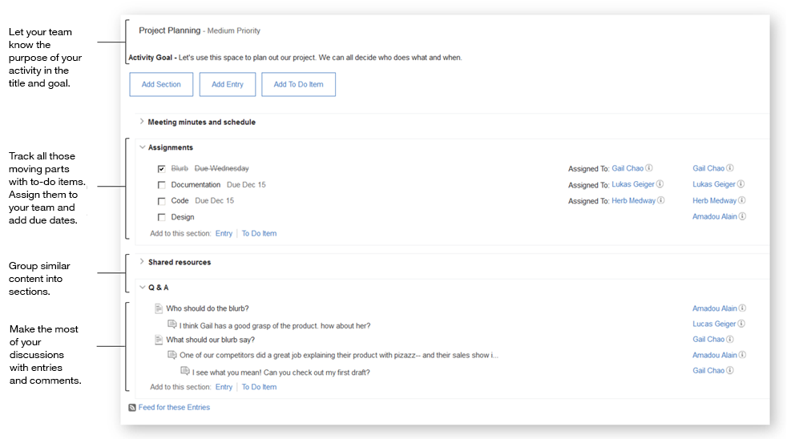

# Coordinating a project 

Managing a project? Keep track of your tasks and team with an activity. You can assemble a list of shared resources, assign tasks to your team, and create a space to check in and ask questions.

## Next steps 

Feel inspired? Strike while the iron's hot. Start by [creating an activity](c_create_activity.md).

**Parent topic:**[Getting acquainted](../../user/activities/c_get_organized.md)

