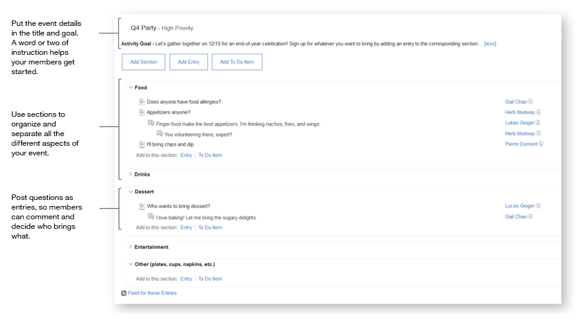

# Planning an event 

Preparing for an event? Coordinate with people using activities. You can make a list of supplies, decide on a location, and tell everyone what to bring.

## Next steps 

Feel inspired? Strike while the iron's hot. Start by [creating an activity](c_create_activity.md).

**Parent topic:**[Getting acquainted](../../user/activities/c_get_organized.md)

