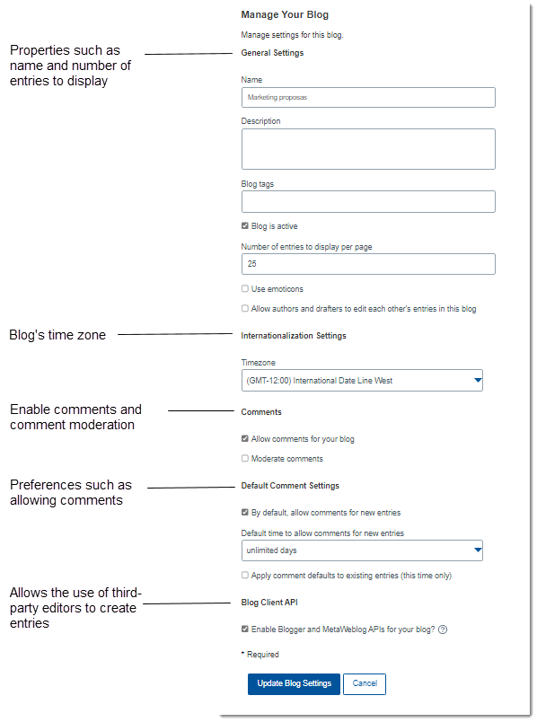

# Managing your community blog 

Manage settings such as name, display, and commenting for the community blog. You can also add files and links to mak the blog more useful, or hide the blog altogether if it's no longer relevant.

## Updating basic blog information 

From the navigation bar, click **Communities** and select the community that contains the blog you want to manage.

1.  To edit basic information about the blog:
    1.  Click **Community Actions** and select **Edit Community**.
    2.  Click the **Blog** tab, then make your changes:
        -   Edit any of the basic information about the blog, such as its name, description, tags, and time zone.
        -   Change whether all community members have author, draft, or viewer membership. For more information on blog roles, see [Assigning app roles for community members](managing_roles_for_community_members.md).
        -   Specify whether comments that are added to the blog are moderated. Moderated comments are saved into a draft state until you approve them.
    3.  Click **Save**.

## Editing blog settings 

1.  From the community menu, click **Blog**.
2.  Click **Blog Actions** and then select **Manage Blog** from the list.
3.  Edit one or more of the following settings:

## Adding links and files 

1.  From the community menu, click **Blog**.
2.  Click **Blog Actions** and select **Manage Blog** from the list. Then select any of the following options in the side panel:
    -   **Links** to add and delete links.
    -   **File Uploads** to upload and delete links, as well as organize them in a directory.

## Going further 

To add or remove a blog member, you must add or remove that person from the community membership. For more information, see [Adding or removing members](t_com_membership_add.md). If you want to change members' role in the community blog, see [Assigning app roles for community members](managing_roles_for_community_members.md).

**Parent topic:**[Sharing information in a community blog](../../user/communities/community_blog_frame.md)

**Related information**  

[Changing your community's access level](../../user/communities/t_com_edit.md)

[Adding a blog to your community](../../user/communities/t_com_creating_community_blog.md)

