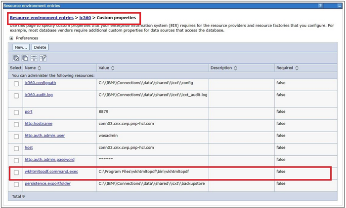
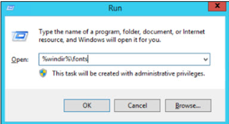
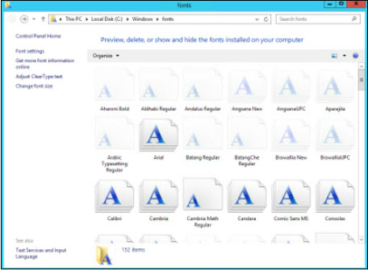

# Post-installation tasks for Connections PDF Export {#post-installation-tasks-for-connections-pdf-export}

PDF Export requires the [wkhtmltox binary package](http://wkhtmltopdf.org/downloads.html) in order to render PDF documents. This is a binary dependency that needs to be deployed on your HCL Connections server. The necessary installation steps are outlined below.

You can also leverage available properties to configure PDF Export according to your needs.

## Downloading and installing {#downloading-and-installing}

1. Download and install the `wkhtmltopdf` binary package.

    The binary package is available to download here: https://wkhtmltopdf.org/downloads.html. Please use the latest stable version 0.12.6 for installation.

    Ensure to download the package according to your server operating system. Common examples are listed below, all distributions can be found via above link.

    |OS|Type|
    |--|----|
    |Windows|[64-bit](https://github.com/wkhtmltopdf/packaging/releases/download/0.12.6-1/wkhtmltox-0.12.6-1.msvc2015-win64.exe) [32-bit](https://github.com/wkhtmltopdf/packaging/releases/download/0.12.6-1/wkhtmltox-0.12.6-1.msvc2015-win32.exe)|
    |RHEL 7 / CentOS 7|[x86\_64](https://github.com/wkhtmltopdf/packaging/releases/download/0.12.6-1/wkhtmltox-0.12.6-1.centos7.x86_64.rpm) [i686](https://github.com/wkhtmltopdf/packaging/releases/download/0.12.6-1/wkhtmltox-0.12.6-1.centos7.i686.rpm) [aarch64](https://github.com/wkhtmltopdf/packaging/releases/download/0.12.6-1/wkhtmltox-0.12.6-1.centos7.aarch64.rpm) [ppc64le](https://github.com/wkhtmltopdf/packaging/releases/download/0.12.6-1/wkhtmltox-0.12.6-1.centos7.ppc64le.rpm)|
    |RHEL 8 / CentOS 8|[x86\_64](https://github.com/wkhtmltopdf/packaging/releases/download/0.12.6-1/wkhtmltox-0.12.6-1.centos8.x86_64.rpm) [aarch64](https://github.com/wkhtmltopdf/packaging/releases/download/0.12.6-1/wkhtmltox-0.12.6-1.centos8.aarch64.rpm) [ppc64le](https://github.com/wkhtmltopdf/packaging/releases/download/0.12.6-1/wkhtmltox-0.12.6-1.centos8.ppc64le.rpm)|
    |RHEL 9|[x86\_64](https://github.com/wkhtmltopdf/packaging/releases/download/0.12.6.1-2/wkhtmltox-0.12.6.1-2.almalinux9.x86_64.rpm) [aarch64](https://github.com/wkhtmltopdf/packaging/releases/download/0.12.6.1-2/wkhtmltox-0.12.6.1-2.almalinux9.aarch64.rpm)|
    
    Once downloaded, install the package according to your system's requirements.
    
    RHEL/CentOS:
    
    ```
    rpm -Uvh wkhtmltox-0.12.6-<version>.rpm
    ```
    
    Windows:
    
    -   Download `wkhtmltox-0.12.6-<version>.exe`
    
    -   Execute binary file to run installer
    
    -   Install tool at appropriate location

2. Configure the PDF Export feature on WebSphere to leverage wkhtmltopdf binary

    In order for the PDF Export feature to use the wkhtmltopdf library, it needs to be able to invoke the tool via the system's command line. There are two ways to ensure this is the case.

    1. Configure the system path to allow execution of the `wkhtmltopdf` command.
    
        PDF Export tries to execute the command
          
        ```
        wkhtmltopdf [args]
        ```
          
        on the system's command line \(`cmd` on Windows, `shell/bash` on Linux\). This can be enabled by adding the wkhtmltopdf to the system's path variable. To test this, try to execute above command on the system's command line. If the command is not recognized, this is not configured correctly. Otherwise PDF Export is now ready and can be used.
          
        **Note:** The command needs to be executable by the same user that will start the WebSphere servers/JVMs.

    2. Configure PDF Export to invoke wkhtmltopdf in the correct install location
    
        If wkhtmltopdf is not available by invoking the command listed in 2.1, you can instead make the PDF Export aware of what execution command is necessary to invoke it instead. For example, if you have installed the feature at location
     
        ```
        /opt/HCL/Connections/wkhtmltox/bin/wkhtmltopdf
        ```
         
        you can add this via WebSphere configuration. Perform the following:
         
        -   Enter the WebSphere administrative console \(e.g.: https://your.dmgr.host:9043/ibm/console\) and navigate to `Resources > Resource Environment > Resource Environment entries`
         
        -   Look for the `ic360` resource environment entry and click on it
         
        -   Navigate to `Additional Properties > Custom properties`
         
        -   Click *New...* to create a new property
         
        -   Enter the name `wkhtmltopdf.command.exec` and the path to the wkhtmltopdf binary \(including its name\) as the value, e.g. `C:\Program Files\wkhtmltopdf\bin\wkhtmltopdf.exe` on Windows or `/opt/HCL/Connections/wkhtmltox/bin/wkhtmltopdf` on Linux.
         
        -   Click *Apply* and *OK*.
         
        -   *Save* the changes to the master configuration.
         
        -   Restart ICXT server. 
         
         
        **Note:** In case of a clustered environment, this library needs to be installed the same way on all nodes of the cluster.

###  Server side fonts {#optional-server-side-fonts}

Without installed fonts, the PDF rendering may result in unsatisfactory result. If there are no font sets installed, we recommend to install [DejaVu fonts](https://dejavu-fonts.github.io/).

!!! note
    
    The following should additionally be installed to support Chinese and Japanese:

    - the library `wqy-microhei-fonts`for CentOS or RHEL 8
    - the library `google-noto-sans-cjk-ttc-fonts` for AlmaLinux 9 or RHEL9

-   RHEL8 or CentOS:

    ```
    sudo yum install dejavu-sans-fonts
    sudo yum install wqy-microhei-fonts
    ```
    
-   RHEL9 or AlmaLinux 9:

    ```
    sudo yum install dejavu-sans-fonts
    sudo yum install google-noto-sans-cjk-ttc-fonts
    ```
    
    To verify that the Dejavu fonts have been properly installed, run the command `fc-list | grep "DejaVu Sans"`
    
    Sample output:
    
    ```
    /usr/share/fonts/TTF/DejaVuSansCondensed.ttf: DejaVu Sans,DejaVu Sans Condensed:style=Condensed,Book
    /usr/share/fonts/TTF/DejaVuSans-BoldOblique.ttf: DejaVu Sans:style=Bold Oblique
    /usr/share/fonts/TTF/DejaVuSansMono.ttf: DejaVu Sans Mono:style=Book
    /usr/share/fonts/TTF/DejaVuSansCondensed-Oblique.ttf: DejaVu Sans,DejaVu Sans Condensed:style=Condensed Oblique,Oblique
    /usr/share/fonts/TTF/DejaVuSansMono-Oblique.ttf: DejaVu Sans Mono:style=Oblique
    /usr/share/fonts/TTF/DejaVuSansCondensed-BoldOblique.ttf: DejaVu Sans,DejaVu Sans Condensed:style=Condensed Bold Oblique,Bold Oblique
    /usr/share/fonts/TTF/DejaVuSans-ExtraLight.ttf: DejaVu Sans,DejaVu Sans Light:style=ExtraLight
    /usr/share/fonts/TTF/DejaVuSans-Oblique.ttf: DejaVu Sans:style=Oblique
    /usr/share/fonts/TTF/DejaVuSansMono-Bold.ttf: DejaVu Sans Mono:style=Bold
    /usr/share/fonts/TTF/DejaVuSansCondensed-Bold.ttf: DejaVu Sans,DejaVu Sans Condensed:style=Condensed Bold,Bold
    /usr/share/fonts/TTF/DejaVuSansMono-BoldOblique.ttf: DejaVu Sans Mono:style=Bold Oblique
    /usr/share/fonts/TTF/DejaVuSans.ttf: DejaVu Sans:style=Book
    /usr/share/fonts/TTF/DejaVuSans-Bold.ttf: DejaVu Sans:style=Bold
    ```

-   Windows:

    -   The fonts can be found at https://dejavu-fonts.github.io/Download.html

    -   The documentation at https://support.microsoft.com/en-us/help/314960/how-to-install-or-remove-a-font-in-windows can be used for reference when installing the fonts. Generally, the required steps are:

        -   Download and unzip the latest DejaVu fonts ZIP archive

        -   Login as Administrator and Click "*Start*"

        -   Search for "*run*"

        

        -   Enter `%windir%\fonts`

        

        

        -   Drag and drop the extracted fonts from the ttf folder to the Fonts config window

        
        
## Additional configuration

You can further adjust the PDF Export feature to meet specific requirements using the configuration options listed in [ICXT - Configuration parameters](https://help.hcltechsw.com/connections/api/icxt/configuration.html#Module_PDFExport).

The following are noteworthy configuration options:

- **icxt.pdfexport.backup.meta.fields** to define which content meta information to include in the PDF by default.
- **ic360.pdfexport.previewMode.selected** to set the default printing quality of PDFs, either standard quality or reduced quality (referred to as "Preview Mode") for improved performance.

For performance-constrained environments, the property **wkhtmltopdf.parallel.processing.limit** is useful in limiting the amount of prints that can be simultaneously executed. 

Another consideration is which group of users are allowed to print PDFs of specific content, which you can define using **icxt.pdfexport.access.requiredrole**. By default, users need editing or authoring role on content in order to leverage this feature. You can change it to allow all readers or only content owners to print PDFs of the content.

**Parent topic:** [Optional post-installation tasks](../install/c_optional_post-install_tasks.md)
