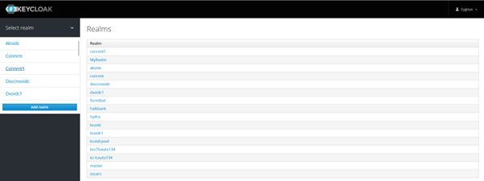
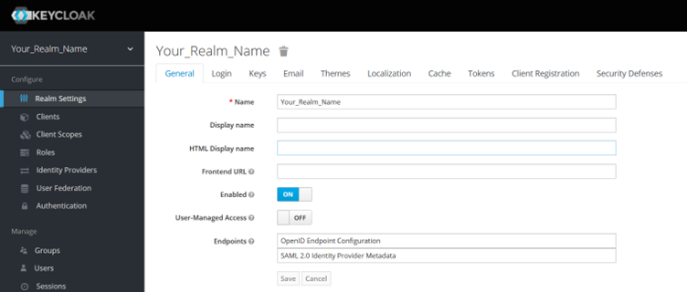
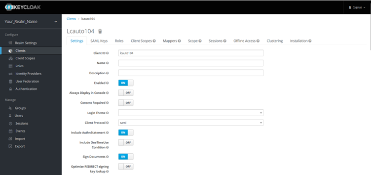
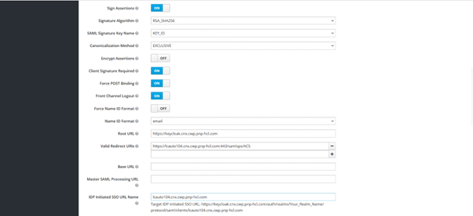

# Configuring KeyCloak as an SAML auth provider for Connections

Configuring Keycloak as the SAML authentication provider for Connections involves these steps.

- Creating a realm
- Within that realm create a client for the Connections web application
- Create Mappers and Roles for th cient.
- Export Metadata file for SP SSo

 
The realm contains the Keycloak SAML clients which provide the authentication for Connections entities. 

## Procedure {#section_yyb_25x_bpb .section}

1. **Create New Realm**

    Login to Keycloak. Click on **Select Realm**.

    In the dropdown menu, select **Add realm**.

    

    Enter the name of your choice for your realm and click “Create”.

    

    Your realm will be created as shown in below screenshot.
    
    

2. **Create Client**

    Select **Client** from the left-hand side (LHS) menu and click **Create** as highlighted in below screenshot.
    

    On the client creation page, click **Select file** to **Import**.
    Use the SP metadata file exported from WebSphere.
    You can change the **Client ID** as per your choice.
    Click **Save**.
    

3. **Edit Client Properties**

    Edit the following client properties:

    - **Name ID format**: email
    - **Root URL**: Keycloak host URL
    - **Initiated SSO URL Name**: Your app host URL
        
        
        

4. **Add Client Scope**

     Select **Client scope** from LHS menu and then select **Create** button from RHS as shown in below screenshot.
    

    Enter a name for the client scope and click **Save**.
    New client scope would be created.

5.  **Create Mappers**

    On the same page, go to the **Mappers** tab and create in Mapper by selecting “Create” button on RHS. Refer below screenshot.
    

    First change/select “Mapper Type” to “User Property from drop down and then provide other required for “firstName” property as shown in below screenshot.
    

    Similarly, create mappers for:
   - `lastName`
    
   - `email`
    

6.  **Create Scope**
    For the same CnxClientScope, go to next tab **Scope** and select available roles and click **Add Selected>**.  
    PFB screenshot.
    

7. **Add Roles**
    From LHS menu, select Roles and click “Add Role” button present on RHS.
    Refer below screenshot.
    

    Provide a role name and click **Save**.
    

    Enable Composite Role

    Once roles is saved, new option will appear on same screen named   “Composite role” with default value as “OFF”. Change value to “On”
    

8.  **Export IDP Metadata File**

    Navigate to **Clients** and select you client.
    On client’s dashboard select last tab **Inastallation**.
    From **Format options** drop down menu select **SAML Metadata SPSSODescriptor**
    Refer below screenshot.
    

    This file can be used for WebSphere configuration to generate IDP-related TAI properties and security certificates.
