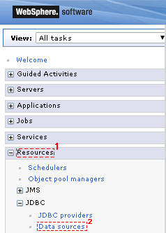
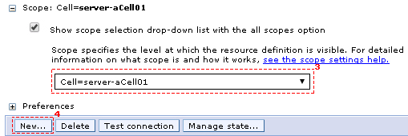
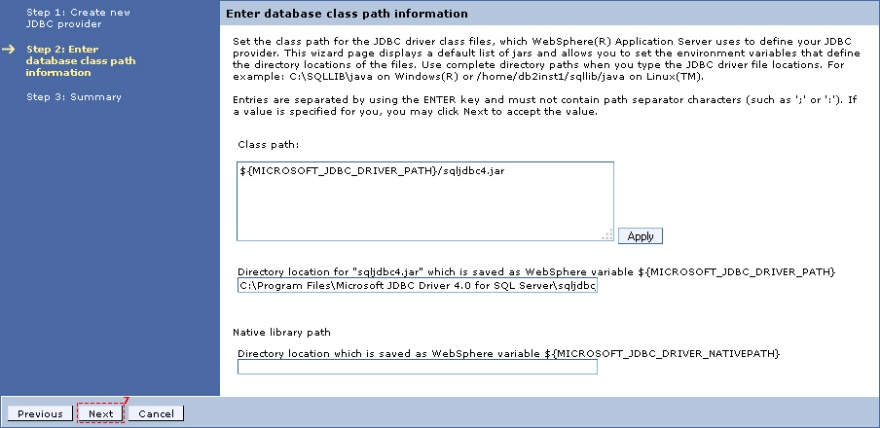

# Creating an MSSQL JDBC provider \(optional\) 

You can skip these steps if you elect to use the default JDBC provider that Connections Activities uses. The Activities JDBC provider is used as the default in the install.properties file when you install the Connections Engagement Center. If you want to have a clear separation for the Connections Engagement Center database, follow these instructions.

|Step|Instructions|
|----|------------|
|1

|Open the Integrated Solutions Console \(ISC\) of your Deployment manager and perform the following steps.

|
|2

|Navigate to **Resources \> JDBC \> JDBC Provider**.

 

|
|3

|Select cell scope and click **New**.

 

|
|4

|Select following configurations and click **Next**.

 

|
|5

|**Note:** Please make sure that the variables are set in the **Environment \> WebSphere variables**.

 Click **Next**

 

|
|6

|Verify the summary, click **Finish** and save your changes directly to the master configuration.

 

|

