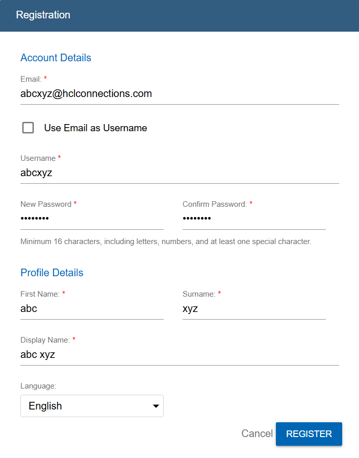

# Displaying a password rule in the user registration and password change dialogs

You can enable an informational banner that displays your organization's password requirements to users. This feature serves as a helpful reminder to guide users in creating a secure and compliant password on their first attempt, but it does not actively enforce these rules.

When enabled, the banner will appear in the following places:

- **Account Registration**: When a user creates a new account.
- **Password Change**: When a user updates their current password.
- **Password Reset**: When a user sets a new password after a reset.

## How to use it

On the pages mentioned previously, a banner will appear near the **"New Password"** and **"Confirm Password"** fields. This banner displays the specific requirements users must follow to create a valid password.

For example, this is how the banner looks on the registration page:

**Example message**:  

***"Minimum 16 characters, including letters, numbers, and at least one special character."***



## Configuring the password banner

Enable the password rules banner by adding the `<passwordInformationBanner>` section within the `deployment-config/installation/selfregistration-config.xml` file. Ensure the configuration appears similar to the following:

```xml
  <passwordInformationBanner> 
    <msgText lang="default">Minimum 16 characters, including letters, numbers, and at least one special character.</msgText> 
    <msgText lang="en">Minimum 16 characters, including letters, numbers, and at least one special character.</msgText> 
    <msgText lang="de">Mindestens 16 Zeichen, einschließlich Buchstaben, Zahlen und mindestens einem Sonderzeichen.</msgText> 
  </passwordInformationBanner>
```

### Managing translations

You can add new language translations or modify existing ones. Note that all message text must be plain text.

### Adding a new language

To add a translation, create a new `<msgText>` node within the `<passwordInformationBanner>` section. This node must include the `lang` attribute, set to a valid BCP 47 language code.

For example, to add a Spanish translation, the node would be:

```xml
  <msgText lang="es">Debe contener un mínimo de 16 caracteres, e incluir letras, números y al menos un carácter especial.</msgText> 
```

### Modifying an existing language

To adjust an existing translation, simply edit the text inside its corresponding `<msgText>` node.

### How language matching works

When the dialog box is displayed, it compares the languages you've configured against the user's browser and operating system language settings.

- If a **match is found**, the message for that language is displayed.
- If **no match** is found, the system displays the message from the `<msgText>` node that has the `default="true"` attribute.

This behavior ensures every user sees the password rules, even if a specific translation for their preferred language is not available.

### Applying your changes

After you have finished customizing the `selfregistration-config.xml` file **Save your changes** and **restart the Invite.ear** application for them to take effect.

## Troubleshooting

If your configuration isn't being applied or you see validation errors in the logs, first **verify that your configuration XML is well-formed and syntactically correct**.

If the XML is valid but the issue persists, check for the `<passwordInformationBanner>` element in the `selfregistration-config.xsd` file. This schema file is used to validate the XML configuration and should contain the following definition:

```xml
  <xs:element name="passwordInformationBanner">
    <xs:annotation>
      <xs:documentation>
        A message to be displayed in the password dialog.
      </xs:documentation>
    </xs:annotation>
    <xs:complexType> 
      <xs:sequence> 
        <xs:element ref="msgText" maxOccurs="unbounded" minOccurs="0" /> 
      </xs:sequence> 
    </xs:complexType> 
  </xs:element>
```
