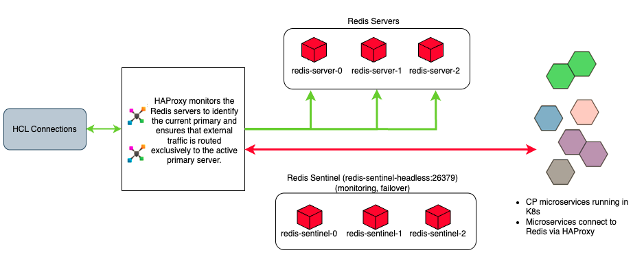

# Enabling and securing Redis traffic to Homepage {#cp_config_om_redis_traffic .concept}

HCL Connections™ requires some additional configuration to know how to securely communicate with the Homepage.

Component Pack provides the following Redis features to support Homepage:

-  High Availability \(HA\)
-  HAProxy integration
-  Redis security with authentication
-  `configureRedis.sh` script for updating Connections and Redis integration configuration if needed.

## Redis High Availability \(HA\) through Redis Sentinel

Using the capabilities of Redis Sentinel, Component Pack runs a Redis Sentinel Cluster \(1 primary Redis server, 2 secondary Redis servers, 3 Sentinels\) that resists, without human intervention, certain kinds of failures. Sentinel capabilities include:

-   Monitoring. Sentinel constantly checks if your primary and secondary Redis servers are working as expected.
-   Automatic failover. If the primary is not working as expected, Sentinel can start a failover process where a secondary is promoted to primary, the other additional secondary servers are reconfigured to use the new primary, and the applications using the Redis server informed about the new address to use when connecting.

## HAProxy Integration

Component Pack supports HAProxy to provide a route from Connections to the Redis cluster running within Component Pack. HAProxy acts as the external entry point for traffic from Connections to the Redis cluster. When configuring Connections to communicate with the Component Pack, the required HAProxy port is set during the bootstrap installation task.

## Redis Security with Authentication

Component Pack supports Redis security via Redis authentication. Redis clients connecting with Redis must authenticate using the Redis password set during the deployment. When configuring Connections, you must set the Redis password.

## configureRedis.sh script

By default, Redis is configured automatically as part of the bootstrap installation task.  The `configureRedis.sh` script can be used to update the Connections and Redis integration configuration after deployment if needed.

#### The Redis topology works as follows:

!!! note
    
    While the Component Pack uses HAProxy inside the Kubernetes cluster to manage Redis communications as shown in the diagram above, an external load balancer can optionally be deployed outside the Kubernetes cluster to load balance the initial network traffic directed to the Component Pack.

Follow these steps to configure and secure the Redis traffic flowing between Connections and Component Pack.

-   **[Manually configuring Redis traffic to Homepage](../install/cp_config_om_redis_enable.md)**  
Configure Redis traffic between the HCL Connections applications and the Homepage.
-   **[Securing Redis traffic to Homepage \(Linux\)](../install/cp_config_om_redis_secure_linux.md)**  
Follow these steps to secure the traffic flowing between the HCL Connections applications and the Homepage.
-   **[Securing Redis traffic to Homepage \(Windows\)](../install/cp_config_om_redis_secure_windows.md)**  
If your deployment runs HCL Connections on Windows, secure Redis traffic by creating a tunnel between Connections on Windows and the Homepage \(running on Linux\). This is an optional, but recommended, step.
-   **[Verifying Redis server traffic](../install/cp_config_om_redis_verify.md)**  
Confirm that traffic is flowing properly from HCL Connections to the Homepage.

**Parent topic:** [Configuring the Orient Me component for Homepage](../install/cp_config_om_intro.md)

