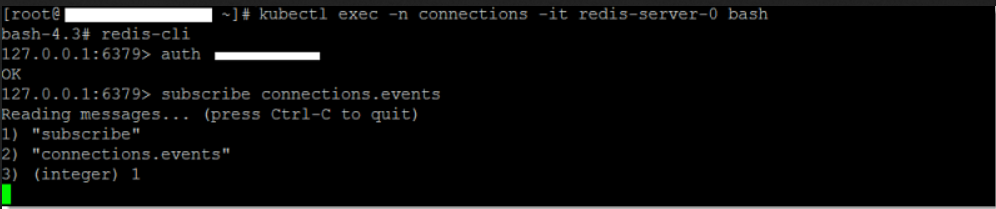
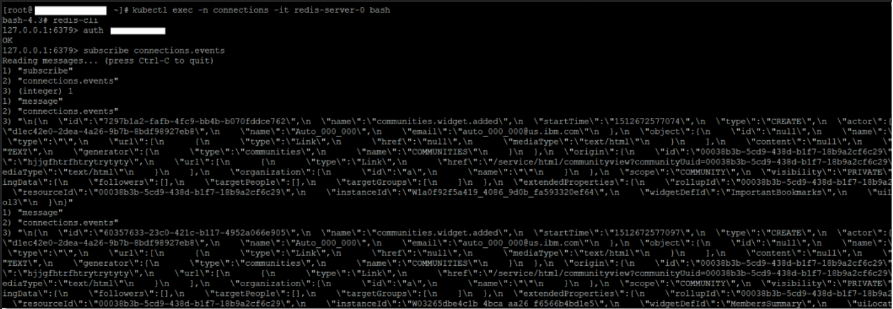

# Verifying Redis server traffic {#cp_config_om_redis_verify .task}

Note the following if you are deploying for high availability:

-   In a Redis HA set up, there are 3 running Redis servers \(redis-server-0, redis-server-1, redis-server-2\). One is a primary and two are replicas that replicate all content with the primary server.
-   Upon installation of Redis HA, the pod running as redis-server-0 assumes the `master` role and redis-server-1 and redis-server-2 assume the `slave` role.
-   In a failover scenario, redis-server-1 or redis-server-2 can assume the `master` role if the Redis primary server becomes unavailable.
-   Because all Redis servers are replicas of each other, you can connect to any running Redis instance to see Redis traffic flowing from Connections to the Homepage.

## Validate Redis Traffic
The following steps are to validate that traffic is flowing properly from HCL Connections™ to the Homepage.

1.  Log in to a Kubernetes node and connect to your running Redis pod.

    **Note:** If you configured SSH tunnelling, validate that the SSH Tunnel is working before you connect to the running Redis pod.

    1.  Log in to a Kubernetes node as a user with kubectl access.

    2.  Enter this command to connect to the Redis pod:

        ```
        kubectl exec -it -n connections redis-server-0 -- bash
        ```

     You will now be in the Redis server container.

2.  Subscribe to the `connections.events` channel.

    To subscribe to the Redis `connections.events` channel, you must first connect and authenticate with the password \(secret\) set during [bootstrap installation](cp_install_services_tasks.md#bootstrap).

    1.  Connect to the Redis server:

        ```
        redis-cli
        ```

    2.  Authenticate with the server:

        ```
        auth <redis-password>
        ```

    3.  Subscribe to the channel:

        ```
        subscribe connections.events
        ```

    For example: 

3.  Follow these steps to validate that events are populated in the connections.events channel.

    1.  Keep the channel from the previous step open, and browse to the Homepage of your Connections server.

    2.  Log in as a user with rights to create a community.

    3.  Create a community, then switch back to the Redis pod. You should see events being posted in the channel.

        For example: 

## Validate SSH Tunnels Are Working

1.  Log on to each machine where you started the SSH Tunnel (eg. the WebSphere Application Server node).

    1.  Enter the following to show the ssh tunnel process:

        ```
        ps aux | grep ssh
        ```

    2.  Confirm that you see the ssh tunnel is running as a process (eg. `ssh -i keys_dir/ssh_key ...`)

2.  Follow these steps to use Telnet to the ssh tunnel and set a Redis key value pair on the primary node.

    1.  If Telnet is not already installed, enter the following to install it.

        ```
        sudo yum -y install telnet
        ```

    2.  Telnet to localhost:

        ```
        sudo telnet localhost 30379
        
        ```

    3.  Authenticate with the Redis server:

        ```
        auth <Redis password>
        ```

    4.  Set a Redis key value. For example, set:

        ```
        SET today Friday
        ```

        The message `+OK` displays to indicate that the value "Friday" was set for the key "today".

    5.  Type the following to exit the Telnet session.

        ```
        quit
        ```

3. Follow these steps to retrieve the value of the key set on your Redis server:

    Because all Redis servers are replicas of each other, you can connect to any running redis instance to see Redis traffic flowing from Connections to Homepage.

    1.  Log in to a Kubernetes node as a user with kubectl access.

    2.  Enter this command to connect to the running Redis pod on the system:

        ```
        kubectl exec -n connections -it redis-server-0 -- bash
        ```

        You will now be in the Redis server container.

    3.  Enter the following commands to authenticate to Redis and retrieve the key value set:

        ```
        bash-4.3# redis-cli
        127.0.0.1:6379> AUTH <redis-password>
        OK
        127.0.0.1:6379> GET today
        "Friday"
        ```

4.  You may run the test again with another key pair. The key pair test confirms that a value set using the SSH tunnel can be retrieved from the in-memory storage of the Redis pod running on the primary node. This proves that the ssh tunnel is working as expected.

## Troubleshooting  

If Connections events don't appear in the connections.events channel when you create a community, follow these steps to resolve the problem:

1.  Ensure that the Redis pod is running:

    1.  Log in to a Kubernetes node as a user with kubectl access.

    2.  Enter this command to check the status of Redis and HAProxy pods on the system:
        -   `kubectl get pods -n connections | grep -e redis -e haproxy`

        -   Confirm that the pods are showing a running status with readiness being 1/1. For example,

            ```
            haproxy-7bbbc56b8c-9rxlj   1/1     Running     0               3h21m
            haproxy-7bbbc56b8c-jz6tz   1/1     Running     0               3h21m
            haproxy-7bbbc56b8c-n2khp   1/1     Running     0               3h21m
            redis-sentinel-0           1/1     Running     0               3h17m
            redis-sentinel-1           1/1     Running     0               3h18m
            redis-sentinel-2           1/1     Running     0               3h18m
            redis-server-0             1/1     Running     0               3h17m
            redis-server-1             1/1     Running     0               3h18m
            redis-server-2             1/1     Running     0               3h18m
            ```

    3.  If the redis-server / redis-sentinel pods are unable to run after a period of time (esp. in HA set up), scale the StatefulSet down to 0 and scale back up again.

        ```
        kubectl scale sts -n connections redis-sentinel --replicas=0
        kubectl scale sts -n connections redis-server--replicas=0
        (wait till all redis pods are terminated)

        kubectl scale sts -n connections redis-server --replicas=3
        kubectl scale sts -n connections redis-sentinel --replicas=3
        ```

2.  If applicable, ensure that the SSH Tunnel is configured properly. Review the steps in the procedure for validating that the tunnel is working.

3.  If the Redis pods have restarted due to a password change (in redis-secret), make sure the `configureRedis.sh` script described in [Running the configuration script](cp_config_om_redis_enable.html#running-the-configuration-script) is run with the new password and appropriate applications are restarted.  Component Pack pods should also be restarted to use the new password.

4.  Check the SystemErr logs on the Connections server. Look to see if the following exceptions are in the log:

    ```
        SystemErr     R Caused by: java.net.UnknownHostException: http://redis_host_name 
    
        [18/05/17 09:47:21:308 IST] 000001f0 SystemErr     R     at java.net.AbstractPlainSocketImpl.connect(AbstractPlainSocketImpl.java:214) 
    
        [18/05/17 09:47:21:308 IST] 000001f0 SystemErr     R     at java.net.SocksSocketImpl.connect(SocksSocketImpl.java:403) 
    
        [18/05/17 09:47:21:308 IST] 000001f0 SystemErr     R     at java.net.Socket.connect(Socket.java:666) 
    
        [18/05/17 09:47:21:308 IST] 000001f0 SystemErr     R     at redis.clients.jedis.Connection.connect(Connection.java:184) 
    
        [18/05/17 09:47:21:308 IST] 000001f0 SystemErr     R     ... 14 more 
    ```

    To resolve these errors, ensure when running the configureRedis.sh script that the setting for Redis Hostname/IPAddress does not include http or https.

5.  Check the logs for redis-server and redis-sentinel pods for errors:

    ```
    kubectl logs -n connections redis-server-0
    kubectl logs -n connections redis-sentinel-0
    ```

    Repeat for other Redis pods.  You may also need to check other Component Pack pods for Redis related errors (eg. orient-web-client for Homepage).
    

**Parent topic:**[Enabling and securing Redis traffic to Homepage](../install/cp_config_om_redis_traffic.md)

