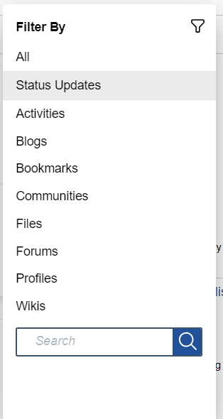
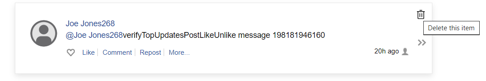

# Deleting or correcting user PI {#t_common_erase_or_correct_data_in_body_text .reference}

If a user who has left the organization wants to make sure that their personal information \(PI\), for example, their social security number, is removed or corrected in all content sources, they can ask the organization to find the occurrences in blogs, wikis, and so on, and to remove or change the text.

<!--1.  The user who has the Search Admin role in Connections does a search in Connections to find all occurrences of the data in question. For example, the Search Admin searches on the term "012-45-2222" \(with quotation marks included in the term\). If the user requesting deletion wants to include @mentions by other Connections users, they must provide some means for the Search Admin to find them, such as the name of the associated user or file.

1.  The user who has the Search Admin role in Connections does a search in Connections to find all occurrences of the data in question. For example, the Search Admin searches on the term "012-45-2222" \(with quotation marks included in the term\). If the user requesting deletion wants to include @mentions by other Connections users, they must provide some means for the Search Admin to find them, such as the name of the associated user or file.
version

    !!! note
        
        The Search Admin generates the search results, but does not have access to all the content.

2.  The Administrative User, who has access to all content, including published IBM Docs files, deletes or updates the data by directly editing it in the application.

3.  The user who either has an Administrative role or News Search Admin role can search from the Homepage > Status tab and delete posts from inactive and active users. -->

1. Login as the Connections Admin.

2. Go to the Discover screen at the Homepage

3. Select the filter icon 

4. Filter the Status Updates 

    

5. Hover over the upper right corner and the delete icon will be displayed.      Click on **Delete** icon to delete the post.

    

## **Manage @mentions in Contents:**

To improve privacy and compliance with regulations like GDPR, organizations can now manage `@mentions` more effectively. This enhancement , automatically replace `@mentions` of inactive users with pseudonyms. This ensures privacy without requiring manual intervention.  
     
For more details, see **[Managing @mentions in Content with Pseudonymization](../admin/c_common_manage_mentions_with_pseudonymization.md)**.

**Parent topic:**[Managing personal information in accordance with PI laws](../admin/c_common_manage_personal_data_for_gdpr.md)