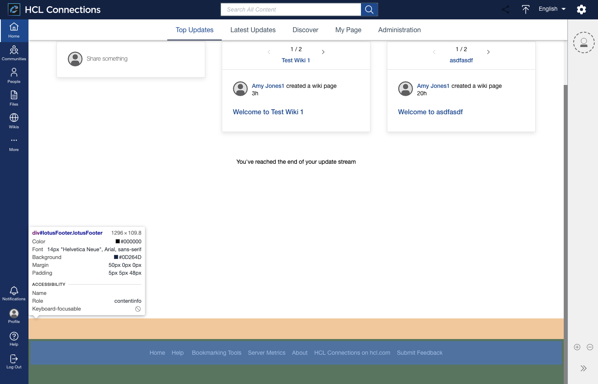

# Customizing the footer

The footer contains links to common resources or references. To improve the footer's functionality, you can apply legacy customization, which involves editing the `footer.jsp` to control the footer content. For more information, refer to [Customizing the footer](https://help.hcltechsw.com/connections/v7/admin/customize/t_admin_common_add_footer_link.html) in the HCL Connections 7.0 documentation.

**Parent topic**: [Customizing the user interface](t_admin_common_customize_main.md)