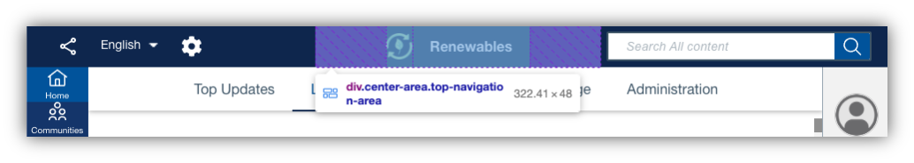

# Customizing the header

Custom configuration for the header is part of the overall custom styles extension. Take advantage of this to reposition the header elements (logo, search box, share actions, language selector, and theme switcher), customize the logo, and more.

The header expects the `top-navigation` object within `style-customization` to be defined with configuration for the elements contained within its left, center, and right areas. Refer to the following JSON snippet, which contains properties that you can use to alter the makeup of the header.

```
{
    "style-customization": {
        "generic": {
            ...
        },
        "top-navigation": {
            "actions": {
                "position": "left"
            },
            "search": {
                "position": "right"
            },
            "logo": {
                "position": "center",
                "order": "1",
                "src": "/logos/renewables-logo.png"
            },
            "text": {
                "position": "center",
                "order": "2",
                "content": "Renewables"
            }
        }
    }
}
```

Where:

-   `actions` corresponds to the action icons displayed in the header
-   `search` corresponds to the search box
-   `logo` points to the logo in the header
-   `text` corresponds to optional text to be displayed in the header

You can define the properties of these together or independently of one another, as in the provided example.

## Repositioning header elements

The `actions`, `search`, `logo`, and `text` values each expect defined `position` and `order` properties:

-   `position`

    These definitions should reflect where in the header each element should be displayed and in what sequence.

    Given that the header only has three aforementioned areas, you can indicate only the following alignments:

    -   `left` to place the element within the left side of the header
    -   `center` to place the element within the center of the header
    -   `right` to place the element within the right side of the header

    Take the previous JSON snippet for example, which had the following configuration: 

    ```
    {
        "style-customization": {
            "generic": {
                ...
            },
            "top-navigation": {
                "actions": {
                    "position": "left"
                }
            }
        }
    }
    ```

    This would render the following UI change:

    

-   `order`

    The `position` alignments are implemented through area containers in which the objects reside. If there is more than one element within a given area, you can use the `order` property to define the order in which the elements should be displayed in that specific area. By default, each element has the same order of 5 leading to a first added, first positioning from the left. A smaller order leads to the element preceding another element, and vice versa.

    To illustrate the point, refer to the `logo` and `text` properties in the first JSON snippet. They share a center position but use the `order` property to indicate that the logo should be to the left of the text:

    

!!! Note 
    
    Under the hood, elements are positioned via CSS flexbox, with three areas (left, center, and right) and the ordering of elements. Natively, this applies right-to-left rearrangement for bi-directional languages like Arabic:

    

## Changing the HCL Connections logo

To reflect the look and feel of your organization on HCL Connections, you can replace the default logo in the header with your company logo. You need to define the `image` property in the header configuration by specifying the `src` tag. This tag points to the actual image that displays as the logo. You can reference any static image that is accessible to you and is in a supported format, such as .jpeg, .png, .svg, and so on.


You can further optimize the image by defining its rendering size. For more information, refer to custom header styles in [Customizing the look and feel of HCL Connections](customizing-look-and-feel.md#header).

## Adding header text

Optionally, you can add header text through the `text` property, which requires an additional `content` value. In this value, specify the actual text you want displayed on the Connections header. By default, the text appears on the left.


**Parent topic**: [Customizing the user interface](t_admin_common_customize_main.md)