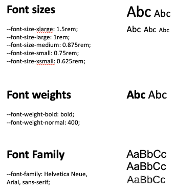

# Customizing the look and feel of HCL Connections

The Connections custom styles are a generic and simplified way of applying style customizations to Connections components. The core idea is that components expect and support properties to define their style. 

Throughout this topic, you will find names such as `--color-header`. These names translate to CSS properties that are used throughout UI components, and which you can modify according to your preferred styling. For instance, you can adjust the colorway to match different themes and branding requiremnts. In other cases, you can resize elements or fonts. Connections provides integration points for overwriting these values in a declarative manner to adjust the look and feel of the UI.

## Applying custom configuration

The custom styles use the extension type `com.hcl.connections.custom.style`.

For guidance on how CSS properties should be defined, refer to the following JSON snippet. This example contains properties that can be used to alter the makeup of the header:

```
{
    "style-customization": {
        "generic": {
            "--color-header": "red",
            "--color-navigation": "yellow",
            "--color-footer": "pink",
            "--color-itmbar": "cyan",
            "--size-itmbar-icon": "30px"
        },
        "top-navigation": {
            ...
        }
    }
}
```

The example uses some of the following properties and supports others:

-   `generic` object expects key-value pairs that would overwrite the existing styles contained in the base Connections UI. The values for this fall into different categories:

    -   `color` values need a valid color value, for example HEX.
    -   `size` values need a valid size value, for example `px`. 

        `--font-size` counts as a size value and is defined in `rem` by default.

    -   `font-weight` values need a valid font weight, for example `400` or `bold`.
    -   `font-family` values need a valid font family value, such as `Helvetica Neue, Arial, sans-serif`.

-   `top-navigation` object relates to elements and their positioning within the header. For more information, refer to [Customizing the header](customizing-header.md).

## Customizing other UI components or areas

For an expanded list of all currently existing properties that you can use to customize a UI component or area, refer to the following tables.

### Fonts

Connections primarily uses the following font sizes, weights, and families:

```
// Font sizes
--font-size-xlarge      : 1.5rem;
--font-size-large       : 1rem;
--font-size-medium      : 0.875rem;
--font-size-small       : 0.75rem;
--font-size-xsmall      : 0.625rem;
--font-size-header      : 1rem;

// Font weights
--font-weight-bold      : bold; 
--font-weight-normal    : 400;

// Font Family
--font-family           : Helvetica Neue, Arial, sans-serif; 
```

Which renders as the following:



To change font styles, refer to the following sections.

#### Font sizes

To change the size of the indicated text category or area, use the following properties:

| Property key | Default value | Usage |
|--------------------|---------------|-----------------------|
| `--font-size-xlarge` | 1.5rem        | Content headlines     |
| `--font-size-large`  | 1rem          | Top navigation links  |
| `--font-size-medium` | 0.875rem      | Most content          |
| `--font-size-small`  | 0.75rem       | Captions and footnotes   |
| `--font-size-xsmall` | 0.625rem      | Side navigation text  |
| `--font-size-header` | 1rem          | Header area           |

#### Font weights

To change the visual weight of the indicated text category or area, use the following properties:

| Property key         | Default value | Usage|
|----------------------|---------------|-----------------------|
| `--font-weight-bold`   | bold          | Header, @mentions     |
| `--font-weight-normal` | 400           | Most content          |
| `--font-weight-header` | bold          | Header area           |

#### Font family

To change the fonts for all content, use the following properties:

| Property key         | Default value                      | Usage |
|----------------------|------------------------------------|-----------------------|
| `--font-family`        | Helvetica Neue, Arial, sans-serif; | All content           |

#### Font colors

To change the color of the indicated text category, use the following properties:

| Property key           | Default value                      | Usage |
|------------------------|------------------------------------|-----------------------|
| --color-text-primary   | #000000                            | Primary text color (all normal text) |
| --color-text-secondary | #3D5466                            | Secondary text color (e.g. captions) |

### Main content 

To customize the background colors and separators (box shadows and borders) of the indicated UI areas in the main content, use the following properties:

| Property key                        | Default value | Usage |
|-------------------------------------|---------------|-----------------------|
| --color-base-background             | #FFFFFF       | General background    |
| --color-main-background             | #FFFFFF       | Background of content item, for example posts |
| --color-main-hover-background       | #E6E6E6       | Hover color for content items (where hover is applicable) |
| --color-main-box-shadow             | 0 0 0 <br><br> This property requires the color value in RGB notation as it adds an additional alpha value for opacity.        | Box shadow (border) of content items |
| --color-main-secondary-background   | #F2F2F2       | Background color for content within content, for example captions |
| --color-main-seconday-border        | #E6E6E6       | Border color for secondary content, for example captions |

### Scrollbar 

Connections uses a custom CSS-based scrollbar, which you can style with the following options:

| Property key                        | Default value | Usage |
|-------------------------------------|---------------|-----------------------|
| --color-scrollbar                   | #F2F2F2       | Color of the general scrollbar |
| --color-scrollbar-thumb             | #8F8F8F       | Color of the scroll thumb or indicator |
| --color-scrollbar-thumb-hover       | #5C5C5C       | Hover color of the scroll thumb or indicator |

### Header

| Property key                        | Default value | Usage |
|-------------------------------------|---------------|-----------------------|
| --color-header                      | #0D264D       | Background color |
| --color-header-text                 | #FFFFFF       | Color of text in the header |
| --size-header-image-height          | 30px          | Height of the header logo; scales both height and width |
| --size-header-spacing               | 20px          | Spacing between elements within the header area |

### Navigation

#### Side navigation bar

| Property key                        | Default value | Usage |
|-------------------------------------|---------------|-----------------------|
| --color-navigation                  | #14356A       | Background color |
| --color-navigation-selected         | #01539B       | Background color of active or selected option |
| --color-navigation-text             | #FFFFFF       | Text color for side navigation bar |

#### Third-level navigation

| Property key                        | Default value | Usage |
|-------------------------------------|---------------|-----------------------|
| --color-third-navigation            | #f1f1f1       | Background color |
| --color-third-navigation-selected   | #d5d5d5       | Background color of active or selected option |
|  --color-third-navigation-text      | #000000       | Text color for third-level navigation |

### Important To Me (ITM) Bar

| Property key                        | Default value | Usage  |
|-------------------------------------|---------------|----------------------|
| --color-itmbar                      | #F2F2F2       | Background color |
| --size-itmbar-icon                  | 48px          | Size of profile icons within the ITM bar |

### Footer

| Property key                        | Default value | Usage |
|-------------------------------------|---------------|-----------------------|
| --color-footer                      | #0D264D       | Background color |
| --color-footer-text                 | #FFFFFF       | Text color |
| --color-footer-text-hover           | #D3D9DE       | Link color on hover |

### Search

| Property key                        | Default value | Usage |
|-------------------------------------|---------------|-----------------------|
| --color-search                      | #FFFFFF       | Background color |
| --color-search-text                 | #000000       | Text color |
| --color-search-selected             | rgba(0, 0, 0, 0.04) | Background color on hover |

### Links

| Property key                        | Default value | Usage  |
|-------------------------------------|---------------|-----------------------|
| --color-link                        | #01539B       | Link color |
| --color-link-hover                  | #092B51       | Link color on hover |

### Buttons

Buttons in the Connections 8.0 UI have changed from Connections 7.0, in that their design has become more focused to the role they fulfill. As such, we now differentiate between primary and secondary actions.

Primary actions are calls to action. They are important and are used to achieve a certain task on a page, for example 'Save', 'Create Topic', 'Edit', and so on.

Secondary actions are any other actions that are available to the user, but which are more or less optional or negative actions. Some examples include 'Cancel', 'Close', or 'Delete'. Secondary actions leverage different button designs depending on whether they are displayed within a normal view (as [outlined buttons](#outlined-buttons)) or a modal or popup dialog (as [text buttons](#text-buttons)).

There is also an additional state for disabled actions, which are generally available but are disabled since they do not apply to the current context or user.

|Button type|Button|On hover|When disabled|
|---|---|---|---|
|**Contained button** <br> Contained buttons are always displayed as a typical button, filled in with contrasting text. On hover, the button color changes to a darker hue (pressing state) and casts a box shadow.|  |  | |
|**Outlined button** <br> Outlined buttons are used in normal content or views. Style-wise, they have borders in the color of a normal button, but without fill. The text color is the same as the button as well. On hover, they behave the same way as a contained button.|  |  |  |
|**Text button** <br> Text buttons are used in modal or popup dialogs, and are more similar to links than to actual buttons. The text is displayed in the same color as the previous button types and changes on hover as well. There is no border or box shadow.|  |  |  |

You can customize many aspects of a button's style, for example its background color in general and in specific states, like on hover or when disabled:

| Property key                        | Default value | Usage|
|-------------------------------------|---------------|-----------------------|
| --color-button                      | #01539B       | Background color |
| --color-button-hover                | #092B51       | Background color on hover |
| --color-button-text                 | #FFFFFF       | Text color |
| --color-button-disabled             | #E6E6E6       | Background color for disabled buttons |
| --color-button-disabled-text        | #ADADAD       | Text color for disabled buttons |

### Notifications or snackbars
| Property key                        | Default value | Usage |
|-------------------------------------|---------------|-----------------------|
| --color-info-message                | #273641       | Background color |
| --color-info-message-text           | #FFFFFF       | Text color |
| --color-info-message-link           | #2ABDEA       | Link color |
| --color-info-message-link-hover     | #14A1DE       | Link color on hover |

### Administrative banner

The banner uses different styles depending on the severity levels:

**Severity: Success**

| Property key                        | Default value | Usage |
|-------------------------------------|---------------|-----------------------|
| --color-admin-banner-success        | #E4FDED       | Background color |
| --color-admin-banner-success-text   | #000000       | Text color |

**Severity: Info**

| Property key                        | Default value | Usage |
|-------------------------------------|---------------|-----------------------|
| --color-admin-banner-info           | #F9EEFF       | Background color |
| --color-admin-banner-info-text      | #000000       | Text color |

**Severity: Warning**

| Property key                        | Default value | Usage  |
|-------------------------------------|---------------|-----------------------|
| --color-admin-banner-warning        | #FFF6E2       | Background color |
| --color-admin-banner-warning-text   | #000000       | Text color |

**Severity: Error**

| Property key                        | Default Vvalue | Usage  |
|-------------------------------------|---------------|-----------------------|
| --color-admin-banner-error          | #FFF2F2       | Background color |
| --color-admin-banner-error-text     | #000000       | Text color |

For information on configuring the banner and updating its content, refer to [Administering the display of a site-wide banner](../admin/admin_banner_onprem.md).

### Modals

| Property key                        | Default value | Usage |
|-------------------------------------|---------------|-----------------------|
| --color-modal-header                | #FFFFFF       | Header background color |
| --color-modal-header-text           | #000000       | Header text color |

### Badges

| Property key                        | Default value | Usage  |
|-------------------------------------|---------------|-----------------------|
| --color-badge                       | #C10C0D       | Background color |
| --color-badge-text                  | #FFFFFF       | Text color |

### Chips

| Property key                        | Default value | Usage |
|-------------------------------------|---------------|-----------------------|
| --color-chip                        | #E6E6E6       | Background color |
| --color-chip-text                   | #000000       | Text color |
| --color-chip-close                  | #ADADAD       | Background color of close icon |
| --color-chip-close-hover            | #8F8F8F       | Background color of close icon on hover |

### Tabs

| Property key                        | Default value | Usage  |
|-------------------------------------|---------------|-----------------------|
| --color-tab                         | #FFFFFF       | Background color |
| --color-tab-text                    | #3D5466       | Text color |
| --color-tab-text-selected           | #01539B       | Text color of active or selected option |
| --color-tab-border-selected         | #0D264D       | Border or highlight of active or selected option |

### Toggles

| Property key                        | Default value | Usage  |
|-------------------------------------|---------------|-----------------------|
|  --color-switch-primary             | #6e9bc2       | Active toggle background color |


**Parent topic**: [Customizing the user interface](t_admin_common_customize_main.md)