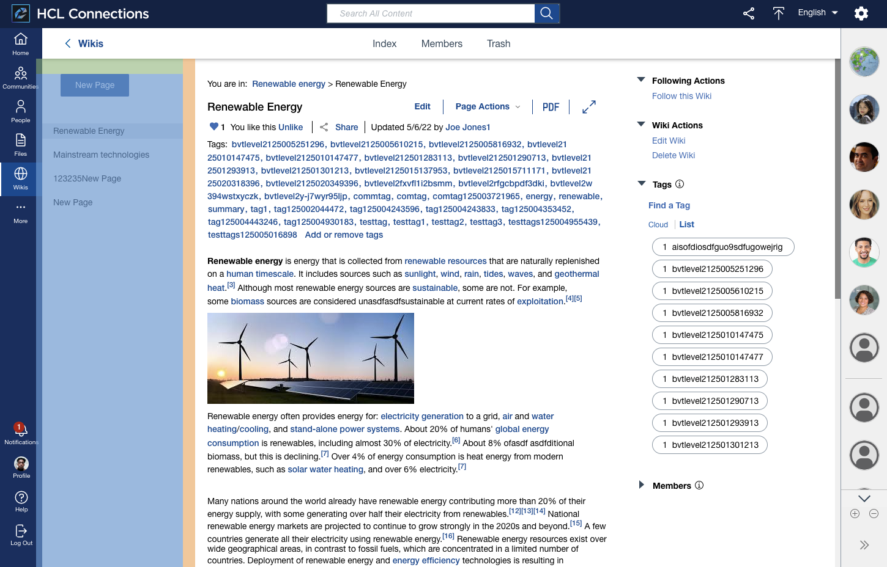

# Customizing navigation

The new user interface has three areas of navigation:

-   **Side navigation bar**

    Contains menus that are specific to the available Connections apps and important user links. For more information, refer to [Customizing the side navigation bar](customizing-side-navigation.md).

-   **Top navigation bar**

    Contains top-level links that are connected to the application a user is currently viewing.

    

-   **Third-level navigation**

    Contains menus that are specific to the application a user is currently viewing. This could be wiki pages in a Wiki or sub-menus in the Files application.

    

You can customize the style of the side navigation bar and third-level navigation. For the top navigation bar, there are no custom styles. However, styles for specific components within it, like links and tabs, are available. For more information, refer to [Customizing the look and feel of HCL Connections](customizing-look-and-feel.md#navigation).

**Parent topic**: [Customizing the user interface](t_admin_common_customize_main.md)