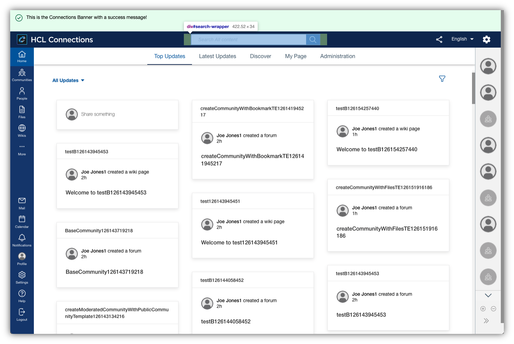

# Customizing search

The search box in the header area provides a seamless way of finding what you're looking for. It shows the pages you recently visited (for Component Pack deployments only) or quick results via typeahead. On search, it opens the full search page. It also reacts contextually with different filter options, recent content, or recommendations, depending on the interaction and the current Connections application that you're viewing.




## Customizing the search box style

There are no custom styles for the main content as a whole, but styles for specific components that appear for search (that is, links, buttons, and chips) are available. For more information, refer to [Customizing the look and feel of HCL Connections](customizing-look-and-feel.md).

## Reconfiguring search options

Using the Connections navigation extension, you can customize search to adjust the search results and behavior. The app registry also allows you to provide translations for menu entries in the same declarative manner as other values.

The following JSON snippet contains properties that you can use to alter the makeup and options of the search box. The custom styles use the extension type `com.hcl.search.customization`:

```
{
    "searchResultOptions": [
        {
            "searchURL": "http://www.google.com/search?q=${searchTerm}",
            "options": [
                {
                    "label": "Google",
                    "url": "http://www.google.com/search?q=${searchTerm}"
                },
                {
                    "label": "Connection",
                    "url": "<your-connections-host>/homepage/web/updates/#topUpdates/topUpdates/all&qs=${searchTerm}&scope=allconnections&ntf=false&p=1&ps=10&soc=%7B%7D&sk=relevance&pers=false&ppl=&t=&dr=&do=all"
                },
                {
                    "label": "Sharepoint",
                    "url": "<your-sharepoint-site>/search.aspx/siteall?q=${searchTerm}"
                }
            ]
        }
    ]
}
```

Where:

-   `searchURL` property defines what search website to open when clicking on the search button or pressing enter.
-   `options` provide an array of search results that the user can select when typing a search query. These results will be displayed as a list below the search box. Each search option should be provided as a JSON object with the following properties:
    -   `label` for the name of the search endpoint to be presented to the user
    -   `url` for the URL that opens when the user clicks the option

!!! Note

    `${searchTerm}` is a placeholder. When the user enters a search query, this will be replaced by that query and thus should be the query parameter used in the search endpoint to be configured.


**Parent topic**: [Customizing the user interface](t_admin_common_customize_main.md)