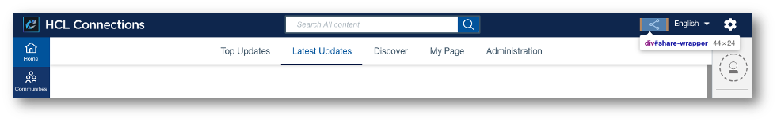

# Customizing share

With the share options in the new Connections header, users can share the page that they're currently viewing with other users within Connections or on external applications.




The share action doesn’t leverage specific custom styles, and instead inherits styles from the modal component.

## Configuring sharing options and behaviors

Modify sharing to add different options and behaviors, most commonly to introduce sharing to third-party applications like Microsoft Teams. The following example outlines the specific configuration required to add Microsoft Teams as a sharing option, but generally applies to other options as well.

```
{
    "name": "MS Teams Share Extension",
    "title": "MS Teams Share",
    "description": "Share extension to share link of current page into a Teams channel",
    "services": [
        "Connections"
    ],
    "state": "enabled",
    "extensions": [
        {
            "name": "MS Teams Share",
            "type": "com.hcl.share.extension",
            "payload": {
                "title": "Share in Teams",
                "include-files": [
                    "/files/customizer/share-extensions/ms-teams/connections-teams-share-extension-8.0.js"
                ],
                "cache-headers": {
                    "cache-control": "max-age=43200"
                },
                "className": "teams-share-button",
                "icon": {
                    "type": "svg",
                    "data": "data:image/svg+xml;base64,PHN2Zy ... 3N2Zz4="
                }
            },
            "path": "global",
            "state": "enabled"
        }
    ]
}
```

The most important properties are as follows:

-   `name`

    Defines the name that is used to show the added option in the dropdown list of sharing options. The dropdown appears if there is at least one share extension defined, and contains all available and enabled share extensions.

-   `type`

    The extension by which share extensions are recognized.

-   `icon`

    Defines the image that is used to represent the added option in the dropdown list of sharing options.

    

-   `include-files`

    Defines an additional JavaScript resource, which is added to the DOM <!---What does this stand for?---> to execute a specific function. This JavaScript resource is expected to contain the `openShareExtension` function, which should contain the logic to open the dialog to the appropriate system.

    You can add this file, for example using Customizer, but generally this simply needs to be a static resource that is available to all users. For example, the JavaScript file specified in the previous example named `connections-teams-share-extension-8.0.js` has the following contents:

    ```
    function openShareExtension() {   
    let shareUrl = `https://teams.microsoft.com/share?href=${window.location.href}&referrer=${window.location.host}&s=${Date.now()}`;
    shareUrl = shareUrl.replace(/(href=).*?(&)/, '$1' + encodeURIComponent(window.location.href) + '$2');
    window.open(shareUrl, '_blank', 'width=700,height=600');        
    }
    ```
    Which would lead to the following dialog being displayed in a new tab:

    


**Parent topic**: [Customizing the user interface](t_admin_common_customize_main.md)