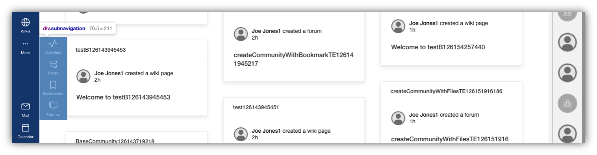

# Customizing the side navigation bar

The side navigation bar contains menus that are specific to the available Connections apps and important user links. These are separated into a main and bottom area, as well as sub-menus. 




## Custom styling

You can customize the visual properties of the side navigation bar, such as its background color and text color. For more information, refer to [Customizing the look and feel of HCL Connections](customizing-look-and-feel.md#navigation).

## Customizing menus and menu entries

Using extensions for the Connections navigation, you can customize the side navigation in a number ways. You can change or remove menus, and add custom menu entries or sub-menus. You can also provide translations for the menu entries through the app registry service.

As an example, the following JSON snippet contains properties that you can use to alter the makeup of the menu entries within the side navigation:

```
{
    "customEntries": [
        {
            "id": "intranet",
            "name": "Intranet",
            "action": "add",
            "link": "https://customer.com/",
            "icon": "https://customer.com/images/logo.png",
            "order": 7000,
            "new_window": true,
            "submenu": [],
            "location": "main"
        },
        {
            "id": "homepage",
            "name": "My Home",
            "action": "update"
        }
    ]
}
```

The properties are as follows:

|Property name &nbsp; &nbsp; &nbsp; &nbsp;|Description|
|-----|-----|
|`customEntries`|This array expects a list of actions that would override default entries. To get an idea of these default entries, refer to the snapshot provided in the latter part of this document.|
|`action`|An attribute within an entry, which defines what type of change must be applied to the navigation. You can indicate the following actions: <br><br> - `add` to add a new entry to the navigation. This option requires the additional properties `id`, `link`, `icon` and `location`. <br> - `remove` to remove an existing entry from the navigation. This option requires the additional property `id`. <br> - `update` to update an existing entry with the provided properties.|
|`id`|Allows you to add or remove an entry, matching the given `action` for the entry. <br> For `add` actions, make sure to define a unique arbitrary `id`. <br> The `id` is also used as a default label in case no other `name` has been provided, and no translation exists in the system.| 
|`name`|Defines the label to display for the entry. <br><br> **Note**: For translations, you can use the generic approach available through the app registry.|
|`location`|Defines where in the navigation the entry should be displayed. You can designate either `main` or `bottom` for the corresponding areas.|
|`order`|Sorts entries within the area specified in `location` from the lowest numerical value to the highest, top to bottom respectively.|
|`link`|Specifies the navigation target that the entry should direct to.
|`icon`|Allows you to provide an image source, which can be either a link to a static image or an inline image, for example an encoded .svg data object.
|`submenu`|Lets you add a menu with more options. This configuration expects the entries within the submenu to be provided as a list. For an example, refer to the `more` element in the default entries snapshot below. <br><br> The `submenu` is only recognized and applied in the `main` area.|

## Configuring navigation entry display according to user roles

Optionally, entries can define properties that validate the role of the user and determine if the navigation entry should be displayed for the user. The role values correspond to Connections application-defined user roles for the `Common` application.

As a Connections WebSphere administrator, you can access the roles list for the Common application by launching the WebSphere administration console and navigating to the list of installed Enterprise Applications. Then, select the application named **Common**, and view **Security role to user/group mapping**.

**Property names**

You can add the following properties:

- `forbiddenRoles` to only display the navigation entry if the user does not contain any of the supplied roles. This property is commonly used with the value of `external`, which would only show the menu entry for internal users.

- `requiredRoles` to only display the navigation entry if the user has any of the supplied roles. For example, a required role of `global-moderator` is used to display the Moderation entry on systems where the Moderation application is enabled.

**Special role values**

These do not reflect true application security roles, but can be used for the purpose described. as follows:

- `external` refers to the user who is an external user of the system (not an internal employee).

- `internal` refers to the user who is an internal employee.

- `authenticated` refers to the user who has been authenticated.

- `anonymous` refers to the user has not been authenticated.

### Sample role designations

In this example, we are extending the previous example to require that the intranet application entry is never displayed for external users.

```
{
    "customEntries": [
        {
            "id": "intranet",
            "name": "Intranet",
            "action": "add",
            "link": "https://customer.com/",
            "icon": "https://customer.com/images/logo.png",
            "order": 7000,
            "new_window": true,
            "submenu": [],
            "location": "main",
            "forbiddenRoles": "external"
        }
    ]
}
```

Another example, which would only display an entry for users with the `admin` role:

```
{
    "customEntries": [
        {
            "id": "adminapp",
            "name": "adminapp",
            "action": "add",
            "link": "https://customer.com/adminapp",
            "icon": "https://customer.com/images/adminlogo.png",
            "order": 7000,
            "new_window": true,
            "submenu": [],
            "location": "main",
            "requiredRoles": "admin"
        }
    ]
}
```

## Snapshot of default entries

The following is a snapshot of the default entries in the `react-nav.json` file:

```
{
    "navbarmenus": {
      "main_menus": [
        {
          "id": "homepage",
          "link": "/homepage",
          "alternate_links": [],
          "icon": "data:image/svg+xml;base64,PHN2ZyBpZD0iU3ZnanNTdmcxMDY3IiB3aWR0aD0iMjg4IiBoZWlnaHQ9IjI4OCIgeG1sbnM9Imh0dHA6Ly93d3cudzMub3JnLzIwMDAvc3ZnIiB2ZXJzaW9uPSIxLjEiIHhtbG5zOnhsaW5rPSJodHRwOi8vd3d3LnczLm9yZy8xOTk5L3hsaW5rIiB4bWxuczpzdmdqcz0iaHR0cDovL3N2Z2pzLmNvbS9zdmdqcyI+PGRlZnMgaWQ9IlN2Z2pzRGVmczEwNjgiPjwvZGVmcz48ZyBpZD0iU3ZnanNHMTA2OSI+PHN2ZyB4bWxucz0iaHR0cDovL3d3dy53My5vcmcvMjAwMC9zdmciIHdpZHRoPSIyODgiIGhlaWdodD0iMjg4IiB2aWV3Qm94PSIwIDAgMzIgMzIiPjxyZWN0IHdpZHRoPSIzMiIgaGVpZ2h0PSIzMiIgZmlsbD0ibm9uZSIgZGF0YS1uYW1lPSImYW1wO2x0O1RyYW5zcGFyZW50IFJlY3RhbmdsZSZhbXA7Z3Q7Ij48L3JlY3Q+PHBhdGggZD0iTTE2LjYxMjMsMi4yMTM4YTEuMDEsMS4wMSwwLDAsMC0xLjI0MjcsMEwxLDEzLjQxOTRsMS4yNDI3LDEuNTcxN0w0LDEzLjYyMDlWMjZhMi4wMDQxLDIuMDA0MSwwLDAsMCwyLDJIMjZhMi4wMDM3LDIuMDAzNywwLDAsMCwyLTJWMTMuNjNMMjkuNzU3MywxNSwzMSwxMy40MjgyWk0xOCwyNkgxNFYxOGg0Wm0yLDBWMThhMi4wMDIzLDIuMDAyMywwLDAsMC0yLTJIMTRhMi4wMDIsMi4wMDIsMCwwLDAtMiwydjhINlYxMi4wNjE1bDEwLTcuNzksMTAsNy44MDA1VjI2WiIgZmlsbD0iI2ZmZmZmZiIgY2xhc3M9ImNvbG9yMDAwIHN2Z1NoYXBlIj48L3BhdGg+PC9zdmc+PC9nPjwvc3ZnPg==",
          "order": 1000,
          "submenu": [],
          "coreCnxService": "homepage"
        },
        {
          "id": "communities",
          "link": "/communities/service/html/allmycommunities",
          "alternate_links": [],
          "icon": "data:image/svg+xml;base64,PD94bWwgdmVyc2lvbj0iMS4wIiBlbmNvZGluZz0iVVRGLTgiPz4KPHN2ZyB3aWR0aD0iNDhweCIgaGVpZ2h0PSI0OHB4IiB2aWV3Qm94PSIwIDAgNDggNDgiIHZlcnNpb249IjEuMSIgeG1sbnM9Imh0dHA6Ly93d3cudzMub3JnLzIwMDAvc3ZnIiB4bWxuczp4bGluaz0iaHR0cDovL3d3dy53My5vcmcvMTk5OS94bGluayI+CiAgICA8dGl0bGU+aWNvbi91c2VyL2NvbW11bml0eS8yNDwvdGl0bGU+CiAgICA8ZyBpZD0iaWNvbi91c2VyL2NvbW11bml0eS8yNCIgc3Ryb2tlPSJub25lIiBzdHJva2Utd2lkdGg9IjEiIGZpbGw9Im5vbmUiIGZpbGwtcnVsZT0iZXZlbm9kZCI+CiAgICAgICAgPHBhdGggZD0iTTE0Ljc2OTIzMDgsMzcgQzE5LjAxMjMwNzcsMzcgMjIuNDYxNTM4NSw0MC4zNjMgMjIuNDYxNTM4NSw0NC41IEwyMi40NjE1Mzg1LDQ0LjUgTDIyLjQ2MTUzODUsNDYgTDE5LjM4NDYxNTQsNDYgTDE5LjM4NDYxNTQsNDQuNSBDMTkuMzg0NjE1NCw0Mi4wMTkgMTcuMzEzODQ2Miw0MCAxNC43NjkyMzA4LDQwIEwxNC43NjkyMzA4LDQwIEwxMS42OTIzMDc3LDQwIEM5LjE0NzY5MjMxLDQwIDcuMDc2OTIzMDgsNDIuMDE5IDcuMDc2OTIzMDgsNDQuNSBMNy4wNzY5MjMwOCw0NC41IEw3LjA3NjkyMzA4LDQ2IEw0LDQ2IEw0LDQ0LjUgQzQsNDAuMzYzIDcuNDQ5MjMwNzcsMzcgMTEuNjkyMzA3NywzNyBMMTEuNjkyMzA3NywzNyBaIE0zNi4zMDc2OTIzLDM3IEM0MC41NTA3NjkyLDM3IDQ0LDQwLjM2MyA0NCw0NC41IEw0NCw0NC41IEw0NCw0NiBMNDAuOTIzMDc2OSw0NiBMNDAuOTIzMDc2OSw0NC41IEM0MC45MjMwNzY5LDQyLjAxOSAzOC44NTIzMDc3LDQwIDM2LjMwNzY5MjMsNDAgTDM2LjMwNzY5MjMsNDAgTDMzLjIzMDc2OTIsNDAgQzMwLjY4NjE1MzgsNDAgMjguNjE1Mzg0Niw0Mi4wMTkgMjguNjE1Mzg0Niw0NC41IEwyOC42MTUzODQ2LDQ0LjUgTDI4LjYxNTM4NDYsNDYgTDI1LjUzODQ2MTUsNDYgTDI1LjUzODQ2MTUsNDQuNSBDMjUuNTM4NDYxNSw0MC4zNjMgMjguOTg3NjkyMywzNyAzMy4yMzA3NjkyLDM3IEwzMy4yMzA3NjkyLDM3IFogTTEzLjIzMDc2OTIsMTkgQzE3LjQ4LDE5IDIwLjkyMzA3NjksMjIuMzU3IDIwLjkyMzA3NjksMjYuNSBDMjAuOTIzMDc2OSwzMC42NDMgMTcuNDgsMzQgMTMuMjMwNzY5MiwzNCBDOC45ODE1Mzg0NiwzNCA1LjUzODQ2MTU0LDMwLjY0MyA1LjUzODQ2MTU0LDI2LjUgQzUuNTM4NDYxNTQsMjIuMzU3IDguOTgxNTM4NDYsMTkgMTMuMjMwNzY5MiwxOSBaIE0zNC43NjkyMzA4LDE5IEMzOS4wMTg0NjE1LDE5IDQyLjQ2MTUzODUsMjIuMzU3IDQyLjQ2MTUzODUsMjYuNSBDNDIuNDYxNTM4NSwzMC42NDMgMzkuMDE4NDYxNSwzNCAzNC43NjkyMzA4LDM0IEMzMC41MiwzNCAyNy4wNzY5MjMxLDMwLjY0MyAyNy4wNzY5MjMxLDI2LjUgQzI3LjA3NjkyMzEsMjIuMzU3IDMwLjUyLDE5IDM0Ljc2OTIzMDgsMTkgWiBNMTMuMjMwNzY5MiwyMiBDMTAuNjg2MTUzOCwyMiA4LjYxNTM4NDYyLDI0LjAxOSA4LjYxNTM4NDYyLDI2LjUgQzguNjE1Mzg0NjIsMjguOTgxIDEwLjY4NjE1MzgsMzEgMTMuMjMwNzY5MiwzMSBDMTUuNzc1Mzg0NiwzMSAxNy44NDYxNTM4LDI4Ljk4MSAxNy44NDYxNTM4LDI2LjUgQzE3Ljg0NjE1MzgsMjQuMDE5IDE1Ljc3NTM4NDYsMjIgMTMuMjMwNzY5MiwyMiBaIE0zNC43NjkyMzA4LDIyIEMzMi4yMjQ2MTU0LDIyIDMwLjE1Mzg0NjIsMjQuMDE5IDMwLjE1Mzg0NjIsMjYuNSBDMzAuMTUzODQ2MiwyOC45ODEgMzIuMjI0NjE1NCwzMSAzNC43NjkyMzA4LDMxIEMzNy4zMTM4NDYyLDMxIDM5LjM4NDYxNTQsMjguOTgxIDM5LjM4NDYxNTQsMjYuNSBDMzkuMzg0NjE1NCwyNC4wMTkgMzcuMzEzODQ2MiwyMiAzNC43NjkyMzA4LDIyIFogTTI0LDQgQzI4LjI0OTIzMDgsNCAzMS42OTIzMDc3LDcuMzU3IDMxLjY5MjMwNzcsMTEuNSBDMzEuNjkyMzA3NywxNS42NDMgMjguMjQ5MjMwOCwxOSAyNCwxOSBDMTkuNzUwNzY5MiwxOSAxNi4zMDc2OTIzLDE1LjY0MyAxNi4zMDc2OTIzLDExLjUgQzE2LjMwNzY5MjMsNy4zNTcgMTkuNzUwNzY5Miw0IDI0LDQgWiBNMjQsNyBDMjEuNDU1Mzg0Niw3IDE5LjM4NDYxNTQsOS4wMTkgMTkuMzg0NjE1NCwxMS41IEMxOS4zODQ2MTU0LDEzLjk4MSAyMS40NTUzODQ2LDE2IDI0LDE2IEMyNi41NDQ2MTU0LDE2IDI4LjYxNTM4NDYsMTMuOTgxIDI4LjYxNTM4NDYsMTEuNSBDMjguNjE1Mzg0Niw5LjAxOSAyNi41NDQ2MTU0LDcgMjQsNyBaIiBpZD0iQ29tYmluZWQtU2hhcGUiIGZpbGw9IiNGRkZGRkYiPjwvcGF0aD4KICAgIDwvZz4KPC9zdmc+",
          "order": 2000,
          "submenu": [],
          "coreCnxService": "communities"
        },
        {
          "id": "people",
          "link": "/profiles/html/networkView.do?widgetId=friends&requireAuth=true",
          "alternate_links": [
            "/profiles/html/profileView.do",
            "/profiles/html/networkView.do",
            "/profiles/html/searchProfiles.do"
          ],
          "icon": "data:image/svg+xml;base64,PHN2ZyBpZD0iU3ZnanNTdmcxMDYxIiB3aWR0aD0iMjg4IiBoZWlnaHQ9IjI4OCIgeG1sbnM9Imh0dHA6Ly93d3cudzMub3JnLzIwMDAvc3ZnIiB2ZXJzaW9uPSIxLjEiIHhtbG5zOnhsaW5rPSJodHRwOi8vd3d3LnczLm9yZy8xOTk5L3hsaW5rIiB4bWxuczpzdmdqcz0iaHR0cDovL3N2Z2pzLmNvbS9zdmdqcyI+PGRlZnMgaWQ9IlN2Z2pzRGVmczEwNjIiPjwvZGVmcz48ZyBpZD0iU3ZnanNHMTA2MyI+PHN2ZyB4bWxucz0iaHR0cDovL3d3dy53My5vcmcvMjAwMC9zdmciIHZpZXdCb3g9IjAgMCAzMiAzMiIgd2lkdGg9IjI4OCIgaGVpZ2h0PSIyODgiPjxwYXRoIGQ9Ik0xNiA0YTUgNSAwIDExLTUgNSA1IDUgMCAwMTUtNW0wLTJhNyA3IDAgMTA3IDdBNyA3IDAgMDAxNiAyek0yNiAzMEgyNFYyNWE1IDUgMCAwMC01LTVIMTNhNSA1IDAgMDAtNSA1djVINlYyNWE3IDcgMCAwMTctN2g2YTcgNyAwIDAxNyA3eiIgZmlsbD0iI2ZmZmZmZiIgY2xhc3M9ImNvbG9yMDAwIHN2Z1NoYXBlIj48L3BhdGg+PHJlY3Qgd2lkdGg9IjMyIiBoZWlnaHQ9IjMyIiBmaWxsPSJub25lIiBkYXRhLW5hbWU9IiZhbXA7bHQ7VHJhbnNwYXJlbnQgUmVjdGFuZ2xlJmFtcDtndDsiPjwvcmVjdD48L3N2Zz48L2c+PC9zdmc+",
          "order": 3000,
          "submenu": [],
          "coreCnxService": "profiles"
        },
        {
          "id": "files",
          "link": "/files",
          "alternate_links": [],
          "icon": "data:image/svg+xml;base64,PHN2ZyBpZD0iU3ZnanNTdmcxMDczIiB3aWR0aD0iMjg4IiBoZWlnaHQ9IjI4OCIgeG1sbnM9Imh0dHA6Ly93d3cudzMub3JnLzIwMDAvc3ZnIiB2ZXJzaW9uPSIxLjEiIHhtbG5zOnhsaW5rPSJodHRwOi8vd3d3LnczLm9yZy8xOTk5L3hsaW5rIiB4bWxuczpzdmdqcz0iaHR0cDovL3N2Z2pzLmNvbS9zdmdqcyI+PGRlZnMgaWQ9IlN2Z2pzRGVmczEwNzQiPjwvZGVmcz48ZyBpZD0iU3ZnanNHMTA3NSI+PHN2ZyB4bWxucz0iaHR0cDovL3d3dy53My5vcmcvMjAwMC9zdmciIHdpZHRoPSIyODgiIGhlaWdodD0iMjg4IiBlbmFibGUtYmFja2dyb3VuZD0ibmV3IDAgMCAzMiAzMiIgdmlld0JveD0iMCAwIDMyIDMyIj48cGF0aCBkPSJNMjUuNyw5LjNsLTctN0MxOC41LDIuMSwxOC4zLDIsMTgsMkg4QzYuOSwyLDYsMi45LDYsNHYyNGMwLDEuMSwwLjksMiwyLDJoMTZjMS4xLDAsMi0wLjksMi0yVjEwQzI2LDkuNywyNS45LDkuNSwyNS43LDkuMwl6IE0xOCw0LjRsNS42LDUuNkgxOFY0LjR6IE0yNCwyOEg4VjRoOHY2YzAsMS4xLDAuOSwyLDIsMmg2VjI4eiIgZmlsbD0iI2ZmZmZmZiIgY2xhc3M9ImNvbG9yMDAwIHN2Z1NoYXBlIj48L3BhdGg+PHJlY3Qgd2lkdGg9IjEyIiBoZWlnaHQ9IjIiIHg9IjEwIiB5PSIyMiIgZmlsbD0iI2ZmZmZmZiIgY2xhc3M9ImNvbG9yMDAwIHN2Z1NoYXBlIj48L3JlY3Q+PHJlY3Qgd2lkdGg9IjEyIiBoZWlnaHQ9IjIiIHg9IjEwIiB5PSIxNiIgZmlsbD0iI2ZmZmZmZiIgY2xhc3M9ImNvbG9yMDAwIHN2Z1NoYXBlIj48L3JlY3Q+PHJlY3Qgd2lkdGg9IjMyIiBoZWlnaHQ9IjMyIiBmaWxsPSJub25lIj48L3JlY3Q+PC9zdmc+PC9nPjwvc3ZnPg==",
          "order": 4000,
          "submenu": [],
          "coreCnxService": "files"
        },
        {
          "id": "more",
          "icon": "data:image/svg+xml;base64,PHN2ZyBpZD0iU3ZnanNTdmcxMDAxIiB3aWR0aD0iMjg4IiBoZWlnaHQ9IjI4OCIgeG1sbnM9Imh0dHA6Ly93d3cudzMub3JnLzIwMDAvc3ZnIiB2ZXJzaW9uPSIxLjEiIHhtbG5zOnhsaW5rPSJodHRwOi8vd3d3LnczLm9yZy8xOTk5L3hsaW5rIiB4bWxuczpzdmdqcz0iaHR0cDovL3N2Z2pzLmNvbS9zdmdqcyI+PGRlZnMgaWQ9IlN2Z2pzRGVmczEwMDIiPjwvZGVmcz48ZyBpZD0iU3ZnanNHMTAwOCIgdHJhbnNmb3JtPSJtYXRyaXgoMC45MTY3LDAsMCwwLjkxNjcsMTEuOTk1MjAwMDAwMDAwMDExLDExLjk5NTIwMDAwMDAwMDAxMSkiPjxzdmcgeG1sbnM9Imh0dHA6Ly93d3cudzMub3JnLzIwMDAvc3ZnIiB3aWR0aD0iMjg4IiBoZWlnaHQ9IjI4OCIgZW5hYmxlLWJhY2tncm91bmQ9Im5ldyAwIDAgMzIgMzIiIHZpZXdCb3g9IjAgMCAzMiAzMiI+PGNpcmNsZSBjeD0iOCIgY3k9IjE2IiByPSIyIiBmaWxsPSIjZmZmZmZmIiBjbGFzcz0iY29sb3IwMDAgc3ZnU2hhcGUiPjwvY2lyY2xlPjxjaXJjbGUgY3g9IjE2IiBjeT0iMTYiIHI9IjIiIGZpbGw9IiNmZmZmZmYiIGNsYXNzPSJjb2xvcjAwMCBzdmdTaGFwZSI+PC9jaXJjbGU+PGNpcmNsZSBjeD0iMjQiIGN5PSIxNiIgcj0iMiIgZmlsbD0iI2ZmZmZmZiIgY2xhc3M9ImNvbG9yMDAwIHN2Z1NoYXBlIj48L2NpcmNsZT48cmVjdCB3aWR0aD0iMzIiIGhlaWdodD0iMzIiIGZpbGw9Im5vbmUiPjwvcmVjdD48L3N2Zz48L2c+PC9zdmc+",
          "order": 5000,
          "link": "",
          "alternate_links": [],
          "submenu": [
            {
              "id": "activities",
              "link": "/activities",
              "alternate_links": [],
              "icon": "data:image/svg+xml;base64,PHN2ZyBpZD0iU3ZnanNTdmcxMDI4IiB3aWR0aD0iMjg4IiBoZWlnaHQ9IjI4OCIgeG1sbnM9Imh0dHA6Ly93d3cudzMub3JnLzIwMDAvc3ZnIiB2ZXJzaW9uPSIxLjEiIHhtbG5zOnhsaW5rPSJodHRwOi8vd3d3LnczLm9yZy8xOTk5L3hsaW5rIiB4bWxuczpzdmdqcz0iaHR0cDovL3N2Z2pzLmNvbS9zdmdqcyI+PGRlZnMgaWQ9IlN2Z2pzRGVmczEwMjkiPjwvZGVmcz48ZyBpZD0iU3ZnanNHMTAzMCI+PHN2ZyB4bWxucz0iaHR0cDovL3d3dy53My5vcmcvMjAwMC9zdmciIHZpZXdCb3g9IjAgMCAzMiAzMiIgd2lkdGg9IjI4OCIgaGVpZ2h0PSIyODgiPjxwYXRoIGQ9Ik0xMiwyOWExLDEsMCwwLDEtLjkyLS42Mkw2LjMzLDE3SDJWMTVIN2ExLDEsMCwwLDEsLjkyLjYyTDEyLDI1LjI4LDIwLjA2LDMuNjVBMSwxLDAsMCwxLDIxLDNhMSwxLDAsMCwxLC45My42OEwyNS43MiwxNUgzMHYySDI1YTEsMSwwLDAsMS0uOTUtLjY4TDIxLDcsMTIuOTQsMjguMzVBMSwxLDAsMCwxLDEyLDI5WiIgZmlsbD0iI2ZmZmZmZiIgY2xhc3M9ImNvbG9yMDAwIHN2Z1NoYXBlIj48L3BhdGg+PHJlY3Qgd2lkdGg9IjMyIiBoZWlnaHQ9IjMyIiBmaWxsPSJub25lIiBkYXRhLW5hbWU9IiZhbXA7bHQ7VHJhbnNwYXJlbnQgUmVjdGFuZ2xlJmFtcDtndDsiPjwvcmVjdD48L3N2Zz48L2c+PC9zdmc+",
              "order": 1000,
              "submenu": [],
              "coreCnxService": "activities"
            },
            {
              "id": "blogs",
              "link": "/blogs",
              "alternate_links": [],
              "icon": "data:image/svg+xml;base64,PHN2ZyBpZD0iU3ZnanNTdmcxMDM0IiB3aWR0aD0iMjg4IiBoZWlnaHQ9IjI4OCIgeG1sbnM9Imh0dHA6Ly93d3cudzMub3JnLzIwMDAvc3ZnIiB2ZXJzaW9uPSIxLjEiIHhtbG5zOnhsaW5rPSJodHRwOi8vd3d3LnczLm9yZy8xOTk5L3hsaW5rIiB4bWxuczpzdmdqcz0iaHR0cDovL3N2Z2pzLmNvbS9zdmdqcyI+PGRlZnMgaWQ9IlN2Z2pzRGVmczEwMzUiPjwvZGVmcz48ZyBpZD0iU3ZnanNHMTAzNiI+PHN2ZyB4bWxucz0iaHR0cDovL3d3dy53My5vcmcvMjAwMC9zdmciIHZpZXdCb3g9IjAgMCAzMiAzMiIgd2lkdGg9IjI4OCIgaGVpZ2h0PSIyODgiPjxyZWN0IHdpZHRoPSIxMCIgaGVpZ2h0PSIyIiB4PSI0IiB5PSIyNCIgZmlsbD0iI2ZmZmZmZiIgY2xhc3M9ImNvbG9yMDAwIHN2Z1NoYXBlIj48L3JlY3Q+PHJlY3Qgd2lkdGg9IjEwIiBoZWlnaHQ9IjIiIHg9IjQiIHk9IjE4IiBmaWxsPSIjZmZmZmZmIiBjbGFzcz0iY29sb3IwMDAgc3ZnU2hhcGUiPjwvcmVjdD48cGF0aCBkPSJNMjYgMTRINmEyIDIgMCAwMS0yLTJWNkEyIDIgMCAwMTYgNEgyNmEyIDIgMCAwMTIgMnY2QTIgMiAwIDAxMjYgMTR6TTYgNnY2SDI2VjZ6TTI2IDI4SDIwYTIgMiAwIDAxLTItMlYyMGEyIDIgMCAwMTItMmg2YTIgMiAwIDAxMiAydjZBMiAyIDAgMDEyNiAyOHptLTYtOHY2aDZWMjB6IiBmaWxsPSIjZmZmZmZmIiBjbGFzcz0iY29sb3IwMDAgc3ZnU2hhcGUiPjwvcGF0aD48cmVjdCB3aWR0aD0iMzIiIGhlaWdodD0iMzIiIGZpbGw9Im5vbmUiIGRhdGEtbmFtZT0iJmFtcDtsdDtUcmFuc3BhcmVudCBSZWN0YW5nbGUmYW1wO2d0OyI+PC9yZWN0Pjwvc3ZnPjwvZz48L3N2Zz4=",
              "order": 2000,
              "submenu": [],
              "coreCnxService": "blogs"
            },
            {
              "id": "bookmarks",
              "link": "/dogear",
              "alternate_links": [],
              "icon": "data:image/svg+xml;base64,PHN2ZyBpZD0iU3ZnanNTdmcxMDQyIiB3aWR0aD0iMjg4IiBoZWlnaHQ9IjI4OCIgeG1sbnM9Imh0dHA6Ly93d3cudzMub3JnLzIwMDAvc3ZnIiB2ZXJzaW9uPSIxLjEiIHhtbG5zOnhsaW5rPSJodHRwOi8vd3d3LnczLm9yZy8xOTk5L3hsaW5rIiB4bWxuczpzdmdqcz0iaHR0cDovL3N2Z2pzLmNvbS9zdmdqcyI+PGRlZnMgaWQ9IlN2Z2pzRGVmczEwNDMiPjwvZGVmcz48ZyBpZD0iU3ZnanNHMTA0NCI+PHN2ZyB4bWxucz0iaHR0cDovL3d3dy53My5vcmcvMjAwMC9zdmciIHZpZXdCb3g9IjAgMCAzMiAzMiIgd2lkdGg9IjI4OCIgaGVpZ2h0PSIyODgiPjxwYXRoIGQ9Ik0yNCw0VjI2Ljc1bC03LjEtMy41OS0uOS0uNDUtLjkuNDVMOCwyNi43NVY0SDI0bTAtMkg4QTIsMiwwLDAsMCw2LDRWMzBMMTYsMjUsMjYsMzBWNEEyLDIsMCwwLDAsMjQsMloiIGZpbGw9IiNmZmZmZmYiIGNsYXNzPSJjb2xvcjAwMCBzdmdTaGFwZSI+PC9wYXRoPjxyZWN0IHdpZHRoPSIzMiIgaGVpZ2h0PSIzMiIgZmlsbD0ibm9uZSIgZGF0YS1uYW1lPSImYW1wO2x0O1RyYW5zcGFyZW50IFJlY3RhbmdsZSZhbXA7Z3Q7Ij48L3JlY3Q+PC9zdmc+PC9nPjwvc3ZnPg==",
              "order": 3000,
              "submenu": [],
              "coreCnxService": "bookmarklet"
            },
            {
              "id": "forums",
              "link": "/forums",
              "alternate_links": [],
              "icon": "data:image/svg+xml;base64,PHN2ZyBpZD0iU3ZnanNTdmcxMDQ4IiB3aWR0aD0iMjg4IiBoZWlnaHQ9IjI4OCIgeG1sbnM9Imh0dHA6Ly93d3cudzMub3JnLzIwMDAvc3ZnIiB2ZXJzaW9uPSIxLjEiIHhtbG5zOnhsaW5rPSJodHRwOi8vd3d3LnczLm9yZy8xOTk5L3hsaW5rIiB4bWxuczpzdmdqcz0iaHR0cDovL3N2Z2pzLmNvbS9zdmdqcyI+PGRlZnMgaWQ9IlN2Z2pzRGVmczEwNDkiPjwvZGVmcz48ZyBpZD0iU3ZnanNHMTA1MCI+PHN2ZyB4bWxucz0iaHR0cDovL3d3dy53My5vcmcvMjAwMC9zdmciIHdpZHRoPSIyODgiIGhlaWdodD0iMjg4IiBlbmFibGUtYmFja2dyb3VuZD0ibmV3IDAgMCAzMiAzMiIgdmlld0JveD0iMCAwIDMyIDMyIj48cGF0aCBkPSJNMjgsNkg4QzYuOCw2LDYsNi44LDYsOHYxNGMwLDEuMiwwLjgsMiwyLDJoOHYtMkg4VjhoMjB2MTRoLTcuMkwxNiwyOC44bDEuNiwxLjJsNC4yLTZIMjhjMS4yLDAsMi0wLjgsMi0yVjgJQzMwLDYuOCwyOS4yLDYsMjgsNnoiIGZpbGw9IiNmZmZmZmYiIGNsYXNzPSJjb2xvcjAwMCBzdmdTaGFwZSI+PC9wYXRoPjxwYXRoIGQ9Ik00LDE4SDJWNWMwLTEuNywxLjMtMywzLTNoMTN2Mkg1QzQuNCw0LDQsNC40LDQsNVYxOHoiIGZpbGw9IiNmZmZmZmYiIGNsYXNzPSJjb2xvcjAwMCBzdmdTaGFwZSI+PC9wYXRoPjxyZWN0IHdpZHRoPSIzMiIgaGVpZ2h0PSIzMiIgZmlsbD0ibm9uZSI+PC9yZWN0Pjwvc3ZnPjwvZz48L3N2Zz4=",
              "order": 4000,
              "submenu": [],
              "coreCnxService": "forums"
            },
            {
              "id": "wikis",
              "link": "/wikis",
              "alternate_links": [],
              "icon": "data:image/svg+xml;base64,PHN2ZyBpZD0iU3ZnanNTdmcxMDU1IiB3aWR0aD0iMjg4IiBoZWlnaHQ9IjI4OCIgeG1sbnM9Imh0dHA6Ly93d3cudzMub3JnLzIwMDAvc3ZnIiB2ZXJzaW9uPSIxLjEiIHhtbG5zOnhsaW5rPSJodHRwOi8vd3d3LnczLm9yZy8xOTk5L3hsaW5rIiB4bWxuczpzdmdqcz0iaHR0cDovL3N2Z2pzLmNvbS9zdmdqcyI+PGRlZnMgaWQ9IlN2Z2pzRGVmczEwNTYiPjwvZGVmcz48ZyBpZD0iU3ZnanNHMTA1NyI+PHN2ZyB4bWxucz0iaHR0cDovL3d3dy53My5vcmcvMjAwMC9zdmciIHZpZXdCb3g9IjAgMCAzMiAzMiIgd2lkdGg9IjI4OCIgaGVpZ2h0PSIyODgiPjxwYXRoIGQ9Ik0xNiwyQTE0LDE0LDAsMSwwLDMwLDE2LDE0LDE0LDAsMCwwLDE2LDJaTTI4LDE1SDIyQTI0LjI2LDI0LjI2LDAsMCwwLDE5LjIxLDQuNDUsMTIsMTIsMCwwLDEsMjgsMTVaTTE2LDI4YTUsNSwwLDAsMS0uNjcsMEEyMS44NSwyMS44NSwwLDAsMSwxMiwxN0gyMGEyMS44NSwyMS44NSwwLDAsMS0zLjMsMTFBNSw1LDAsMCwxLDE2LDI4Wk0xMiwxNWEyMS44NSwyMS44NSwwLDAsMSwzLjMtMTEsNiw2LDAsMCwxLDEuMzQsMEEyMS44NSwyMS44NSwwLDAsMSwyMCwxNVptLjc2LTEwLjU1QTI0LjI2LDI0LjI2LDAsMCwwLDEwLDE1aC02QTEyLDEyLDAsMCwxLDEyLjc5LDQuNDVaTTQuMDUsMTdoNmEyNC4yNiwyNC4yNiwwLDAsMCwyLjc1LDEwLjU1QTEyLDEyLDAsMCwxLDQuMDUsMTdaTTE5LjIxLDI3LjU1QTI0LjI2LDI0LjI2LDAsMCwwLDIyLDE3aDZBMTIsMTIsMCwwLDEsMTkuMjEsMjcuNTVaIiBmaWxsPSIjZmZmZmZmIiBjbGFzcz0iY29sb3IwMDAgc3ZnU2hhcGUiPjwvcGF0aD48cmVjdCB3aWR0aD0iMzIiIGhlaWdodD0iMzIiIGZpbGw9Im5vbmUiIGRhdGEtbmFtZT0iJmFtcDtsdDtUcmFuc3BhcmVudCBSZWN0YW5nbGUmYW1wO2d0OyIgdHJhbnNmb3JtPSJyb3RhdGUoOTAgMTYgMTYpIj48L3JlY3Q+PC9zdmc+PC9nPjwvc3ZnPg==",
              "order": 5000,
              "submenu": [],
              "coreCnxService": "wikis"
            }
          ]
        }
      ],
      "bottom_menus": [
        {
          "id": "mail",
          "link": "",
          "alternate_links": [],
          "icon": "data:image/svg+xml;base64,PHN2ZyBpZD0iU3ZnanNTdmcxMDIyIiB3aWR0aD0iMjg4IiBoZWlnaHQ9IjI4OCIgeG1sbnM9Imh0dHA6Ly93d3cudzMub3JnLzIwMDAvc3ZnIiB2ZXJzaW9uPSIxLjEiIHhtbG5zOnhsaW5rPSJodHRwOi8vd3d3LnczLm9yZy8xOTk5L3hsaW5rIiB4bWxuczpzdmdqcz0iaHR0cDovL3N2Z2pzLmNvbS9zdmdqcyI+PGRlZnMgaWQ9IlN2Z2pzRGVmczEwMjMiPjwvZGVmcz48ZyBpZD0iU3ZnanNHMTAyNCI+PHN2ZyB4bWxucz0iaHR0cDovL3d3dy53My5vcmcvMjAwMC9zdmciIHdpZHRoPSIyODgiIGhlaWdodD0iMjg4IiB2aWV3Qm94PSIwIDAgMzIgMzIiPjxwYXRoIGQ9Ik0yOCA2SDRhMiAyIDAgMCAwLTIgMnYxNmEyIDIgMCAwIDAgMiAyaDI0YTIgMiAwIDAgMCAyLTJWOGEyIDIgMCAwIDAtMi0yem0tMi4yIDJMMTYgMTQuNzggNi4yIDh6TTQgMjRWOC45MWwxMS40MyA3LjkxYTEgMSAwIDAgMCAxLjE0IDBMMjggOC45MVYyNHoiIGZpbGw9IiNmZmZmZmYiIGNsYXNzPSJjb2xvcjAwMCBzdmdTaGFwZSI+PC9wYXRoPjxyZWN0IHdpZHRoPSIzMiIgaGVpZ2h0PSIzMiIgZmlsbD0ibm9uZSIgZGF0YS1uYW1lPSImYW1wO2x0O1RyYW5zcGFyZW50IFJlY3RhbmdsZSZhbXA7Z3Q7Ij48L3JlY3Q+PC9zdmc+PC9nPjwvc3ZnPg0KDQo=",
          "order": 1000,
          "submenu": [],
          "isnotify": false,
          "new_window": false,
          "element_id": "mail_action"
        },
        {
          "id": "calendar",
          "link": "",
          "alternate_links": [],
          "icon": "data:image/svg+xml;base64,PHN2ZyBpZD0iU3ZnanNTdmcxMDIyIiB3aWR0aD0iMjg4IiBoZWlnaHQ9IjI4OCIgeG1sbnM9Imh0dHA6Ly93d3cudzMub3JnLzIwMDAvc3ZnIiB2ZXJzaW9uPSIxLjEiIHhtbG5zOnhsaW5rPSJodHRwOi8vd3d3LnczLm9yZy8xOTk5L3hsaW5rIiB4bWxuczpzdmdqcz0iaHR0cDovL3N2Z2pzLmNvbS9zdmdqcyI+PGRlZnMgaWQ9IlN2Z2pzRGVmczEwMjMiPjwvZGVmcz48ZyBpZD0iU3ZnanNHMTAyNCI+PHN2ZyB4bWxucz0iaHR0cDovL3d3dy53My5vcmcvMjAwMC9zdmciIHdpZHRoPSIyODgiIGhlaWdodD0iMjg4IiB2aWV3Qm94PSIwIDAgMzIgMzIiPjxwYXRoIGQ9Ik0yNiA0LjAzaC00di0yaC0ydjJoLTh2LTJoLTJ2Mkg2YTIgMiAwIDAgMC0yIDJ2MjBhMiAyIDAgMCAwIDIgMmgyMGEyIDIgMCAwIDAgMi0ydi0yMGEyIDIgMCAwIDAtMi0yem0wIDIySDZ2LTE0aDIwem0wLTE2SDZ2LTRoNHYyaDJ2LTJoOHYyaDJ2LTJoNHoiIGZpbGw9IiNmZmZmZmYiIGNsYXNzPSJjb2xvcjAwMCBzdmdTaGFwZSI+PC9wYXRoPjxyZWN0IHdpZHRoPSIzMiIgaGVpZ2h0PSIzMiIgZmlsbD0ibm9uZSIgZGF0YS1uYW1lPSImYW1wO2x0O1RyYW5zcGFyZW50IFJlY3RhbmdsZSZhbXA7Z3Q7Ij48L3JlY3Q+PC9zdmc+PC9nPjwvc3ZnPg0KDQo=",
          "order": 2000,
          "submenu": [],
          "isnotify": false,
          "new_window": false,
          "element_id": "calendar_action"
        },
        {
          "id": "notifications",
          "link": "/homepage/web/updates/#myStream/myNotifications/forme/all",
          "alternate_links": ["/homepage/web/updates/#myNotifications/private/all"],
          "icon": "data:image/svg+xml;base64,PHN2ZyBpZD0iU3ZnanNTdmcxMDIyIiB3aWR0aD0iMjg4IiBoZWlnaHQ9IjI4OCIgeG1sbnM9Imh0dHA6Ly93d3cudzMub3JnLzIwMDAvc3ZnIiB2ZXJzaW9uPSIxLjEiIHhtbG5zOnhsaW5rPSJodHRwOi8vd3d3LnczLm9yZy8xOTk5L3hsaW5rIiB4bWxuczpzdmdqcz0iaHR0cDovL3N2Z2pzLmNvbS9zdmdqcyI+PGRlZnMgaWQ9IlN2Z2pzRGVmczEwMjMiPjwvZGVmcz48ZyBpZD0iU3ZnanNHMTAyNCI+PHN2ZyB4bWxucz0iaHR0cDovL3d3dy53My5vcmcvMjAwMC9zdmciIHdpZHRoPSIyODgiIGhlaWdodD0iMjg4IiB2aWV3Qm94PSIwIDAgMzIgMzIiPjxwYXRoIGQ9Ik0yOC43MDcxLDE5LjI5MywyNiwxNi41ODU5VjEzYTEwLjAxMzYsMTAuMDEzNiwwLDAsMC05LTkuOTQ5MlYxSDE1VjMuMDUwOEExMC4wMTM2LDEwLjAxMzYsMCwwLDAsNiwxM3YzLjU4NTlMMy4yOTI5LDE5LjI5M0ExLDEsMCwwLDAsMywyMHYzYTEsMSwwLDAsMCwxLDFoN3YuNzc2OGE1LjE1Miw1LjE1MiwwLDAsMCw0LjUsNS4xOTg3QTUuMDA1Nyw1LjAwNTcsMCwwLDAsMjEsMjVWMjRoN2ExLDEsMCwwLDAsMS0xVjIwQTEsMSwwLDAsMCwyOC43MDcxLDE5LjI5M1pNMTksMjVhMywzLDAsMCwxLTYsMFYyNGg2Wm04LTNINVYyMC40MTQxTDcuNzA3LDE3LjcwN0ExLDEsMCwwLDAsOCwxN1YxM2E4LDgsMCwwLDEsMTYsMHY0YTEsMSwwLDAsMCwuMjkzLjcwN0wyNywyMC40MTQxWiIgZmlsbD0iI2ZmZmZmZiIgY2xhc3M9ImNvbG9yMDAwIHN2Z1NoYXBlIj48L3BhdGg+PHJlY3Qgd2lkdGg9IjMyIiBoZWlnaHQ9IjMyIiBmaWxsPSJub25lIiBkYXRhLW5hbWU9IiZhbXA7bHQ7VHJhbnNwYXJlbnQgUmVjdGFuZ2xlJmFtcDtndDsiPjwvcmVjdD48L3N2Zz48L2c+PC9zdmc+",
          "order": 3000,
          "submenu": [],
          "isnotify": true,
          "new_window": false,
          "coreCnxService": "homepage",
          "element_id": "notifications_action_wrapper"
        },
        {
          "id": "profile",
          "link": "/profiles/html/myProfileView.do",
          "alternate_links": [
            "/profiles/html/editMyProfileView.do"
          ],
          "icon": "",
          "order": 4000,
          "submenu": [],
          "new_window": false,
          "isnotify": false,
          "coreCnxService": "profiles",
          "element_id": "profiles_action",
          "user_image": {
            "static": [
              "data:image/png;base64,iVBORw0KGgoAAAANSUhEUgAAADAAAAAwCAYAAABXAvmHAAAAA3NCSVQICAjb4U/gAAAAAXNSR0IArs4c6QAAAARnQU1BAACxjwv8YQUAAAAJcEhZcwAAEnQAABJ0Ad5mH3gAAAUBSURBVGhD7VlLTxtXFD5+4SdEEIk6phAbRwoWdSOIcFeNVMiuShdVds0uRWlo+Q/9JV2kEf8hiyZtpTQxWRBXdRVsoAoBAcaRDfjtwdP7nbElRIjKvTOmReonjfAw45nvO697zrVtbu47nc4x7O2/5xb/CzgJuq5Tq9Xio9uwRMDh4SE1Gk2q1+tUqVTE5wY5HA5yOh10cHBA5XKZarUa3wdxVsJUEoOMpmkUCARoeHiY/H4/RSJhGhwcJLvdRjabjcU0mxqtr7+hZ89+o93dt+R295DL5eLrOMxAWUCHvMfjobm5bygUCgmiTbby8dABSXgExPP5t/T48c+USqXYK06n05QIx9RU4vv2ZykgXC5dCtLt219SMBhkMhAE8hB39MD/IKxeb7Dlr137mIaGPqTt7W0qFovCW3ZlEdI5AEKVSpVGRi7T7OzXImQiTO60gJhSqUTh8AjdufMVXbw4wMJVISUA5PGyeHyc7t2bpZ6eHg4bFeB7vb0Bmp+fPzHsTgtpAW63mxKJhIhpu5TlTwKM4fN5aHr6Mw5JFUgJAOFQaIhisTGuLlYAeYGcCAR6lbwgJQCJpuuH7H6z5a8DeBWVDLnQdQGoFqgc2WyWy6JV6FQqFUgJAGB5q6x/FGdWRrsBWL/ZbCiJ+E8IABBGKpAWgPfAUFaGkeEBtcVMSgBIl8sVymRWxZk1XSWeiTXg4GBffJYPCGkBMPzOzja3E1Z5AeuLpqHV7nIZhat9Pj9dvz7JK7Jq3B6FsTiG6Natz0Vpdko/U1rAwEA/TU5OWkK+A6wvkUiU24pWq4sCALi6Wq22z6wBjKFpDSYvG5XSOdBo1KhQMHp4q4DnVqsVpUokxQKkS6WKaCe2LG0l8NytrR0xFMkXBmkzogtdWVnjfLACIIxpbnUVpdk4l4F0CLlcTp5nFxd/F0O8r31FHT6fj5aWUiwA87EspD0Ad0PIw4c/UDr9p9JLO8B30+k0LSwsiM/GLoUslDIRIvr6+iiZfMFjpSow4CeTi2K07FUiDygJAJDESOadnZxSRQLh/f193icyUxCUBYB0obAnQuAPJQKwfiaTob09cyVZ+ZuGy3V6/fqNdPnDvZiFM5ksj6dmoC5dAJYrl0uitMotQBBQLBbao6m5nTlTAgCsnhj0ZT0Ay6M1xx6qGZgSACKa1lRa1PBdlf7/OEw/AXMBGjxZQHS9XmufqUNZAAigl79yJUper0+qvca9mCui0Sh7EDt0qu259O60Ybm6IK+JIeQLunlzmkuirAC/30vxeJzFo7vFmgCDoCRL5dM//T6Al4G0QbwhJjEXJRKf8HZgOHyZk1HVeqhiIIwt9nw+T69eLdOTJ79wYmOFx7XOGvE+Ue8VAFJwLazS399PweAHNDExIchPMWns46jE/kkASRzwJDaNl5ez9Px5kjY3N/knKnTA6Jtwz3Eh7wjAVNSpLIjRcDgsXP2RmFuDQgy2P8wtPKcByGLmhlfW1v4Si+W6aOFXKJfbFdccLLQjxHb//rfC2Dpb2lDqoFgsRjMzM3ThQh///oVrOM4asDjEIBKQI7lcTrTeS8I7L0TuuEWYucl29+6sjm4QYXLjxqc0Ph4TCnt4yIAXVOPbakAMcsIoGESPHv1ET5/+SrYHD37Ux8au0ujoKFvZTEk7KyB8vF4PvXyZItvGxobecdN5A1cpJOV5JA8gYsw3I/8yzrkAor8BEh6oWzzLFK0AAAAASUVORK5CYII="
            ],
            "url": "/profiles/photo.do?userid={user_uuid}",
            "url_replacements": {
              "user_uuid": "js:getCurrentUserId()"
            }
          }
        },
        {
          "id": "help",
          "link": "/help/user/homepage/hframe.html",
          "alternate_links": [],
          "icon": "data:image/svg+xml;base64,PHN2ZyBpZD0iU3ZnanNTdmcxMDE0IiB3aWR0aD0iMjg4IiBoZWlnaHQ9IjI4OCIgeG1sbnM9Imh0dHA6Ly93d3cudzMub3JnLzIwMDAvc3ZnIiB2ZXJzaW9uPSIxLjEiIHhtbG5zOnhsaW5rPSJodHRwOi8vd3d3LnczLm9yZy8xOTk5L3hsaW5rIiB4bWxuczpzdmdqcz0iaHR0cDovL3N2Z2pzLmNvbS9zdmdqcyI+PGRlZnMgaWQ9IlN2Z2pzRGVmczEwMTUiPjwvZGVmcz48ZyBpZD0iU3ZnanNHMTAxNiI+PHN2ZyB4bWxucz0iaHR0cDovL3d3dy53My5vcmcvMjAwMC9zdmciIHZpZXdCb3g9IjAgMCAzMiAzMiIgd2lkdGg9IjI4OCIgaGVpZ2h0PSIyODgiPjxwYXRoIGQ9Ik0xNiwyQTE0LDE0LDAsMSwwLDMwLDE2LDE0LDE0LDAsMCwwLDE2LDJabTAsMjZBMTIsMTIsMCwxLDEsMjgsMTYsMTIsMTIsMCwwLDEsMTYsMjhaIiBmaWxsPSIjZmZmZmZmIiBjbGFzcz0iY29sb3IwMDAgc3ZnU2hhcGUiPjwvcGF0aD48Y2lyY2xlIGN4PSIxNiIgY3k9IjIzLjUiIHI9IjEuNSIgZmlsbD0iI2ZmZmZmZiIgY2xhc3M9ImNvbG9yMDAwIHN2Z1NoYXBlIj48L2NpcmNsZT48cGF0aCBkPSJNMTcsOEgxNS41QTQuNDksNC40OSwwLDAsMCwxMSwxMi41VjEzaDJ2LS41QTIuNSwyLjUsMCwwLDEsMTUuNSwxMEgxN2EyLjUsMi41LDAsMCwxLDAsNUgxNXY0LjVoMlYxN2E0LjUsNC41LDAsMCwwLDAtOVoiIGZpbGw9IiNmZmZmZmYiIGNsYXNzPSJjb2xvcjAwMCBzdmdTaGFwZSI+PC9wYXRoPjxyZWN0IHdpZHRoPSIzMiIgaGVpZ2h0PSIzMiIgZmlsbD0ibm9uZSI+PC9yZWN0Pjwvc3ZnPjwvZz48L3N2Zz4=",
          "order": 5000,
          "submenu": [],
          "new_window": true,
          "isnotify": false,
          "element_id": "help_action",
          "coreCnxService": "help"
        },
        {
          "id": "logout",
          "link": "/homepage/ibm_security_logout?logoutExitPage=/",
          "alternate_links": [],
          "icon": "data:image/svg+xml;base64,PHN2ZyBpZD0iaWNvbiIgeG1sbnM9Imh0dHA6Ly93d3cudzMub3JnLzIwMDAvc3ZnIiB3aWR0aD0iMzIiIGhlaWdodD0iMzIiIHZpZXdCb3g9IjAgMCAzMiAzMiI+PGRlZnM+PHN0eWxlPi5jbHMtMXtmaWxsOm5vbmU7fTwvc3R5bGU+PC9kZWZzPjx0aXRsZT5sb2dvdXQ8L3RpdGxlPjxwYXRoIGQ9Ik02LDMwSDE4YTIuMDAyMywyLjAwMjMsMCwwLDAsMi0yVjI1SDE4djNINlY0SDE4VjdoMlY0YTIuMDAyMywyLjAwMjMsMCwwLDAtMi0ySDZBMi4wMDIzLDIuMDAyMywwLDAsMCw0LDRWMjhBMi4wMDIzLDIuMDAyMywwLDAsMCw2LDMwWiIgZmlsbD0iI2ZmZmZmZiIgY2xhc3M9ImNvbG9yMDAwIHN2Z1NoYXBlIi8+PHBvbHlnb24gcG9pbnRzPSIyMC41ODYgMjAuNTg2IDI0LjE3MiAxNyAxMCAxNyAxMCAxNSAyNC4xNzIgMTUgMjAuNTg2IDExLjQxNCAyMiAxMCAyOCAxNiAyMiAyMiAyMC41ODYgMjAuNTg2IiBmaWxsPSIjZmZmZmZmIiBjbGFzcz0iY29sb3IwMDAgc3ZnU2hhcGUiLz48cmVjdCBpZD0iX1RyYW5zcGFyZW50X1JlY3RhbmdsZV8iIGRhdGEtbmFtZT0iJmx0O1RyYW5zcGFyZW50IFJlY3RhbmdsZSZndDsiIGNsYXNzPSJjbHMtMSIgd2lkdGg9IjMyIiBoZWlnaHQ9IjMyIi8+PC9zdmc+",
          "order": 6000,
          "submenu": [],
          "new_window": false,
          "isnotify": false,
          "element_id": "logout_action"
        }
      ]
    }
  }
```


**Parent topic**: [Customizing navigation](customizing-navigation.md)