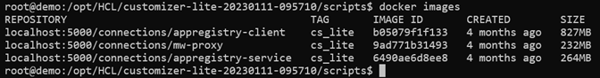

# Installing Customizer Lite {#cp_install_customizer_lite}

This topic describes how to install Customizer Lite. There are two deployment options, hereby referred to as Customizer Lite and Customizer Lite HA. Customizer Lite – the most basic deployment using a single Docker node running a single instance of each required service and Customizer Lite HA – a more resilient deployment using a pair \(or more\) of Docker nodes all running instances of each required service with requests load balanced across available nodes.

## Before you begin

Prerequisites before installing Customizer Lite:

**Note**: Kubernetes is NOT required.

- Customers with access to HCL Harbor repository
- System requirements
- Docker
- Docker registry
- Docker compose
- Setting up a reverse proxy

### Customers with access to HCL Harbor repository

Customizer Lite makes use of three Docker images that are part of the full Component Pack. For customers who prefer to pull these images directly from Harbor rather than import from .tar file archives, see "Add Harbor Helm repository" in the [Component Pack installation guide](cp_install_services_tasks.md#harbor_repo).

The images for `appregistry-client`, `appregistry-service`, and `mw-proxy` can be pulled directly, and updated at any time for that matter, if new versions are published. Customizer Lite does not require or use Helm, so chart components can be ignored; only the Docker images are needed.

### System requirements

For Customizer Lite (with a single Docker instance), a single virtual machine (4 CPU, 2.x GHZ, 8GB memory, and at least 100GB disk) with a x86_64 Linux OS. Use two (or more) of these virtual machines to configure for Customizer Lite HA deployment.

Customizer Lite 8 CR1 has been validated using docker-ce 20.10.x and docker-compose version 2.15.x.

### Docker

Make sure that you [install Docker properly](https://docs.docker.com/engine/install/), and install the same Docker configuration on each of the virtual machines. 

**Note**: If you are unable to install Docker from the Docker repositories, try running the following statement before executing the yum `install` command:

```
yum-config-manager --setopt="docker-ce-stable.baseurl=https://download.docker.com/linux/centos/7/x86_64/stable" --save
```

For more details, see the Docker installation fixes for [Rancher](https://github.com/rancher/rancher/issues/29246) and [CentOS/RHEL](https://github.com/docker/for-linux/issues/1111).

### Docker registry {#docker_registry .section}

1.  Create shared directories for TLS certificates.
   
    Run the following commands (adopt the paths to your directory) to create directories where the self-signed certificates for the Docker registry will be stored:

    **Note**: For Customizer Lite HA, choose a directory on an NFS share or similar to make the certificates in the directories available on all Docker servers.
    
    ```
    mkdir -p /opt/HCL-Shared/docker-registry
    mkdir /opt/HCL-Shared/docker-registry/{auth,certs,registry}
    ```
    
2.  Encrypt the password for the Docker registry "admin" user using `httpasswd`:

    ```
    docker run --entrypoint htpasswd registry:2.7.0 -Bbn admin '[ADMIN USER PASSWORD]' > /opt/HCL-Shared/docker-registry/auth/htpasswd
    docker system prune -a
    ```
    
    **Note**:  "registry:2.7.0" was the last Docker registry image version, where the httpasswd command was still included. Thus, we explicitly use this version to create the httpasswd file and delete that image afterwards.
    
3.  Create self-signed certificates for the Docker registry:

    1. Create a working directory:
    
        ```
        mkdir -p /opt/INSTALL/docker-reg
        cd /opt/INSTALL/docker-reg
        ```

    2. Create self-signed certificates for the Docker registry that will be valid for 999 days by running the following commands:       
    
        ```
        openssl genrsa -des3 -passout pass:[SECRET PASSPHRASE] -out docker-reg.keypair.key 4096
        ```

        ```
        openssl rsa -passin pass:[SECRET PASSPHRASE] -in docker-reg.keypair.key -out docker-reg.key
        ```

        ```
        openssl req -new -key docker-reg.key -out docker-reg.csr
        ```

        ```
        Country Name (2 letter code) [XX]:AT
        State or Province Name (full name) []:
        Locality Name (eg, city) [Default City]:Vienna
        Organization Name (eg, company) [Default Company Ltd]:Example Company
        Organizational Unit Name (eg, section) []:
        Common Name (eg, your name or your server's hostname) []:customizer.example.com
        ...
        ```

        ```
        openssl x509 -req -days 9999 -in docker-reg.csr -signkey docker-reg.key -out docker-reg.crt
        ```

        Questions when running the above command can be answered with the defaults.
        
    c.  Copy certificates to shared directory:
    
        ```
        cp docker-reg.crt /opt/HCL-Shared/docker-registry/certs/
        cp docker-reg.key /opt/HCL-Shared/docker-registry/certs/
        ```      

4.  Add the newly created self-signed certificates to the Linux certificate trust store so that Docker can use them:

    ```
    cp /opt/HCL-Shared/docker-registry/certs/docker-reg.crt /etc/pki/ca-trust/source/anchors
    update-ca-trust 
    ```

    **Note**: For Customizer Lite HA, this step needs to be done for each Customizer Lite server.
    
5.  Restart Docker so it accepts the new certificates:

    ```
    systemctl restart docker
    ```

6.  Create and start the Docker registry using the following command. If you modified the paths in step 1, you need to change them for this command as well.

    If no Docker registry is installed, Docker will automatically pull the most recent version of "registry:2" from the Docker repositories.

    ```
    docker run -d -p 5000:5000 --restart=always --name registry -v /opt/HCL-Shared/docker-registry/auth:/auth -v /opt/HCL-Shared/docker-registry/certs:/certs -v /opt/HCL-Shared/docker-registry/registry:/var/lib/registry -e "REGISTRY_AUTH=htpasswd" -e "REGISTRY_AUTH_HTPASSWD_REALM=Registry Realm" -e "REGISTRY_AUTH_HTPASSWD_PATH=/auth/htpasswd" -e "REGISTRY_HTTP_TLS_CERTIFICATE=/certs/docker-reg.crt" -e "REGISTRY_HTTP_TLS_KEY=/certs/docker-reg.key" registry:2
    ```

7.  Verify that the Docker registry is running using `docker ps`, as follows:

    ```
    docker ps
    CONTAINER ID        IMAGE               COMMAND                  CREATED             STATUS              PORTS                    NAMES
    8564329b0258        registry:2          "/entrypoint.sh /etc…"   5 seconds ago       Up 3 seconds        0.0.0.0:5000->5000/tcp   registry
    ```

**Docker Compose**

-   Check the [release updates](https://github.com/docker/compose/releases) for the newest version of Docker. The Customizer Lite Docker Compose script requires a minimum version of 1.22.
 
-   Download the current Docker Compose binary to `/usr/local/bin/docker-compose`:

    ```
    sudo curl -L https://github.com/docker/compose/releases/download/2.15.1/docker-compose-Linux-x86_64 -o /usr/local/bin/docker-compose 
    ```

-   Make `docker-compose` executable:

    ```
    sudo chmod +x /usr/local/bin/docker-compose
    ```

-   Check the version of the installed Docker Compose:

    ```
    docker-compose –version
    Docker Compose version v2.15.1
    ```

**Setting up a reverse proxy**

**Note**: For Customizer Lite, you can skip this step.

Customizer Lite HA requires the use of a reverse proxy. The following is an example using NGINX.

Refer to steps 4 through 10 in the following topic: [Configuring the NGINX proxy server for Customizer](cp_config_customizer_setup_nginx.md).

## Installing Customizer Lite

The following steps provide the instructions for installing Customizer Lite and the configuration changes required for Connections to enable Customizer.

If deploying Customizer Lite, the files can be installed on the local storage of the single virtual machine.

If deploying Customizer Lite HA with multiple Docker nodes, place the files on a shared volume \(such as NFS for Linux or SMB for Windows\) so that all Docker nodes can mount and share the same Docker images and service configuration files. Mount the shared volume into the file system of each virtual machine before making the changes outlined below. Steps 1-7 below should only need to be performed once if directories are shared and mounted properly on each Docker node. Step 8 is repeated on all nodes to start the services.

1.  Copy the Customizer Lite archive onto the required storage volume \(either local or shared\). For example, to `/opt/HCL`.

2.  Extract the archive into the storage location. The archive will create a subdirectory `customizer-lite-20230111-095710`. For example:

    ```
    mkdir -p /opt/HCL
    cd /opt/HCL
    yum -y install unzip
    unzip /opt/HCL/CustomizerLite-8.0CR1.zip
    ```

    There should be five subdirectories as shown below:

    

    Where:
    
    -   `customizations` is where the customization files are placed. Initially, it will contain three files. These are required by Customizer and should not be deleted or moved.
    
    -   `data` is where applications settings get saved.
    
    -   `images` is the directory for the three Customizer images.
    
    -   `scripts` are scripts for deploying, starting, and updating Customizer.
    
3.  Set the read permissions on the new sub-directory `chmod -R 700 /opt/HCL/customizer-lite-20230111-095710`.

4.  Go into the `customizer-lite-20230111-095710` directory, and change the permissions of these other directories:

    -   chmod -R 005 customizations
    -   chmod -R 005 data
    -   chmod -R 007 data/settings
 
5.  **Note:** This step applies only when you are using local image tar archive files and not pulling images from Harbor.

    From the `scripts` directory run the `setupImages.sh` script. This will load all three of the Customizer images into the Docker registry. To run the script, execute the following:

    ```
    ./setupImages.sh -dr Docker_registry -u Your_user_name -p Your_password -st cs_lite
    ```

    Where:

    -   "Docker_registry" is the hostname of your Docker registry server (include port if applicable, for example, "dockerregistry.example.com:5000" or "localhost:5000").
    -   "Your_user_name" is your Docker registry user name, for example "admin".
    -   "Your_password" is your Docker registry password (for details, see the [Docker registry section](#docker_registry)).
    -   "cs_lite" param. This does not change. It must be `cs_lite`.
    
6.  Run `docker images` and make note of the full repository name and tag for each of the `mw-proxy`, `appregistry-service`, and `appregistry-client`. For example, from the following:

    

    You would recognize the image name and tag information as:
    
    -   localhost:5000/connections/appregistry-client:cs_lite
    -   localhost:5000/connections/appregistry-service:cs_lite
    -   localhost:5000/connections/mw-proxy:cs_lite

7.  Edit the `scripts/.env` file.

    **Note**:  Files starting with a "." are hidden by default on Linux. Use `ls -a scripts` to list that file as well.
    
    1.  Set the two environmental variables in the .env file as appropriate:
    
        -   "CONNECTIONS_URL" should be set to the FQDN of the IBM HTTP Server (IHS) of your Connections environment. For example, `cnx-ihs.example.com` or simply `connections.example.com`
        
        -   "NGINX_URL":
        
            -   For Customizer Lite HA environments, this should be set to the hostname of the NGINX server of your Connections environment, for example `cnx-nginx.example.com`
            
            -   For Customizer Lite installations, this should point to the IBM HTTP Server (IHS) of your Connections environment, for example `cnx-ihs.example.com` or simply `connections.example.com`            
        
        So, for example:
       
        -   CONNECTIONS_URL=cnx-ihs.example.com
        
        -   NGINX_URL=cnx-nginx.example.com
        
    2.  For each of the following *_IMAGE values in the .env file, replace the value with the corresponding image name that you found in the `docker image` command from earlier. For example:
    
        -   MW_PROXY_IMAGE=localhost:5000/connections/appregistry-client
        
        -   APPREGISTRY_SERVICE_IMAGE=localhost:5000/connections/appregistry-service
        
        -   APPREGISTRY_CLIENT_IMAGE=localhost:5000/connections/mw-proxy

        For customers who have pulled images directly from the Harbor repository, those image names will be like:

        -   MW_PROXY_IMAGE=hclcr.io/cnx/appregistry-client
        -   APPREGISTRY_SERVICE_IMAGE=hclcr.io/cnx/appregistry-service
        -   APPREGISTRY_CLIENT_IMAGE= hclcr.io/cnx/mw-proxy

    3.  For each of the following *_VERSION values in the .env file, replace the value with the corresponding tag that you found in the `docker image` command from earlier. For example:

        -   MW_PROXY_VERSION=cs_lite
        -   APPREGISTRY_SERVICE_VERSION=cs_lite
        -   APPREGISTRY_CLIENT_VERSION=cs_lite

        For customers who have pulled images directly from the Harbor repository, those image versions will be in a timestamp format like so:

        -   MW_PROXY_VERSION=20230111-093731

        -   APPREGISTRY_SERVICE_VERSION=20230111-084531

        -   APPREGISTRY_CLIENT_VERSION=20230112-092021

        In summary, the image and version information in the .env entries must match the image and tag information for the actual images in the Docker repository, so that `docker-compose` can start up containers by referencing those images.   

8.  **Note: (Customizer Lite HA only)** Edit the `scripts/docker-compose.yml` file and in the `mw-proxy` environment section, add the following line to ensure that the mw-proxy service accesses the `appregistry-service` via load balancer using this URL: `APPREGISTRY_SERVICE_PROXY: ‘http://${NGINX_URL}’`

    The environment section should then look similar to this:
    
    ```
    environment:
        USE_SSL: 'true'
        MW_REVERSE_PROXY: '${NGINX_URL}'
        CUSTOMIZER_INTERSERVICE_HOST: '${CONNECTIONS_URL}'
        CUSTOMIZER_INTERSERVICE_PORT: '443'
        IS_PRIVATE_CLOUD: 'true'
        REDIS_INSTALLED: 'false'
        LOCAL_DIRECTORY: '/mnt'
        ROARR_LOG: '${MW_PROXY_LOGGING_ENABLED}'
        APPREGISTRY_SERVICE_PROXY: 'http://${NGINX_URL}'
    ```

9.  Assuming all the prerequisites are in place and Connections is configured, Customizer can now be started in two ways:

    - The command `docker-compose up`, which will output logs to the terminal.
    
    - Running the script `update-all-services.sh`, which will return the command prompt.
    
    `Docker-compose up` must be run from within the scripts directory.
    
    **Important**: For Customizer Lite HA only, this step is repeated on each of the Docker nodes to start the services on each.