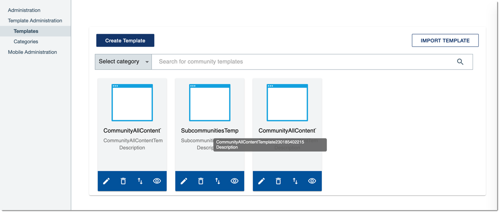

# Migrating data from MongoDB 3 to 5 

Back up, copy, restore, and validate your MongoDB databases.

## Before you begin {#prereq_vpw_z1n_t5b .section}

Before migrating your data, check the verification section below to understand how data migration is validated. Note that 'Mongo' refers to MongoDB 3, and 'Mongo5' to MongoDB 5 in this article.

- Back up your Mongo data.
- Ensure that Mongo5 is already installed.
- Check that Mongo and Mongo5 pods are in running status.

    `$ kubectl -n connections get pod | grep mongo`

    |`mongo-0`|`2/2`|`Running`|`0`|`11h`|
    |`mongo5-0`|`2/2`|`Running`|`0`|`11h`|

- Ensure that the user account has the necessary access rights to perform the steps in this task.
- Note that you will use the following PV storage components to backup and restore MongoDB data:

    |Component Pack service|Required storage component|Directories|
    |----------------------|--------------------------|-----------|
    |MongoDB 3 \(for backup\)|Mongo|/pv-connections/mongo-node-0/data/db|
    |MongoDB 5 \(to restore\)|Mongo5|/pv-connections/mongo5-node-0/data/db|


**Note:** To avoid losing new data while migrating the existing data, run this task during a maintenance window.

## Migrate MongoDB data {#section_bs5_f1q_bvb .section}

1. Copy the backup from Mongo to the new Mongo5 database.

    **Note:** The following steps depend on the type of file system used, for example NFS, EFS, and the like.

    1. Ensure that you have the necessary permissions to complete the following steps.
    
    2. Go to the location which was configured as the PV storage component directory on your Mongo database, for example: /mnt/pv-connections/mongo-node-0/data/db/backups or NFS master: /pv-connections/mongo-node-0/data/db/backups
    
    3. Copy the Mongo backup folder to the Mongo5 directory, for example: cp -rfp /pv-connections/mongo-node-0/data/db/backups /pv-connections/mongo5-node-0/data/db

2. Restore data with x509 Authentication activated.
    1. Connect to a Mongo5 pod by running the following command:

        `kubectl exec -ti -n connections $(kubectl get pods -n connections |grep mongo5-0|awk '{print $1}') -- bash`

    2. Restore the database:

        ``` {#codeblock_j2k_k1q_bvb}
        mongorestore --ssl --sslPEMKeyFile /etc/mongodb/x509/user_admin.pem --sslCAFile /etc/mongodb/x509/mongo-CA-cert.crt --host $(hostname -f) --authenticationDatabase '$external' --authenticationMechanism MONGODB-X509 --username 'C=IE,ST=Ireland,L=Dublin,O=IBM,OU=Connections-Middleware-Clients,CN=admin,emailAddress=admin@mongodb' /data/db/backups/catalog-bkp1
        ```

        This command returns the following output:

        ``` {#codeblock_k2k_k1q_bvb}
        o/p: 
        ……………
        ……………
        2022-08-19T05:47:12.443+0000	44 document(s) restored successfully. 0 document(s) failed to restore. 
        ```


## Verify migration {#section_jnx_n1q_bvb .section}

1. Verify that the data is migrated successfully.
    1. Connect to a Mongo5 pod by running the following command \(if not already\):

        `kubectl exec -ti -n connections $(kubectl get pods -n connections |grep mongo5-0|awk '{print $1}') -- bash`

    2. Connect to a Mongo5 daemon:

        ``` {#codeblock_iwm_q1q_bvb}
        mongosh --tls --tlsCertificateKeyFile /etc/mongodb/x509/user_admin.pem --tlsCAFile /etc/mongodb/x509/mongo-CA-cert.crt --host $(hostname -f)  --authenticationDatabase '$external' --authenticationMechanism MONGODB-X509
        ```

        This command returns the following output:

        ``` {#codeblock_jwm_q1q_bvb}
        o/p: Using MongoDB:        5.0.14
        Using Mongosh:        1.6.0
        ```

    3. Verify that the Connections databases inside Mongo5 are created during the restoration process:

        ``` {#codeblock_kwm_q1q_bvb}
        show databases
        ```

        This command returns the following output:

        ``` {#codeblock_lwm_q1q_bvb}
        o/p: 
        AppReg               268.00 KiB
        ITM                  168.00 KiB
        admin                172.00 KiB
        boards-app           392.00 KiB
        boards-licence       128.00 KiB
        boards-notification  316.00 KiB
        boards-user          388.00 KiB
        cnx-slack-servicedb   32.00 KiB
        commtpldb             44.00 KiB
        config               260.00 KiB
        datamigrationdb        1.23 MiB
        local                  3.09 MiB
        profiledb            816.00 KiB
        relationshipdb         2.08 MiB
        ```

    4. Verify collections:

        ``` {#codeblock_mwm_q1q_bvb}
        use commtpldb
        show collections
        ```

        This command returns the following output:

        ``` {#codeblock_nwm_q1q_bvb}
        o/p: 
        CommTemplate
        TemplateCategory
        ```

2. Verify the data population on the screen from one of the components. The following verification procedure uses the `community-template-service` as an example to demonstrate the data migration on the interface.
    1. The deployment `community-template-service` uses Mongo3. Before starting to migrate data from Mongo3 to Mongo5, the following three templates are created as follows:

        

        As Mongo3 is in use, these templates are stored in the Mongo3 database.

    2. Switch deployment `community-template-service` to use Mongo5.

        ``` {#codeblock_izp_s1q_bvb}
        kubectl -n connections edit deployment community-template-service
        
        Edit the following to mongo5 :
        
                - name: MONGODB_HOST
                  value: mongo5
        
        ......
        
                - name: MONGO_RS_MEMBERS_HOSTS
                  valueFrom:
                    configMapKeyRef:
                      key: mongo5-rs-members-hosts
                      name: connections-env
        ```

    3. Since there is no data created and migrated in Mongo5 yet, the database used for `community-template-service` is blank.

        

    4. Perform the previous data migration procedure and verify the `community-template-service` screen. If the steps are correctly done, the community-template-service screen should populate the data from Mongo3, as seen in step 5a.

**Parent topic:** [Steps to install or upgrade to Component Pack 8](../install/cp_install_services_tasks.md)

