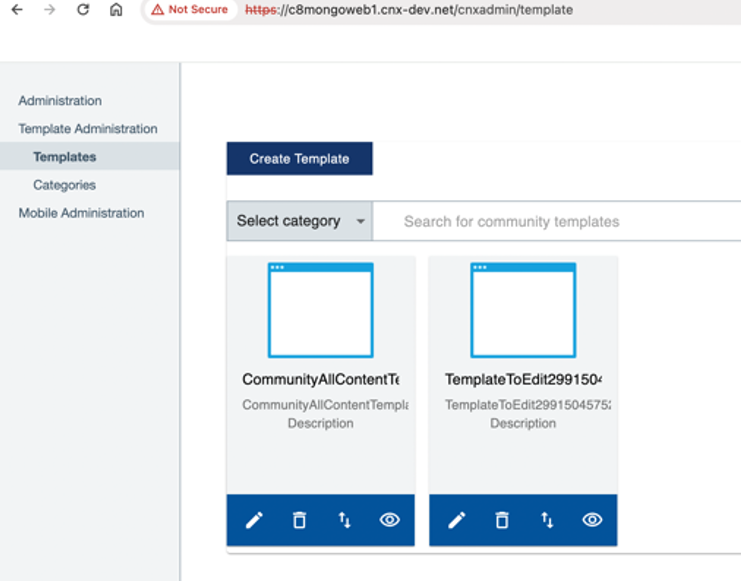

# Migrating large-scale data from MongoDB 3 to 5 

If you have a substantial amount of data in MongoDB 3 that you wish to migrate to MongoDB 5, our tests have indicated that generating a backup may require several days and the restoration process will be as time-consuming. Consequently, the complete migration of MongoDB could span several days, resulting in the Connections environment being offline for an extended period of time. As a suitable alternative, perform the following procedure for large-scale data migration.

This alternative approach is an in-place upgrade, which involves using a Bitnami Docker container. It requires the latest version of Docker to be installed on a separate machine.

If you have a relatively small amount of data to migrate, you can refer to [Migrating data from MongoDB 3 to 5](migrating_data_mongodb_v3_v5.md).

## Before you begin {#prereq_largescale_mongo .section}

Note that 'Mongo' refers to MongoDB 3, and 'Mongo5' to MongoDB 5 in this article.

-   On your Mongo3 environment, note any community templates you previously created. This information will be helpful in later on verifying that migration succeeded, as you will need to check for the same community templates after migrating the database to Mongo5. For example, in an environment using Mongo3 we created two community templates as shown in the following image:

    

    After a successful migration, the same community templates should appear for the Mongo5 environment, as described in the [verification section](#verify_large_mongo_migration).

    If the migration failed, these templates would no longer be visible.

-   Back up your Mongo data on NFS master node.

    ```
    cd /pv-connections
    tar cvf $(date +%Y%m%d)-backup.tar.gz es* mongo* 
    ```

-   Ensure that Mongo5 is already installed on the Kubernetes cluster.
-   Check that the Mongo5 pod is in running state.

    ```
    $ kubectl -n connections get pod | grep mongo5 
    ```

    This gives the following output:

    ```
    |mongo5-0|2/2|Running|0|11h|
    ```

!!! note

    To avoid losing new data while migrating the existing data, run this task during a maintenance window.

To migrate the data, it is recommended to scale down the MongoDB 5 statefulset to 0:

```
$  kubectl scale sts mongo5 -n connections --replicas 0
statefulset.apps/mongo5 scaled
```

## Procedure

### Move or copy the data folders

Move the data to the Mongo 5 NFS folders using the following commands. Make sure that the file ownership remains unchanged after transferring the data:

```
cd /pv-connections
mv mongo-node-0 mongo5-node-0
mv mongo-node-1 mongo5-node-1
mv mongo-node-2 mongo5-node-2
```

### Migrate MongoDB data from version 3 to 5 using Docker on a standalone machine

Then, mount a folder from NFS_MASTER onto a standalone machine, say, server1 using NFS (Network File System), using these general steps:

1.  Log in as root.

2.  Ensure that firewalls and security settings allow NFS traffic between the servers (separate machine and NFS).

3.  Install NFS packages, ensuring that NFS packages are installed on both NFS_MASTER and server1. For instance, if you want to install NFS on a CentOS 7 machine, then install the nfs-utils, cifs-utils packages.

    Then start the NFS server by running the following command:

    ```
    systemctl start nfs-server
    ```

    And check the nfs-server status:

    ```
    systemctl status nfs-server
    ```

4.  Configure NFS export on NFS_MASTER:

    1.  Edit the /etc/exports file on NFS_MASTER.

    2.  Add entries to specify the folder you want to export:

        ```
        /pv-connections/mongo5-node-0/data/db        SERVER1_IP(no_root_squash,rw)
        ```

        Replace:
        
        -   /path/to/shared/folder with the actual path of the directory you want to share

        -   SERVER1_IP with the IP address of server1

        !!! note

            Here, no_root_squash is used because we want remote root users to modify the file on the shared file system.

    3.  Save the file and run `exportfs -a` to apply the changes.

5.  Mount the shared folder on server1:

    1.  Create directories on server1, where you want to mount the shared folder:

        ```
        sudo mkdir -p /mnt/mongo5-node-0/data/db
        ```

    2.  Use the mount command to mount the shared folder from NFS_MASTER onto the following directory:

        ```
        sudo mount NFS_MASTER_IP:/pv-connections/mongo5-node-0/data/db /mnt/mongo5-node-0/data/db
        ```

        Replace:

        -   NFS_MASTER_IP with the IP address of NFS_MASTER

        -   /path/to/shared/folder with the actual path of the shared directory on NFS_MASTER

6.  Verify that the mount was successful by listing the contents of the mounted directory:

    ```
    ls /mnt/mongo5-node-0/data/db
    ```

    Remember to replace the placeholder values (NFS_MASTER_IP, SERVER1_IP, /path/to/shared/folder) with the appropriate values for your setup. 

7.  Perform data migration. Refer to the next section *Enhancing MongoDB data compatibility*.

### Enhance MongoDB data compatibility

On the separate machines with Docker, run the following shell script to make Mongo v3 data compatible with v5:

1. Open a text editor (for example nano, Vim, gedit, and the like) on your system and create a new file.

2. Copy the following shell script code into this file.

    ```
    #!/usr/bin/env bash
    # This script expects the MongoDB 3.6 databases in the mongo5 shares
    # I recommend to move mongo-node-x to mongo5-node-x, because copy needs too long

    NFS_ROOT=/mnt
    for i in 3.6 4.0 4.2 4.4 5.0; do
    docker pull bitnami/mongodb:${i}
    container=mongo$(echo $i | tr -d .)
    for j in 0 1 2; do
        cd ${NFS_ROOT}/mongo5-node-$j
        docker run -dt -name ${container} -p 27017:27017 -v $(pwd )/data/db:/bitnami/mongodb/data/db:Z bitnami/mongodb:${i}
        sleep 15
        # Update CompatibiltyVersion to next version
        docker exec -it ${container} mongo -host 127.0.0.1 -eval "db.adminCommand( { setFeatureCompatibilityVersion: '${i}' } )"
        if [ "$(echo "$i == 3.6" | bc -l)" -eq 1 ]; then
        # Remove replicaset definition from database local
        docker exec -it ${container} mongo -host 127.0.0.1 -eval "db.getSiblingDB('local').system.replset.remove({})"
        docker exec -it ${container} mongo -host 127.0.0.1  -eval "var conn = new Mongo(); var db = conn.getDB('userprefs-service'); db.dropDatabase();"
        fi
        # Stop mongodb databases
        docker exec -it ${container} mongo -host 127.0.0.1 -eval "db.getSiblingDB('admin').shutdownServer()"
        docker stop ${container}
        docker rm ${container}
    done
    done
    ```

3. Save the file as a script by adding a .sh extension. For instance, `mongo_migration.sh`.

4. Make the script executable using the following command:

    ```
    sudo chmod u+x mongo_migration.sh
    ```

5. Run the script:

    ```
    ./mongo_migration.sh
    ```

6.  Now go to the Kubernetes master node and scale up the MongoDB 5 statefulset to your desired replicas, for example 1:

    ```
    $  kubectl scale sts mongo5 -n connections -replicas 1
    statefulset.apps/mongo5 scaled
    ```  

    Wait until Mongo5 pod is in running status:

    ```
    $ kubectl -n connections get pod | grep mongo5
    |mongo5-0|2/2|Running|0|11h|
    ```    

### Post-migration procedure

After the data migration is complete, unmount NFS using the following command:

```
sudo umount -l /mnt/mongo5-node-0/data/db
```

Then, log out as root.


## Verify migration  {#verify_large_mongo_migration .section}

Verify that migration is successful through the following:

-   Get Mongo pod details by running the following command:

    ```
    $  kubectl -n connections get po | grep mongo5
    mongo5-0                                                    2/2     Running
    ```

    Ensure that the mongo pod is up and running before and after migration.

-   Ensure that the previously created community templates are migrated successfully and displayed in the user interface. For instance, the community templates shown in the [earlier example](#prereq_largescale_mongo) are still in the new Mongo5 environment, as shown in the following image:

    


**Parent topic:** [Steps to install or upgrade to Component Pack 8](../install/cp_install_services_tasks.md)

