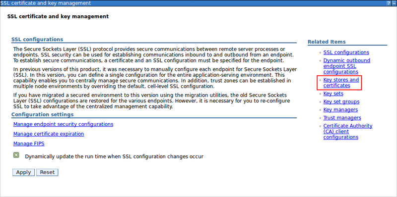
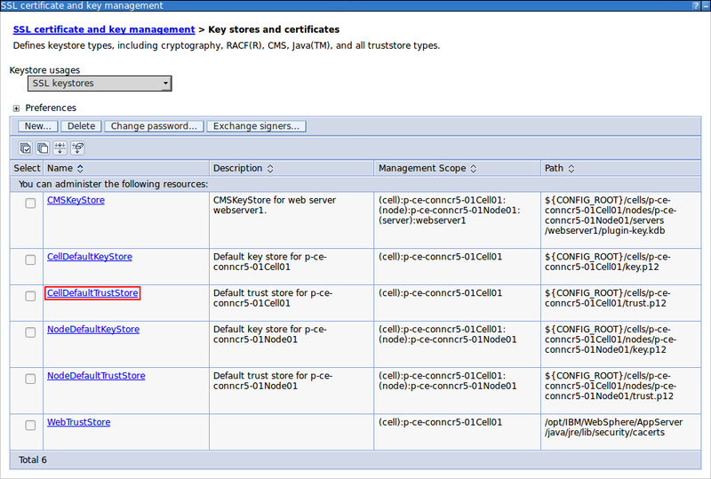
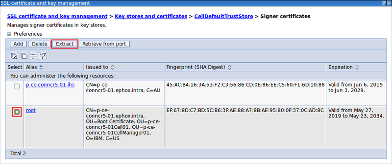
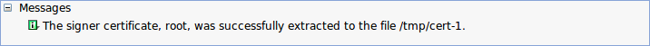
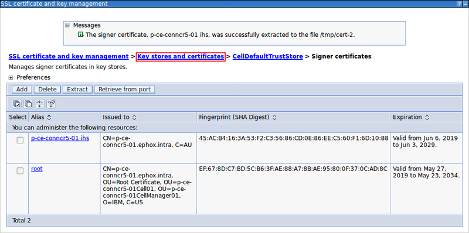
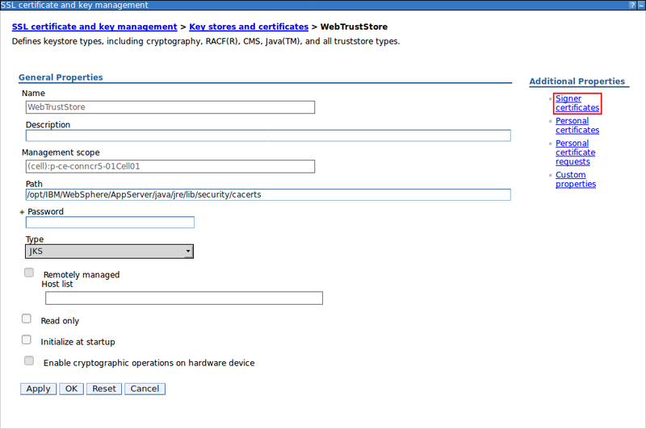

# Create a web-aware trust store for the Tiny Editors Services {#setup-services-certificates-create-a-web-aware-truststore .task}

This task outlines the process for creating a web-aware trust store for the Tiny Editors Services.

1.  Log in to the web interface of the WebSphere Application Server Console.

    The default address is: https://host\_name:9043/ibm/console

2.  Expand **Security** and click the **SSL certificate and key management** link.

    

3.  Click **Key stores and certificates** link.

    

4.  Click **New**.

    

5.  Create a trust store.

    1.  Enter a **Name** for the Tiny Editors Services trust store.

    2.  Enter the **Path** to the WebSphere JVM trust store.

        For example:

        ```
        /opt/IBM/WebSphere/AppServer/java/jre/lib/security/cacerts
        ```

    3.  Enter the password for the WebSphere JVM trust store into the **Password** and **Confirm password** fields.

        !!! tip 
            
            The default password for the WebSphere JVM trust store is changeit .

    4.  Set the **Type** to JKS .

    5.  Click **OK**.

    

6.  Click the **Save** link.

    

7.  Export in-house root certificates for use with the Tiny Editors Services trust store.

    1.  Click the **CellDefaultTrustStore** link.

        

    2.  Click the **Signer certificates** link.

        

    3.  Select the checkbox for a required certificate and click **Extract**.

        

    4.  Specify a file name for the certificate and click **OK**.

        

        

    5.  If additional certificates are required, repeat steps [7.c](#select-exportable-cert) and [7.d](#name-exportable-cert), otherwise click the **Key stores and certificates** breadcrumb link.

        

8.  Import in-house root certificates.

    1.  Click the link of the Tiny Editor Services Trust Store.

        

    2.  Click the **Signer certificates** link.

        

    3.  Click **Add**.

        

    4.  Enter a memorable **Alias** and enter **File name** of a previously exported certificate. Click **OK**.

        

        

    5.  If additional certificates require importing, repeat steps [8.c](#add-cert) and [8.d](#alias-imported-cert).


**Parent topic:** [Configuring the SSL certificates for the Tiny Editors Services](t_01-setup_02-services_02-certificates_00-summary.md)

