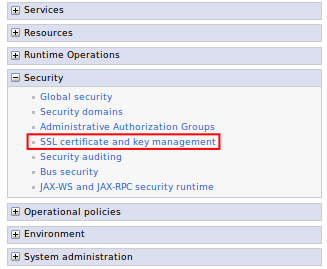
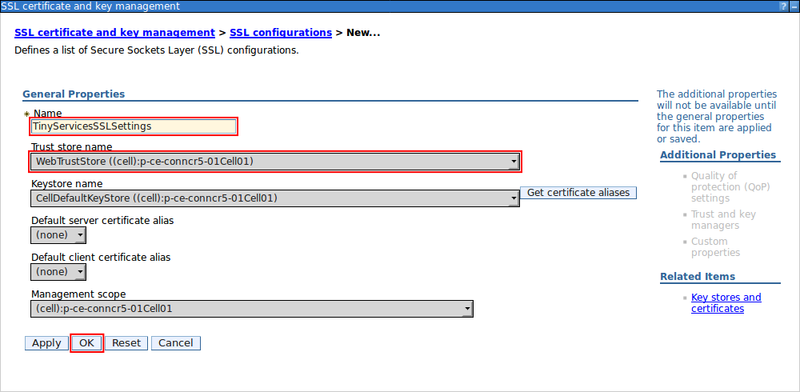
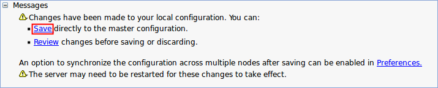

# Create a Tiny Editors Services specific SSL configuration {#setup-services-certificates-create-a-services-specific-ssl-config .task}

This task outlines the process for creating a Tiny Editors Services specific SSL configuration from the web-aware trust store. This procedure includes updating the application.conf to add the SSL configuration attributes.

**Before you begin:**

-   An existing application.conf for the Tiny Editors Services is required. See: [Create an application.conf for the Tiny Editors Services](t_01-setup_02-services_01-appconf_01-create-an-application-conf.md).
-   A suitable trust store is required. See: [Create a web-aware trust store for the Tiny Editors Services](t_01-setup_02-services_02-certificates_01-create-a-web-aware-truststore.md) for details.

1.  Log in to the web interface of the WebSphere Application Server Console.

    The default address is: https://host\_name:9043/ibm/console

2.  Expand **Security** and click the **SSL certificate and key management** link.

    

3.  Click the **SSL Configurations** link.

    

4.  Click **New**.

    

5.  Define the SSL configuration.

    1.  Enter a **Name** for the Tiny Editors Servers SSL configuration

    2.  From the **Trust store name** list, Select [the Tiny Editors Services trust store](t_01-setup_02-services_02-certificates_01-create-a-web-aware-truststore.md).

    3.  Click **OK**.

    

6.  Click the **Save** link.

    

7.  Open the [Tiny Editors Services configuration file application.conf](t_01-setup_02-services_01-appconf_01-create-an-application-conf.md) in a text editor.

    !!! note 
        
        Use a plain text editor to avoid inserting invalid formatting or symbols into application.conf. Do not use a rich text editor such as Microsoft Word for editing configuration files.

8.  Under the `ephox` root element, define the SSL configuration for the Tiny Editors Services by adding the following elements:

    1.  `ephox.http.websphere.ssl-config-name` : The name of the Tiny Editors Services SSL configuration set in step [5.a](#tiny-ssl-config-name).

    2.  `ephox.http.websphere.use-ssl-config` : Set to true.

    3.  `ephox.http.trust-all-cert` : Set to false.

    ```sh
    ephox {
      # ... other settings not shown
      http {
        websphere {
          ssl-config-name = "TinyServicesSSLSettings"
          use-ssl-config = true
        }
        trust-all-cert = false
      }
    }
    ```


**Parent topic:** [Configuring the SSL certificates for the Tiny Editors Services](t_01-setup_02-services_02-certificates_00-summary.md)

