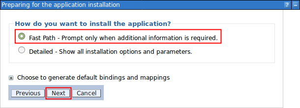

# Installing the Tiny Editors Services {#setup-services-install .task}

Installing the Tiny Editors Services will provide the Tiny editors with spellchecking, link checking and media embedding functionality.

**Before you begin:** Ensure that you have [created an application.conf for the Tiny Editors Services](t_01-setup_02-services_01-appconf_01-create-an-application-conf.md) in the correct directory.

1.  Log in to the web interface for your WebSphere Application Server Console.

    The default address is: https://host\_name:9043/ibm/console

2.  Click the **New Application** link.

    

3.  Click the **New Enterprise Application** link.

    

4.  Specify the editorsServices\_c6.ear file included in the services directory of the Tiny Editors for HCL Connections package, and click **Next**.

    

5.  Select the **Fast Path** installation option, and click **Next**.

    

6.  Click **Next** to accept the default installation settings.

    

7.  Map the Tiny Editor Selector to the server running HCL Connections™.

    1.  Select all of the modules.

    2.  Select the server/cluster/node combinations from the list.

    3.  Click **Apply**.

    4.  Click **Next**.

    

8.  Click **Next** to accept the default Virtual host mapping.

    

9.  Click **Finish** to complete the application installation.

    

10. Once the application has been installed, click the **Save** link.

    

**Parent topic:** [Optional: Installing Tiny Editors Services](t_01-setup_02-services_00-summary.md)

**Previous topic:** [Configuring the SSL certificates for the Tiny Editors Services](t_01-setup_02-services_02-certificates_00-summary.md)

**Next topic:** [Starting the Tiny Editors Services application](t_01-setup_02-services_04-start.md)

