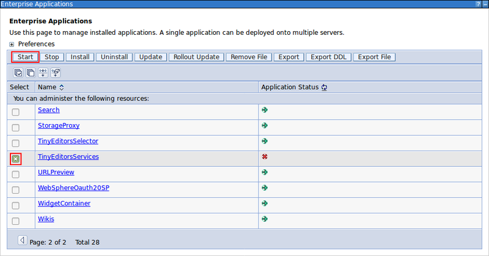

# Starting the Tiny Editors Services application {#setup-services-start .task}

The Tiny Editors Services must be started before they can be used.

1.  Navigate to **Applications** \> **Application Types** \> **WebSphere enterprise applications**.

    

2.  Select the checkbox for **TinyEditorsServices** from the list of applications, and click **Start**.

    

**Parent topic:** [Optional: Installing Tiny Editors Services](t_01-setup_02-services_00-summary.md)

**Previous topic:** [Installing the Tiny Editors Services](t_01-setup_02-services_03-install.md)

**Next topic:** [Regenerate the webserver plugin](t_regenerate-webserver-plugin.md)

