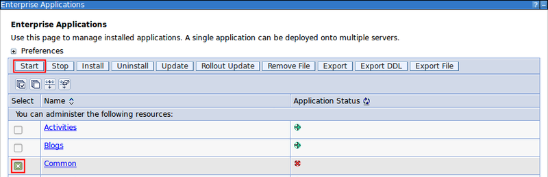

# Install manually {#setup-editors-install-install-manually .task}

The manual install process requires copying files into the right locations and restarting some services.

**Before you begin:**

-   Determine the host\_name of the server hosting HCL Connections™.
-   Get user access as the HCL Connections installer or higher administrative permissions, on both:
    -   The host server.
    -   The WebSphere Application Server Console.

1.  Stop the **Common** WebSphere enterprise application.

    1.  Log in to the web interface of the WebSphere Application Server Console.

        The default address is: https://host\_name:9043/ibm/console

    2.  Navigate to **Applications** \> **Application Types** \> **WebSphere enterprise applications**.

        

    3.  Select the checkbox for **Common** from the list of applications and click **Stop**.

        

        

2.  Determine the Connections paths \(customization\_path and provision\_path\).

    1.  Log in to the web interface of the WebSphere Application Server Console.

        The default address is: https://host\_name:9043/ibm/console

    2.  Expand **Environment** and click the **WebSphere variables** link.

        

    3.  Find the **CONNECTIONS\_CUSTOMIZATION\_PATH** in the variables list and record the value which will be referred to as customization\_path from this point.

        

    4.  Find the **CONNECTIONS\_PROVISION\_PATH** in the variables list and record the value which will be referred to as provision\_path from this point.

        

3.  In the customization\_path/javascript directory, create the subdirectory tiny/editors/connections.

    !!! note 
        
        If the directory already exists, delete or move the contents to a new folder before proceeding.

4.  Install the Tiny Editors for HCL Connections configuration files:

    1.  Locate the config directory in the uncompressed Tiny Editors for HCL Connections package.

    2.  Copy the contents of the config directory to the customization\_path/javascript/tiny/editors/connections directory.

5.  Install the Tiny Editors for HCL Connections jar file:

    1.  Locate the editor directory in the uncompressed Tiny Editors for HCL Connections package.

    2.  Copy the editor/tiny.editors.connections\_version.jar to the provision\_path/webresources directory.

6.  Follow the [post-customization steps](https://help.hcltechsw.com/connections/v6/admin/customize/t_admin_common_customize_postreq.html) to ensure the server cache is updated.

7.  Start the **Common** WebSphere enterprise application.

    1.  Log in to the web interface of the WebSphere Application Server Console.

        The default address is: https://host\_name:9043/ibm/console

    2.  Navigate to **Applications** \> **Application Types** \> **WebSphere enterprise applications**.

        

    3.  Select the checkbox for **Common** from the list of applications and click **Start**.

        

        

8.  Verify the install:

    1.  Browse to the following URL: http://host\_name\_and\_port/connections/resources/web/tiny.editors.connections/verify.html

        If the installation was successful, a confirmation message appears alongside the installed version numbers.

    2.  Browse to the edit screen for a wiki or blog.

        If the installation was successful, the Tiny editors will be loaded.

    !!! note 
        
        If Tiny Editors for HCL Connections is not available, [restart the Common enterprise application](t_restart-common-app.md) to force a cache update.

**Parent topic:** [Installing Tiny Editors integration](t_01-setup_03-editors_02-install_00-summary.md)

