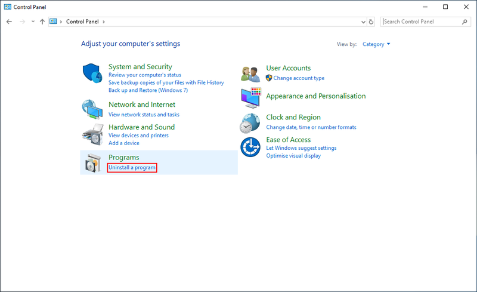
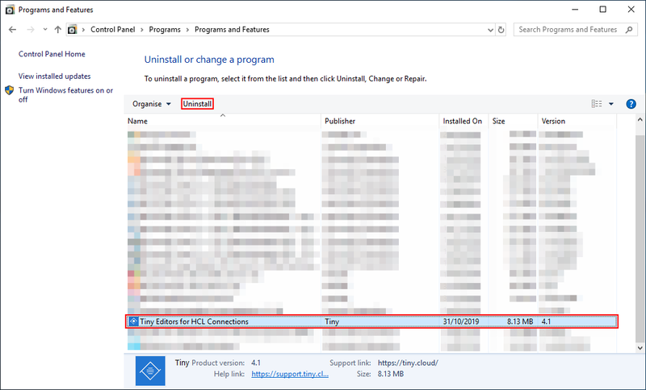
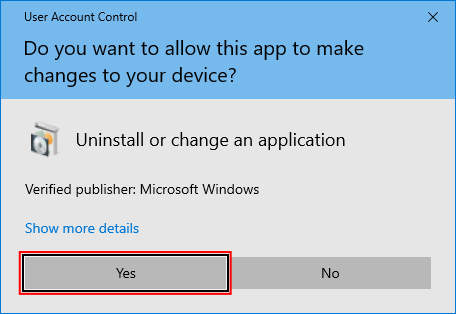
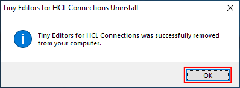

# Uninstall the Tiny Editors Integration on Windows {#uninst-editors-uninstall-on-windows .task}

Running the uninstall program will remove the Tiny Editors integration on Windows.

1.  Stop the **Common** WebSphere enterprise application.

    1.  Log in to the web interface of the WebSphere Application Server Console.

        The default address is: https://host\_name:9043/ibm/console

    2.  Navigate to **Applications** \> **Application Types** \> **WebSphere enterprise applications**.

        

    3.  Select the checkbox for **Common** from the list of applications and click **Stop**.

        

        

2.  Navigate to **Programs** \> **Uninstall a program** in Control Panel.

    

3.  Select the Tiny Editors for HCL Connections entry and click **Uninstall**.

    

4.  If prompted for System Administrator privileges, click **Yes**.

    

5.  Click **Yes** at the prompt and allow the installer to complete the uninstall.

    

    

6.  Click **OK** to close the uninstaller.

    

7.  Start the **Common** WebSphere enterprise application.

    1.  Log in to the web interface of the WebSphere Application Server Console.

        The default address is: https://host\_name:9043/ibm/console

    2.  Navigate to **Applications** \> **Application Types** \> **WebSphere enterprise applications**.

        

    3.  Select the checkbox for **Common** from the list of applications and click **Start**.

        

        

**Parent topic:** [Uninstalling Tiny Editors Integration](t_03-uninst_01-editors_00-summary.md)

