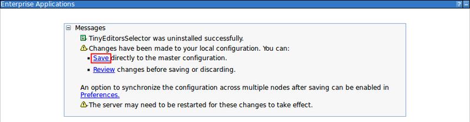

# Uninstalling the Tiny Editors Selector {#uninst-selector-uninstall .task}

Completely remove the Tiny Editors Selector application if you are no-longer using role-based editor deployment or if you are uninstalling Tiny Editors for HCL Connections completely.

**Before you begin**: The Tiny editors integration must not be configured to use role-based editor deployment or the Tiny editors integration has been uninstalled.

1.  Navigate to **Applications** \> **Application Types** \> **WebSphere enterprise applications**.

    

2.  Select the checkbox for **TinyEditorsSelector** from the list of applications and click **Uninstall**.

    

3.  Click **OK** to confirm the uninstall.

    

4.  Click the **Save** link to finish the uninstall.

    

**Parent topic:** [Uninstalling Tiny Editors for HCL Connections](t_03-uninst_00-summary.md)

**Previous topic:** [Uninstalling the Tiny Editors Services](t_03-uninst_02-services-uninstall.md)

