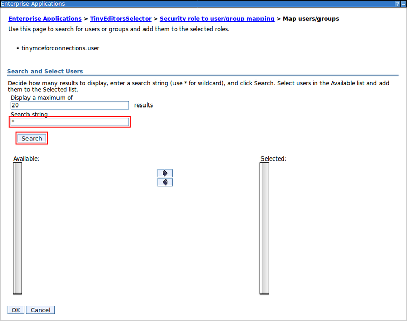
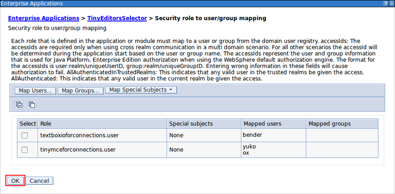

# Configuring the Tiny Editors Selector roles {#setup-selector-configure .task}

Assigning an editor to users or roles is performed by configuring the [Tiny Editors Selector service](t_01-setup_01-selector_00-summary.md). This step can also be done after installation of Tiny Editors for HCL Connections is complete.

**Before you begin:** The Tiny Editors Selector service must be started and the editor must be set to `'role-based'`.

1.  Log in to the Web interface for your WebSphere Application Server Console.

    The default location for the WebSphere Application Server Console is: https://your-server-here:9043/ibm/console

2.  Navigate to **Applications** \> **Application Types** \> **WebSphere enterprise applications**.

    

3.  Find the **TinyEditorsSelector** in the list of applications and click the **TinyEditorsSelector** link.

    

4.  On the **Configuration** tab, click the **Security role to user/group mapping** link.

    

5.  Select the checkbox in the **Select** column for either:

    -   **tinymceforconnections.user** to assign the TinyMCE editor.

6.  Assign the selected editor by:

    -   Clicking **Map Users...** to assign the editor to individual users.
    -   Clicking **Map Groups...** to assign the editor to a user group.
    

7.  Assign the selected editor to a user or group by:

    1.  Using the **Search string** field to search for the user or group, then click **Search** to list the results.

        

    2.  Select one or more target users or groups from the **Available** list and press the Right Arrow \(**-\>**\) button to add the selected users or groups to the **Selected** list. To add additional users or groups, repeat step [7](#find-user).

        

8.  Click **OK** to set the selected editor for the selected users/groups.

    

9.  Click **OK** on the **Security role to user/group mapping** dialog.

    

10. Click **Save** to save the change.

    

**Parent topic:** [Modifying Tiny Editors for HCL Connections](t_02-modify_00-summary.md)

