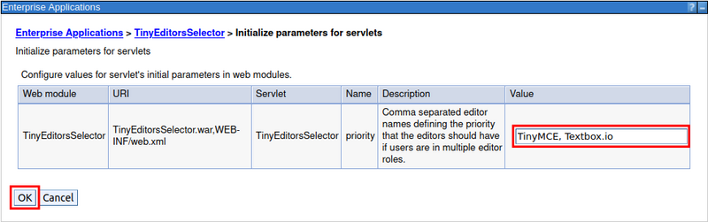
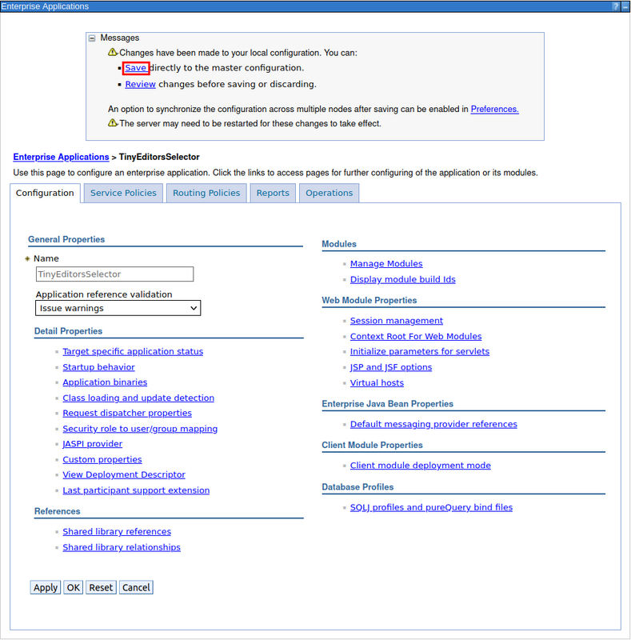

# Configuring the Tiny Editors Selector editor priority {#setup-selector-configure .task}

Assigning the editor priority is performed by configuring the [Tiny Editors Selector service](t_01-setup_01-selector_00-summary.md). This step can also be done after the installation of Tiny Editors for HCL Connections is complete.

**Before you begin:** The Tiny Editors Selector service must be installed.

1.  Log in to the Web interface for your WebSphere Application Server Console.

    The default location for the WebSphere Application Server Console is: https://your-server-here:9043/ibm/console

2.  Navigate to **Applications** \> **Application Types** \> **WebSphere enterprise applications**.

    

3.  Select the checkbox for **TinyEditorsSelector** from the list of applications and click **Stop**.

    

4.  Find **TinyEditorsSelector** in the list of applications and click the **TinyEditorsSelector** link.

    

5.  On the **Configuration** tab, click the **Initialize parameters for servlets** link.

    

6.  Set the **priority** value to  "TinyMCE" in any order separated by a comma then click **OK**.

    

7.  Click **Save** to save the change.

    

8.  Select the checkbox for **TinyEditorsSelector** from the list of applications and click **Start**.

    

**Parent topic:** [Configuring the Tiny Editors integration](t_01-setup_03-editors_01-configure_00-summary.md)

