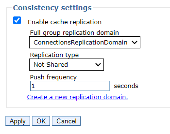

# Updating WebSphere to support Azure AD OIDC authentication for Connections {#t_azure_oidc_websphere .task}

Single sign-on is accomplished by setting up a trust relationship between the Connections server and Microsoft Azure using the WebSphere OpenID Connect Relying Party Trust Association Interceptor \(OIDC Relying Party TAI\). This requires that the WebSphereOIDCRP application is installed on each cluster.

Complete the steps in [Adding an application in Azure AD for SSO with Connections](t_azure_add_app.md), which results in values that you'll need in step 7 of the following procedure.

1.  For every cluster, deploy WebSphereOIDCRP. In this example, the Connections applications are installed across the four clusters, AppsCluster, InfraCluster, PushCluster, and UtilCluster.

    

    !!! note 
        
        The OIDC Replying Party TAI code is shipped as part of WebSphere Application Server. It is recommended that you are running WebSphere 8.5.5.18 which contains all required fixes. However, if you are running an earlier version of WebSphere, you must install at least version 1.3.0 of the OIDC jar. Find the latest version from https://www.ibm.com/support/pages/node/290565.

2.  Apply a unique context root to each of the clusters. For example, for the Apps cluster, go to **Enterprise Applications** \> **WebSphereOIDCRP\_AppsCluster.ear** \> **Context Root For Web Modules**.

    

3.  Apply clusters to each module. For example, for the Apps cluster, go to **Enterprise Applications** \> **WebSphereOIDCRP\_AppsCluster.ear** \> **Manage Modules**

    

4.  Configure Global Security Custom Properties by clicking **Security** \> **Global security** \> **Custom Properties** and setting these properties to the following values:

    |Property|Value|
    |--------|-----|
    |com.ibm.websphere.security.disableGetTokenFromMBean **Note:** If this property doesn't exist, add it.|false|
    |com.ibm.websphere.security.DeferTAItoSSO|com.ibm.ws.security.oidc.client.RelyingParty|

5.  As the WebSphere administrator, in the administrative console, click **Security** \> **Global security** \> **Web and SIP security** \> **Trust association**.

6.  Click **Interceptors** \> **New to add an interceptor**.

7.  For the interceptor class name, enter com.ibm.ws.security.oidc.client.RelyingParty.

8.  Add the following properties and values.

    !!! note 
        
        Use the values for `\{client\_id\}`, `\{client\_secret\}`, and `\{tenant\}` that you copied from steps 3 and 4 of the previous procedure.

    |Property|Value|
    |--------|-----|
    |provider\_1.identifier|azuread|
    |provider\_1.clientId|\{client\_id\} Find this value in Azure Connections application configuration|
    |provider\_1.clientSecret|\{client\_secret\}|
    |provider\_1.signatureAlgorithm|RS256|
    |provider\_1.scope|openid profile email api://\{client\_id\}/default|
    |provider\_1.interceptedPathFilter|/activities/.\*,/blogs/.\*,/dogear/.\*,/files/.\*,/forums/.\*,/metrics/.\*,/metricssc/\*,/mobile/.\*,/connections/filesync/.\*,/connections/filediff/.\*,/mobileAdmin/.\*,/storageproxy/.\*,/wikis/.\*|
    |provider\_1.excludedPathFilter|/activities/service/downloadExtended/.\*,/survey/.\*,/surveys/.\*,/ibm/console,/ibm/console/.\*,/profiles/dsx/.\*,/communities/dsx/.\*,/dm,/dm/atom/seedlist,/dm/atom/communities/feed,/activities/service/atom2/forms/communityEvent,/communities/recomm/handleEvent,/communities/calendar/handleEvent,/profiles/seedlist/myserver,/activities/service/atom2/forms/communityEvent,/news/web/statusUpdateEE.\*,/dogear/seedlist/myserver,/news/seedlist/myserver,/communities/calendar/seedlist/myserver|
    |provider\_1.authorizeEndpointUrl|https://login.microsoftonline.com/\{tenant\}/oauth2/v2.0/authorize|
    |provider\_1.tokenEndpointUrl|https://login.microsoftlonline.com/\{tenant\}/oauth2/v2.0/token|
    |provider\_1.jwkEndpointUrl|https://login.microsoftonline.com/\{tenant\}/discovery/v2.0/keys|
    |provider\_1.signVerifyAlias|cnxoidccert|
    |provider\_1.issuerIdentifier|https://login.microsoftonline.com/\{tenant\}/v2.0|
    |provider\_1.userIdentifier|email|
    |provider\_1.useJwtFromRequest|ifPresent|
    |provider\_1.createSession|true|
    |provider\_1.verifyIssuerInIat|true|
    |provider\_1.audiences|ALL\_AUDIENCES|
    |provider\_1.setLtpaCookie|true|
    |provider\_1.callbackServletContext|/oidcclient\_apps|
    |provider\_2.identifier|azuread|
    |provider\_2.clientId|\{client\_id\}|
    |provider\_2.clientSecret|\{client\_secret\}|
    |provider\_2.signatureAlgorithm|RS256|
    |provider\_2.scope|openid profile email api://c270bc0a-0097-48d6-8e65-1728143c5c9e/default|
    |provider\_2.interceptedPathFilter|/connections/bookmarklet/.\*,/connections/oauth/.\*,/connections/resources/.\*,/connections/config/.\*,/communities/.\*,/connections/proxy/.\*,/help/.\*,/xcc/.\*,/selfservice/.\*,/news/.\*,/profiles/.\*,/search/.\*,/socialsidebar/.\*,/touchpoint/.\*,/connections/thumbnail/.\*,/connections/opengraph/.\*,/oauth2/.\*,/connections/opensocial/.\*|
    |provider\_2.excludedPathFilter|/activities/service/downloadExtended/.\*,/survey/.\*,/surveys/.\*,/ibm/console,/ibm/console/.\*,/profiles/dsx/.\*,/communities/dsx/.\*,/dm,/dm/atom/seedlist,/dm/atom/communities/feed,/activities/service/atom2/forms/communityEvent,/communities/recomm/handleEvent,/communities/calendar/handleEvent,/profiles/seedlist/myserver,/activities/service/atom2/forms/communityEvent,/news/web/statusUpdateEE.\*,/dogear/seedlist/myserver,/news/seedlist/myserver,/communities/calendar/seedlist/myserver|
    |provider\_2.authorizeEndpointUrl|https://login.microsoftonline.com/\{tenant\}/oauth2/v2.0/authorize|
    |provider\_2.tokenEndpointUrl|https://login.microsoftonline.com/\{tenant\}/oauth2/v2.0/token|
    |provider\_2.jwkEndpointUrl|https://login.microsoftonline.com/\{tenant\}/discovery/v2.0/keys|
    |provider\_2.signVerifyAlias|cnxoidccert|
    |provider\_2.issuerIdentifier|https://login.microsoftonline.com/\{tenant\}/v2.0|
    |provider\_2.userIdentifier|email|
    |provider\_2.useJwtFromRequest|ifPresent|
    |provider\_2.createSession|true|
    |provider\_2.verifyIssuerInIat|true|
    |provider\_2.audiences|ALL\_AUDIENCES|
    |provider\_2.setLtpaCookie|true|
    |provider\_2.callbackServletContext|/oidcclient\_infra|
    |provider\_3.identifier|azuread|
    |provider\_3.clientId|\{client\_id\}|
    |provider\_3.clientSecret|\{client\_secret\}|
    |provider\_3.signatureAlgorithm|RS256|
    |provider\_3.scope|openid profile email api://c270bc0a-0097-48d6-8e65-1728143c5c9e/default|
    |provider\_3.interceptedPathFilter|/push/.\*|
    |provider\_3.excludedPathFilter|/activities/service/downloadExtended/.\*,/survey/.\*,/surveys/.\*,/ibm/console,/ibm/console/.\*,/profiles/dsx/.\*,/communities/dsx/.\*,/dm,/dm/atom/seedlist,/dm/atom/communities/feed,/activities/service/atom2/forms/communityEvent,/communities/recomm/handleEvent,/communities/calendar/handleEvent,/profiles/seedlist/myserver,/activities/service/atom2/forms/communityEvent,/news/web/statusUpdateEE.\*,/dogear/seedlist/myserver,/news/seedlist/myserver,/communities/calendar/seedlist/myserver|
    |provider\_3.authorizeEndpointUrl|https://login.microsoftonline.com/\{tenant\}/oauth2/v2.0/authorize|
    |provider\_3.tokenEndpointUrl|https://login.microsoftonline.com/\{tenant\}/oauth2/v2.0/token|
    |provider\_3.jwkEndpointUrl|https://login.microsoftonline.com/\{tenant\}/discovery/v2.0/keys|
    |provider\_3.signVerifyAlias|cnxoidccert|
    |provider\_3.issuerIdentifier|https://login.microsoftonline.com/\{tenant\}/v2.0|
    |provider\_3.userIdentifier|email|
    |provider\_3.useJwtFromRequest|ifPresent|
    |provider\_3.createSession|true|
    |provider\_3.verifyIssuerInIat|true|
    |provider\_3.audiences|ALL\_AUDIENCES|
    |provider\_3.setLtpaCookie|true|
    |provider\_3.callbackServletContext|/oidcclient\_push|
    |provider\_4.identifier|azuread|
    |provider\_4.clientId|\{client\_id\}|
    |provider\_4.clientSecret|\{client\_secret\}|
    |provider\_4.signatureAlgorithm|RS256|
    |provider\_4.scope|openid profile email api://c270bc0a-0097-48d6-8e65-1728143c5c9e/default|
    |provider\_4.interceptedPathFilter|/homepage/.\*,/moderation/.\*,/connections/rte/.\*,/connections/webeditors/.\*|
    |provider\_4.excludedPathFilter|/activities/service/downloadExtended/.\*,/survey/.\*,/surveys/.\*,/ibm/console,/ibm/console/.\*,/profiles/dsx/.\*,/communities/dsx/.\*,/dm,/dm/atom/seedlist,/dm/atom/communities/feed,/activities/service/atom2/forms/communityEvent,/communities/recomm/handleEvent,/communities/calendar/handleEvent,/profiles/seedlist/myserver,/activities/service/atom2/forms/communityEvent,/news/web/statusUpdateEE.\*,/dogear/seedlist/myserver,/news/seedlist/myserver,/communities/calendar/seedlist/myserver|
    |provider\_4.authorizeEndpointUrl|https://login.microsoftonline.com/\{tenant\}/oauth2/v2.0/authorize|
    |provider\_4.tokenEndpointUrl|https://login.microsoftonline.com/\{tenant\}/oauth2/v2.0/token|
    |provider\_4.jwkEndpointUrl|https://login.microsoftonline.com/\{tenant\}/discovery/v2.0/keys|
    |provider\_4.signVerifyAlias|cnxoidccert|
    |provider\_4.issuerIdentifier|https://login.microsoftonline.com/\{tenant\}/v2.0|
    |provider\_4.userIdentifier|email|
    |provider\_4.useJwtFromRequest|ifPresent|
    |provider\_4.createSession|true|
    |provider\_4.verifyIssuerInIat|true|
    |provider\_4.audiences|ALL\_AUDIENCES|
    |provider\_4.setLtpaCookie|true|
    |provider\_4.callbackServletContext|/oidcclient\_util|
    |provider\_1.realmIdentifier|tid|
    |provider\_2.realmIdentifier|tid|
    |provider\_3.realmIdentifier|tid|
    |provider\_4.realmIdentifier|tid|
    |JndiCacheName|services/cache/OpenidRpCache|

9.  Configure the Azure tenant as a trusted realm:

    1.  Click **Security** \> **Global security** \> **RMI/IIOP security** \> **CSIv2 inbound communications** \> **Trusted authentication realms - inbound**.

    2.  In the **Realms** section, click **Add External Realm**.

    3.  For the **External realm name** field, enter the value for \{tenant\}.

    4.  Click **OK**.

10. Create a new object cache instance with the JNDI name matching the one used in the last TAI property in the preceeding table \(**Resources** \> **cache Instances** \> **Object cache instances**\).

    

11. Go to **Application servers** \> **cluster** \> **Container Services** \> **Dynamic cache service**, and for each cluster’s dynamic cache service make sure that cache replication is enabled and uses **ConnectionsReplicationDomain**.

    

12. Configure the trusted realm:

    1.  Click **Security** \> **Global security**.

    2.  In the **User account repository** section, click **Configure**.

    3.  In the **Related Items** section, click **Trusted authentication realms - inbound** \> **Add External Realm**.

    4.  In the **External realm name** field, enter the value for `provider_1.issuerIdentifier` from the Interceptor.

    5.  Click **OK**.

13. Add the root signing certificate of the Microsoft Certificate endpoint to the default trust store:

    1.  Click **Security** \> **SSL certificate and key management**.

    2.  Click **Key stores and certificates**.

    3.  Select **CellDefaultTrustStore** and click **Signer certificates**.

    4.  Click **Retrieve from port**.

    5.  For the **Host** field, enter `login.microsoftonline.com`.

    6.  For the **Port** field, enter **443**.

    7.  For the **Alias** field, enter `cnxoidccert`. \(You will need to use this name as a value for `property provider_1.signVerifyAlias`. \)

    8.  Click **Retrieve signer information**.

    9.  Click **OK** and save the changes.

14. Change security role for user/group for applications:

    1.  Click **Applications** \> **Application types** \> **Enterprise Applications** \> **Application name** \> **Security role to user/group mapping**.

    2.  For each resource, change the permission for all roles that have "All Authenticated in Application's Realm" to "All Authenticated in Trusted Realm."

15. Synchronize all nodes.

16. Restart the WebSphere server.

Return to step 8 of [Adding an application in Azure AD for SSO with Connections](t_azure_add_app.md) and add a redirect URI.

Then [Configure Connections to support Azure OIDC](t_azure_config_conn_oidc.md).

**Parent topic:** [Enabling single sign-on with OIDC for Microsoft Azure AD](../secure/c_azure_oidc_container.md)

