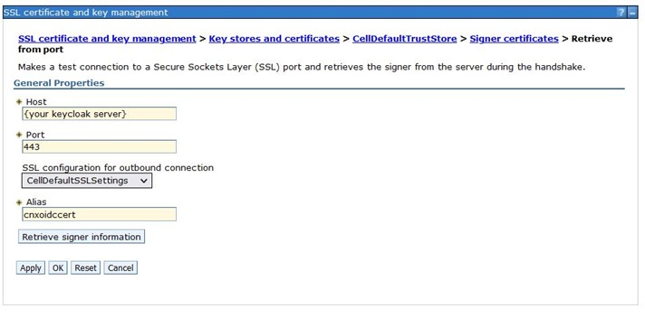

# Updating WebSphere to support Keycloak OIDC Authentication for Connections {#t_keycloak_oidc_websphere .context}

Single sign-on is accomplished by setting up a trust relationship between the Connections server and Keycloak using the WebSphere OpenID Connect Relying Party Trust Association Interceptor (OIDC Relying Party TAI). This requires that the WebSphereOIDCRP application is installed on each cluster and configuration of the TAI.

## Before you begin

Complete the steps in [Configuring KeyCloak as an OIDC provider for Connections](t_keycloak_config_conn_oidc.md), which results will provide the values that you will need in the steps of the following procedure.

## Procedure

1.  For every cluster, deploy WebSphereOIDCRP. To install the WebSphereOIDCRP application follow the instructions in the WebSphere documentation [Configuring an OpenID Connect Relying Party](https://www.ibm.com/docs/en/was-nd/8.5.5?topic=users-configuring-openid-connect-relying-party) and follow *Step 1* in *“Install the OpenID Connect application“* . 
In this example, the Connections applications are installed across the four clusters, AppsCluster, InfraCluster, PushCluster, and UtilCluster.

    

    !!! note 
        
        The OIDC Replying Party TAI code is shipped as part of WebSphere Application Server. It is recommended that you are running at least WebSphere 8.5.5.18 which contains all required fixes. However, if you are running an earlier version of WebSphere, you must install at least version 1.3.0 of the OIDC jar. Find the latest version from https://www.ibm.com/support/pages/node/290565. 

2.  Apply a unique context root to each of the clusters. For example, for the Apps cluster, go to **Enterprise Applications** \> **WebSphereOIDCRP\_AppsCluster.ear** \> **Context Root For Web Modules**.

    

3.  Apply clusters to each module. For example, for the Apps cluster, go to **Enterprise Applications** \> **WebSphereOIDCRP\_AppsCluster.ear** \> **Manage Modules**

    

4.  Configure Global Security Custom Properties by clicking **Security** \> **Global security** \> **Custom Properties** and setting these properties to the following values:

    |Property|Value|
    |--------|-----|
    |com.ibm.websphere.security.disableGetTokenFromMBean **Note:** If this property doesn't exist, add it.     |false|
    |com.ibm.websphere.security.DeferTAItoSSO | com.ibm.ws.security.oidc.client.RelyingParty|
    

5. Since we are using Keycloak clients for authentication disable the **com.ibm.ws.security.oauth20.tai.OAuthTAI**  filter. 
As the WebSphere administrator, in the administrative console, go to **Security** \> **Global security** \> **Web and SIP security** \> **Trust association** > **Interceptors**. Select *com.ibm.ws.security.oauth20.tai.OAuthTAI* and set the **provider_1.filter name** to some dummy value to disable intercepting requests. 

6. Add the **OIDC Relying Party TAI**. As the WebSphere administrator, in the administrative console, go to **Security** > **Global security** > **Web and SIP security** > **Trust association.** 

7. Click on **Interceptors** \> **New to add an interceptor**.

8. For the interceptor class name, enter *com.ibm.ws.security.oidc.client.RelyingParty*.

9.  Add the following properties and values.

    !!! note 
        
        Use the values for {client_id}, {client_secret}, and {realm} are the values from the previous procedure.

    |Property|Value|
    |--------|-----|
    |provider_1.identifier|keycloak|
    |provider_1.clientId|{client_id} Find this value in Keycloak realm configuration|
    |provider_1.clientSecret|{client_secret} Find this value in Keycloak client configuration|
    |provider_1.signatureAlgorithm|RS256|
    |provider_1.scope|openid profile email|
    |provider_1.interceptedPathFilter|/activities/.\*,/blogs/.\*,/dogear/.\*,/files/.\*,/forums/.\*,/metrics/.\*,/metricssc/\*,/mobile/.\*,/connections/filesync/.\*,/connections/filediff/.\*,/mobileAdmin/.\*,/storageproxy/.\*,/wikis/.\*|
    |provider_1.excludedPathFilter|/activities/service/downloadExtended/.\*,/survey/.\*,/surveys/.*,/ibm/console,/ibm/console/.\*,/profiles/dsx/.*,/communities/dsx/.\*,/dm,/dm/atom/seedlist,/dm/atom/communities/feed,/activities/service/atom2/forms/communityEvent,/communities/recomm/handleEvent,/communities/calendar/handleEvent,/profiles/seedlist/myserver,/activities/service/atom2/forms/communityEvent,/news/web/statusUpdateEE.\*,/dogear/seedlist/myserver,/news/seedlist/myserver,/communities/calendar/seedlist/myserver,/activities/service/downloadExtended/.*,/survey/.\*,/surveys/.\*,/ibm/console,/ibm/console/.\*,/profiles/dsx/.\*,/communities/dsx/.\*,/dm,/dm/atom/seedlist,/dm/atom/communities/feed,/activities/service/atom2/forms/communityEvent,/communities/recomm/handleEvent,/communities/calendar/handleEvent,/profiles/seedlist/myserver,/activities/service/atom2/forms/communityEvent,/news/web/statusUpdateEE.*,/dogear/seedlist/myserver,/news/seedlist/myserver,/communities/calendar/seedlist/myserver,/mobile/homepage/SecurityConfiguration,/connections/resources/web/.\*,/connections/resources/ic/.\*,/connections/opensocial/rpc,/xcc/js/.\*,/xcc/templates/.\*,/files/static/.\*,/blogs/static/.\*,/wikis/static/.\*,/communities/calendar/Calendar.xml,/homepage/web/itemSetPersistence.action/repos|
    |provider_1.authorizeEndpointUrl|https://{keycloak_server}/auth/realms/{realm}/protocol/openid-connect/auth|
    |provider_1.tokenEndpointUrl|https://{keycloak_server}/auth/realms/{realm}/protocol/openid-connect/token|
    |provider_1.jwkEndpointUrl|https://{keycloak_server}/auth/realms/{realm}/protocol/openid-connect/certss|
    |provider_1.signVerifyAlias|cnxoidccert|
    |provider_1.issuerIdentifier|https://{keycloak_server}/auth/realms/{realm}|
    |provider_1.userIdentifier|email|
    |provider_1.useJwtFromRequest|ifPresent|
    |provider_1.createSession|true|
    |provider_1.verifyIssuerInIat|true|
    |provider_1.audiences|ALL_AUDIENCES|
    |provider_1.setLtpaCookie|true|
    |provider_1.callbackServletContext|/oidcclient_apps|
    |provider_2.identifier|keycloak|
    |provider_2.clientId|{client_id} Find this value in Keycloak realm configuration|
    |provider_2.clientSecret|{client_secret} Find this value in Keycloak client configuration|
    |provider_2.signatureAlgorithm|RS256|
    |provider_2.scope|openid profile email|
    |provider_2.interceptedPathFilter|/connections/bookmarklet/.\*,/connections/oauth/.\*,/connections/resources/.\*,/connections/config/.\*,/communities/.\*,/connections/proxy/.\*,/help/.\*,/xcc/.\*,/selfservice/.\*,/news/.\*,/profiles/.\*,/search/.\*,/socialsidebar/.\*,/touchpoint/.\*,/connections/thumbnail/.\*,/connections/opengraph/.\*,/oauth2/.\*,/connections/opensocial/.\*|
    |provider_2.excludedPathFilter|/activities/service/downloadExtended/.\*,/survey/.\*,/surveys/.\*,/ibm/console,/ibm/console/.\*,/profiles/dsx/.\*,/communities/dsx/.\*,/dm,/dm/atom/seedlist,/dm/atom/communities/feed,/activities/service/atom2/forms/communityEvent,/communities/recomm/handleEvent,/communities/calendar/handleEvent,/profiles/seedlist/myserver,/activities/service/atom2/forms/communityEvent,/news/web/statusUpdateEE.\*,/dogear/seedlist/myserver,/news/seedlist/myserver,/communities/calendar/seedlist/myserver,/activities/service/downloadExtended/.\*,/survey/.\*,/surveys/.\*,/ibm/console,/ibm/console/.\*,/profiles/dsx/.\*,/communities/dsx/.\*,/dm,/dm/atom/seedlist,/dm/atom/communities/feed,/activities/service/atom2/forms/communityEvent,/communities/recomm/handleEvent,/communities/calendar/handleEvent,/profiles/seedlist/myserver,/activities/service/atom2/forms/communityEvent,/news/web/statusUpdateEE.\*,/dogear/seedlist/myserver,/news/seedlist/myserver,/communities/calendar/seedlist/myserver,/mobile/homepage/SecurityConfiguration,/connections/resources/web/.\*, /connections/resources/ic/.* ,/connections/opensocial/rpc,/xcc/js/.* ,/xcc/templates/.* ,/files/static/.* ,/blogs/static/.* ,/wikis/static/.* ,/communities/calendar/Calendar.xml,/homepage/web/itemSetPersistence.action/repos|
    |provider_2.authorizeEndpointUrl| https://{keycloak_server}/auth/realms/{realm}/protocol/openid-connect/auth|
    |provider_2.tokenEndpointUrl|https://{keycloak_server}/auth/realms/{realm}/protocol/openid-connect/token|
    |provider_2.jwkEndpointUrl|https://{keycloak_server}/auth/realms/{realm}/protocol/openid-connect/certs|
    |provider_2.signVerifyAlias|cnxoidccert|
    |provider_2.issuerIdentifier|https://{keycloak_server}/auth/realms/{realm}|
    |provider_2.userIdentifier|email|
    |provider_2.useJwtFromRequest|ifPresent|
    |provider_2.createSession|true|
    |provider_2.verifyIssuerInIat|true|
    |provider_2.audiences|ALL_AUDIENCES|
    |provider_2.setLtpaCookie|true|
    |provider_2.callbackServletContext|/oidcclient_infra|
    |provider_3.identifier|keycloak|
    |provider_3.clientId|{client_id} Find this value in Keycloak realm configuration|
    |provider_3.clientSecret|{client_secret} Find this value in Keycloak client configuration|
    |provider_3.signatureAlgorithm| RS256|
    |provider_3.scope|openid profile email|
    |provider_3.interceptedPathFilter|/push/.\*|
    |provider_3.excludedPathFilter|/activities/service/downloadExtended/.\*,/survey/.\*,/surveys/.\*,/ibm/console,/ibm/console/.\*,/profiles/dsx/.\*,/communities/dsx/.\*,/dm,/dm/atom/seedlist,/dm/atom/communities/feed,/activities/service/atom2/forms/communityEvent,/communities/recomm/handleEvent,/communities/calendar/handleEvent,/profiles/seedlist/myserver,/activities/service/atom2/forms/communityEvent,/news/web/statusUpdateEE.\*,/dogear/seedlist/myserver,/news/seedlist/myserver,/communities/calendar/seedlist/myserver,/activities/service/downloadExtended/.\*,/survey/.\*,/surveys/.\*,/ibm/console,/ibm/console/.\*,/profiles/dsx/.\*,/communities/dsx/.\*,/dm,/dm/atom/seedlist,/dm/atom/communities/feed,/activities/service/atom2/forms/communityEvent,/communities/recomm/handleEvent,/communities/calendar/handleEvent,/profiles/seedlist/myserver,/activities/service/atom2/forms/communityEvent,/news/web/statusUpdateEE.\*,/dogear/seedlist/myserver,/news/seedlist/myserver,/communities/calendar/seedlist/myserver,/mobile/homepage/SecurityConfiguration,/connections/resources/web/.\*,/connections/resources/ic/.\*,/connections/opensocial/rpc,/xcc/js/.\*,/xcc/templates/.\*,/files/static/.\*,/blogs/static/.\*,/wikis/static/.\*,/communities/calendar/Calendar.xml,/homepage/web/itemSetPersistence.action/repos|
    |provider_3.authorizeEndpointUrl|https://{keycloak_server}/auth/realms/{realm}/protocol/openid-connect/auth|
    |provider_3.tokenEndpointUrl|https://{keycloak_server}/auth/realms/{realm}/protocol/openid-connect/tokenn|
    |provider_3.jwkEndpointUrl|https://{keycloak_server}/auth/realms/{realm}/protocol/openid-connect/certs|
    |provider_3.signVerifyAlias|cnxoidccert|
    |provider_3.issuerIdentifier|https://{keycloak_server}/auth/realms/{realm}|
    |provider_3.userIdentifier|email|
    |provider_3.useJwtFromRequest|ifPresent|
    |provider_3.createSession|true|
    |provider_3.verifyIssuerInIat|true|
    |provider_3.audiences|ALL_AUDIENCES|
    |provider_3.setLtpaCookie|true|
    |provider_3.callbackServletContext|/oidcclient_push|
    |provider_4.identifier|keycloak|
    |provider_4.clientId|{client_id} Find this value in Keycloak realm configuration|
    |provider_4.clientSecret|{client_secret} Find this value in Keycloak client configuration|
    |provider_4.signatureAlgorithm|RS256|
    |provider_4.scope|openid profile email|
    |provider_4.interceptedPathFilter|/homepage/.\*,/moderation/.\*,/connections/rte/.\*,/connections/webeditors/.\*, /homepage/login/.\*|
    |provider_4.excludedPathFilter|/activities/service/downloadExtended/.\*,/survey/.\*,/surveys/.\* ,/ibm/console,/ibm/console/.\*,/profiles/dsx/.\*,/communities/dsx/.\*,/dm,/dm/atom/seedlist,/dm/atom/communities/feed,/activities/service/atom2/forms/communityEvent,/communities/recomm/handleEvent,/communities/calendar/handleEvent,/profiles/seedlist/myserver,/activities/service/atom2/forms/communityEvent,/news/web/statusUpdateEE.\*,/dogear/seedlist/myserver,/news/seedlist/myserver,/communities/calendar/seedlist/myserver,/activities/service/downloadExtended/.\*,/survey/.\*,/surveys/.\*,/ibm/console,/ibm/console/.\*,/profiles/dsx/.\*,/communities/dsx/.\*,/dm,/dm/atom/seedlist,/dm/atom/communities/feed,/activities/service/atom2/forms/communityEvent,/communities/recomm/handleEvent,/communities/calendar/handleEvent,/profiles/seedlist/myserver,/activities/service/atom2/forms/communityEvent,/news/web/statusUpdateEE.\* ,/dogear/seedlist/myserver,/news/seedlist/myserver,/communities/calendar/seedlist/myserver, /mobile/homepage/SecurityConfiguration,/connections/resources/web/.* ,/connections/resources/ic/.*,/connections/opensocial/rpc,/xcc/js/.* ,/xcc/templates/.* ,/files/static/.*,/blogs/static/.*,/wikis/static/.* ,/communities/calendar/Calendar.xml,/homepage/web/itemSetPersistence.action/repos|
    |provider_4.authorizeEndpointUrl|https://{keycloak_server}/auth/realms/{realm}/protocol/openid-connect/auth|
    |provider_4.tokenEndpointUrl|https://{keycloak_server}/auth/realms/{realm}/protocol/openid-connect/token|
    |provider_4.jwkEndpointUrl|https://{keycloak_server}/auth/realms/{realm}/protocol/openid-connect/certs|
    |provider_4.signVerifyAlias|cnxoidccert|
    |provider_4.issuerIdentifier|https://{keycloak_server}/auth/realms/{realm}|
    |provider_4.userIdentifier|email|
    |provider_4.useJwtFromRequest|ifPresent
    |provider_4.createSession|true|
    |provider_4.verifyIssuerInIat|true|
    |provider_4.audiences|ALL_AUDIENCES|
    |provider_4.setLtpaCookie|true|
    |provider_4.callbackServletContext|/oidcclient_util|
    |jndiCacheName|services/cache/OpenidRpCache|

10.  Configure the Keycloak realm as a trusted realm:<ol><li>Click **Security** \> **Global security** \> **RMI/IIOP security** \> **CSIv2 inbound communications** \> **Trusted authentication realms - inbound**.</li><li>In the **Realms** section, click **Add External Realm**.</li><li>For the **External realm name** field, enter the value for \{realm\}.</li><li>Click **OK**.</li></ol>

11. Create a new object cache instance with the JNDI name matching the one used in the last TAI property in the preceeding table. <ol><li>Go to **Resources** \> **cache Instances** \> **Object cache instances**\.</li><li>Set the **name** to *oidc_cache*</li><li>Set the **JNDI name** to <filepath>services/cache/OpenidRpCache</filepath></li><li>Select **Enable cache replication**</li><li>Set the **Full group replication domain** to *ConnectionsReplicationDomain*</li></ol>

    

12. Go to **Application servers** \> **cluster** \> **Container Services** \> **Dynamic cache service**, and for each cluster’s dynamic cache service make sure that cache replication is enabled and uses **ConnectionsReplicationDomain**.

    

13. Configure the trusted realm:

    1.  Click **Security** \> **Global security** > **RMI/IIOP security** > **CSIv2 inbound communications** > **Trusted authentication realms – inbound**.

    2.  Click on **Add External Realm**.

    3.  In the **External realm name** field, enter the value for `provider_1.issuerIdentifier` from the Interceptor.

    4.  Click **OK**.
    
    

14. Add the root signing certificate of the Microsoft Certificate endpoint to the default trust store:

    1.  Go to **Security** \> **SSL certificate and key management** > **Key stores and certificates**.

    2.  Select **CellDefaultTrustStore** and click on **Signer certificates**.

    4.  Click **Retrieve from port**.

    5.  For the **Host** field, enter {your keycloak server}.

    6.  For the **Port** field, enter **443**.

    7.  For the **Alias** field, enter `cnxoidccert`. \(You used this name as a value for `property provider_1.signVerifyAlias`. \)

    8.  Click **Retrieve signer information**.

    9.  Click **OK** and save the changes.  
    
    

15. Change security role for user/group for applications:

    1.  Click **Applications** \> **Application types** \> **Enterprise Applications** \> **Application name** \> **Security role to user/group mapping**.

    2.  For each resource, change the permission for all roles that have *"All Authenticated in Application's Realm"* to *"All Authenticated in Trusted Realm."*

16. Synchronize all nodes.

17. Restart the WebSphere server (Restart all Clusters) .

**Parent topic:** [Enabling Keycloak as an OIDC provider for Connections](../secure/c_keycloak_oidc.md)

