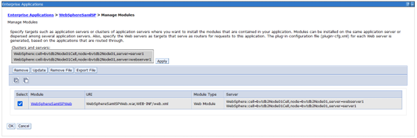
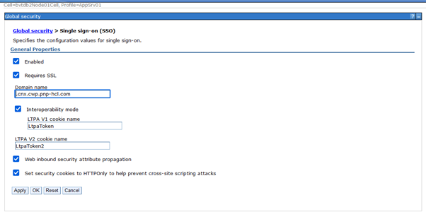

# Updating WebSphere to support Keycloak SAML Authentication for Connections

To accomplish SSO using WebSphere® Application Server as a service provider partner to identity providers (IdPs - In our case it is Keycloak), you must establish partnerships between the WebSphere Application Server SAML service provider and external SAML identity provider i.e. keycloak.

## Before you begin


## Procedure

1. **Install the SAML ACS Application**

    Choose one of the following approaches:

    - Install the SAML ACS application by using the python script:

        ```bash
        cd /opt/IBM/WebSphere/AppServer/bin
        ./wsadmin.sh -f installSamlACS.py install bvtdb2Node01 server
        ```

    - Using the Administrative WAS Console

        -- Navigate to:  
        `Applications > Application type > Websphere Enterprise applications`

        -- Select **Install**

        
            
        -- Select **Remote file system** and choose the following EAR file:  
        `/opt/IBM/WebSphere/AppServer/installableApps/WebSphereSamlSP.ear`

        -- Click **Next** on each screen and **Save** on the last screen

2.  **Apply Target Servers**

    `Enterprise Applications > WebSphereSamlSP > Manage Modules`
        
    

3. **Configure Single Sign-On Settings**

    Navigate to:  
    `Global security > Single sign-on (SSO)`
        

    

4. **Add TAI Properties for ACSTrustAssociationInterceptor**

    Navigate to:  
    `Global security > Trust association > Interceptors > com.ibm.ws.security.web.saml.ACSTrustAssociationInterceptor`

    | Property | Value |
    |----------|-------|
    | sso_1.sp.acsUrl | https://your_application_url/samlsps/kcacs |
    | sso_1.sp.filter | request-url^=/homepage\|/login\|/service/authredirect.jsp;request-url!=forceLogin;request-url!=/login_redirect |
    | sso_1.sp.idMap | localRealm |
    | sso_1.sp.trustAnySigner | true |
    | sso_1.sp.charEncoding | UTF-8 |
    | sso_1.sp.disableDecodedURL | true |
    | sso_1.sp.enforceTaiCookie | false |
    | sso_1.sp.principalName | NameID |
    | sso_1.idp_1.SignleSignOnUrl | Copy "Target IDP initiated SSO URL" from keycloak client property "IDP Initiated SSO URL Name" |
    | sso_1.idp_1.EntityID | https://{keycloak_server}/auth/realms/{realm} |
    | sso_1.idp_1.certAlias | kcsamlcert |
    | sso_1.sp.login.error.page | Same as value of sso_1.idp_1.SignleSignOnUrl |
    | sso_1.sp.trustStore | NodeDefualtTrustStore |
    | sso_1.sp.targetUrl | https://{your_application_url/homepage/web/login_redirect?redirectUrl=/homepage |
    | sso_1.sp.useRelayStateForTarget | true |
    | sso_1.sp.useRealm | WAS_DEFAULT |
    | sso_1.sp.includeCacheKey | false |
    | sso_1.sp.includeToken | true |
    | sso_1.sp.preserveRequestState | true |
    | sso_1.EntityID | https://your_application_url/samlsps/kcacs |
        
    ---

5. **Configure Global Security Custom Properties**

    Navigate to:  
    `Global security > Custom properties`
    
    Set/update the following(highlighted) properties with respected values.
    
    !!! note 
        
        If any of the properties doesn't exist, add it.

    
    

    ---

6. **Configure Signer Certificate**

    Import IDP metadata file (Refer to last step in [Keycloal configuration](../secure/t_keycloak_config_conn_saml.md))

    ```bash
    cd /opt/IBM/WebSphere/AppServer/bin/
    ./wsadmin.sh -lang jython -username username -password password
    AdminTask.importSAMLIdpMetadata('-idpMetadataFileName Path_to_metadata.xml -idpId 1 -ssoId 1 -signingCertAlias kcsamlcert')
    AdminConfig.save()
    ```

     Navigate to below path to check if certificate has been imported successfully:  
    **Global security** > **SSL certificate and key management** > **Key stores and certificates** > **NodeDefaultTrustStore** > **Signer Certificates**

    

    

7. **Add Trusted Realms**

    Navigate to:  
    **Global security** > **Federated repositories** > **Trusted authentication realms – inbound**

    1.  Click **Security** \> **Global security** > **RMI/IIOP security** > **CSIv2 inbound communications** > **Trusted authentication realms – inbound**.

    2.  Click on **Add External Realm**.

    3.  In the **External realm name** field, enter the value for realmName and realm URL from keycloak.

    4.  Click **OK**.

       

    ---

