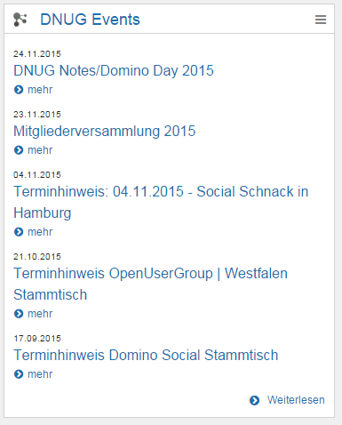

# Clipping 

This widget allows you to display content from other sites. For example, you can include the news section from an external website. To configure this widget, HTML, jQuery and CSS skills are useful.

**Important:** Be sure that you configured the AJAX-Proxy. For more information, see [HCL Connections proxy configuration](https://help.hcltechsw.com/connections/v7/connectors/icec/cec-inst-ibm-conx-proxy-config.html) in the Connections Engagement Center Installation Instructions.

**Important:** Be sure to configure the Clipping widget to work with the Connections Cloud approved proxies.

## Content source { .section}

The content from another website will be displayed.

## Expected format { .section}

The Clipping widget displays the selected HTML from the source URL in Connections Engagement Center/Connections standard formatting. For customized appearance you can add custom CSS. Multiple selectors are displayed in the defined order. Please make sure not to enter a forwarding URL but the targeted URL instead.

## Configuration options for Admin/Page Editor { .section}

URL \(content source\)

Apply Custom CSS, which can be pasted or edited in the widget editor

Selector Type: Use cropmarks or a jQuery/CSS selector to specify the displayed content. For more information, see the [jQuery website](http://jquery.com/).

