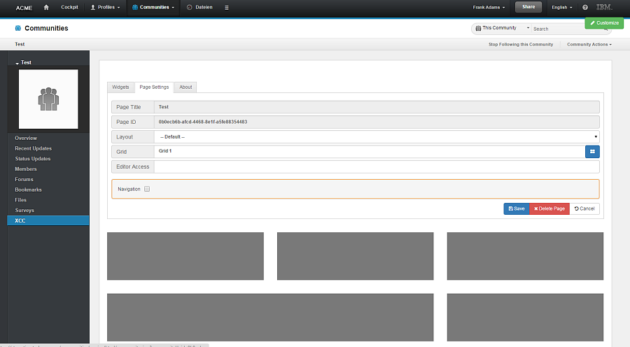

# Adding the Engagement Center widget to a Community {#id_name .reference}

Organization administrators must first add the Connections Engagement Center extension for Communities to their organization. The extension makes the Connections Engagement Center widget available so that Community owners can add it to a Community. Community owners can add the Connections Engagement Center widget to a Community in the same way they would add any other widget or app by using the **Community Actions** menu.

## Adding the Connections Engagement Center extension for Communities to your cloud organization { .section}

Before your users can add the Community Engagement Center widget to a Community, you must first add the extension:

1.  Log in to HCL Connections Cloud with an organization administrator account.
2.  In the navigation click on **Admin \> Manage Organization**.
3.  In the left navigation click **Organization Extensions**.
4.  You should now see the registered Apps for your organization. Click **Add**.
5.  Select **Manually install an extension**.
6.  For **Service**, select **Communities**.
7.  For **Extension Point**, leave **Community App**.
8.  Type the app **Name** and the**Description**.
9.  Provide an **Icon URL** and the**URL** of your Connections Engagement Center domain. The URL should look like this:

    ```
    https://apps.<yourLocale>.collabserv.com/xcc/communityCloud
    ```

10. Add the following to the **Properties**:

    ```
    {
        "defId": "Connections Engagement Center",
        "themes": "wpthemeThin wpthemeNarrow wpthemeWide wpthemeBanner",
        "modes": "view fullpage",
        "primaryWidget": "true",
        "showInPalette": "true",
        "iconUrl": "https://sampleconnectionswidget.mybluemix.net/icon.png",
        "itemSet": [
            {
                "name": "width",
                "value": "100%"
            },
            {
                "name": "url",
                "value": "https://apps.<yourLocale>.collabserv.com/xcc/communityCloud"
            },
            {
                "name": "height",
                "value": "1000px"
            }
        ],
        "uniqueInstance": "true",
        "url": "/connections/resources/web/com.ibm.social.urliWidget.web.resources/widget/urlWidget.xml"
    }
    ```

    **Note:**

    -   Make sure to replace <yourLocale\> with your cloud domain. For example, `apps.na.collabserv.com`.
    -   Do not change the value of `defId` as shown above. The value of `defId` must be `"Connections Engagement Center"` to ensure that the Connections Mobile app displays the Connections Engagement Center widget within the Connections Mobile app on iOS and Android devices. If community owners wish to change the name of the widget itself, that action should be done when the widget is added to the Connections Community.
11. Save the configuration.

The Connections Engagement Center widget should be available in Communities after a maximum of 15 minutes.

Community owners can add the Connections Engagement Center widget to a Community in the same way they would add any other widget or app by using the **Community Actions** menu.

To remove the Connections Engagement Center page, click **Delete Page** in the **Page Settings** tab in the Admin panel.



You can administer the Connections Engagement Center as Page Editor if you are a Community owner, Connections administrator, or a Page Editor of this Connections Engagement Center page.

You will not leave the Community if the Connections Engagement Center navigation is linking to other Connections Engagement Center pages. If you click on such a link, the Connections Engagement Center page will directly render in this community. With the browser next and back button you can navigate through the Connections Engagement Center pages. Also, you can send this link to colleagues, and they will see the same Connections Engagement Center page.

**Parent topic:**[Overview](../../connectors/icec/cec-introduction_top.md)

