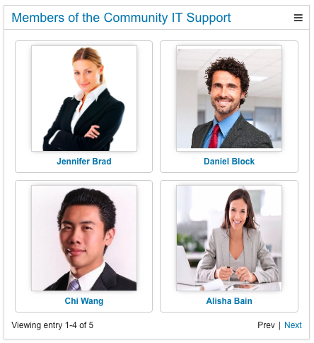

# Community Members {#concept_zn2_txh_qcb .concept}

The Community Members widget shows members and owners of a specified community in a tiles grid.

If a tile is clicked, the HCL Connections profile of the member or owner will be opened in a new browser tab. If a tile is hovered, a tag icon will appear in the top right corner of the tile. If the tag icon is clicked, you can see whether that is person is a member or owner of the specified community.

A page size can be set to define the amount of displayed community members per page in the pagination.

