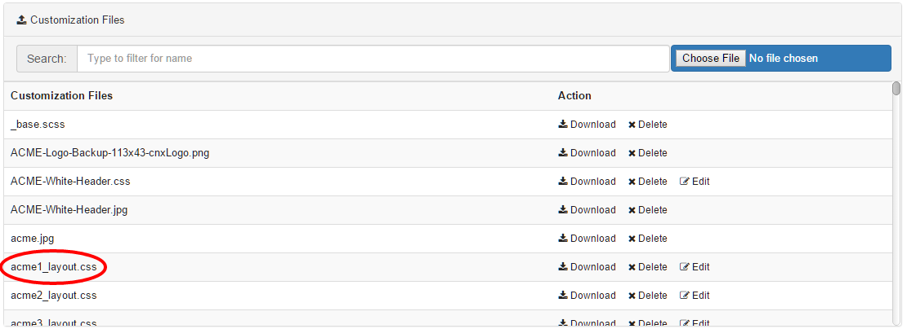

# Custom CSS and images {#concept_zqw_rzt_5bb .concept}

You can customize the appearance of nearly every visible element of your Connections Engagement Center. Include your own CSS or create a custom CSS file. Upload a stylesheet to the **Connections Engagement Center-Settings** tab. This topic describes how to apply custom CSS to UI elements and includes sample CSS.

## Include custom CSS and images { .section}

Make sure that you do not use an existing file name, because the uploaded file overwrites older versions without further inquiry. Images \(e.g. \*.jpg, \*.png\) requested by your CSS can be uploaded through the same upload form.

After uploading your CSS, you can select the uploaded stylesheet file for the current page in the **Page Settings** tab under the **Layout** selector. To edit multiple pages you can go to the **Page-Management** tab and edit a page. Click on the wrench icon and it will open a dialog, allowing you to specify a CSS for each page.



## Create custom CSS { .section}

The instruction given in this documentation demands basic CSS knowledge. A free CSS online-guide can be found on [http://www.w3schools.com/css/](http://www.w3schools.com/css/).

You can customize the appearance of nearly every visible element of your Connections Engagement Center. CSS language depends on order and specificity. To detect which selector you have to use to change an attribute \(color, size, etc.\) we recommend you to use either the Developer-Tools of Google Chrome \([https://developer.chrome.com/devtools](https://developers.google.com/web/tools/chrome-devtools)\) or the Developer-Toolbar of Mozilla Firefox \([https://developer.mozilla.org/docs/Tools](https://developer.mozilla.org/docs/Tools)\).

Your customized CSS is loaded last. This way using the same selector as the one that is applied should change the appearance of the element. If not, and even an increased specificity does not result in the desired behavior the *important*-keyword will grant you access to the attribute.

Uploaded images are located in the same folder as the CSS. No path has to be specified.

## CSS for all pages { .section}

If you are using one Connections Engagement Center page only or want all Connections Engagement Center pages to behave and appear in the same way, it is recommended to use CSS selectors starting with the *.xccstyle* body-class.

Example of a red background:

```
.xccstyle {
	background-color: #f00;
}

```

## CSS by page-id { .section}

Through the *.\{page-id\}* body-class you can set styles that exclusively apply to the Connections Engagement Center page having the page-id. This way you can avoid uploading CSS files for each Connections Engagement Center page you want to appear different from the standard.

Example of green background exclusively for *my-special-page*:

```
.my-special-page {
	background-color: #0f0;
}


```

## CSS by grid layout { .section}

If you want your pages to behave differently depending on what grid layout is selected, we recommend that you select by *.Layout\{\#\}* body-class in your CSS.

Example of blue background for all pages in grid-layout 17:

```
.Layout17 {
	background-color: #00f;
}

```

## CSS for widgets { .section}

```
<div class="widget" position="{grid-positon}">
	<div class="xccWidget" data-wtype="{widget-type}">
		<div class="wheader">
			<div class="wtitle">
				<!-- Title here --!>
			</div>
		</div>
		<div class="wbody">
			<div class="{widget-type}">
				<!-- Content here --!>
			</div>
		</div>
	</div>
</div>

```

Customizing the widgets in general is possible through several classes. Connections Engagement Center widgets have a standard structure. Use CSS selectors similar to *.xccstyle .xccwidget .wheader .wtitle* if you want to customize the overall-appearance of your widgets.

-   **Type-specific**: It is possible to apply styles to specific widget types \(for example, Top-News-widget\). We recommend you to use a attribute selector on the *data-wtype*-attribute, because it allows you to customize the header/title and body of the widget, while *.\{widget-type\}* class is limited to the body. For example, here's code for a red font for the title of all Top-News widgets:

    ```
    .xccstyle .xccWidget[data-wtype=“xccTopNews“] .wheader .wtitle {
    	color: #f00;
    }
    
    ```

-   **Position-specific**: By referring to the *position* attribute, you can style widgets placed on a specific grid position. The top-left grid position is always *position="0".* For example, here's code for red font for the title of the widget on grid position 0:

    ```
    .xccstyle [position="0"] .xccWidget .wheader .wtitle {
    	color: #f00;
    }
    
    ```


**Parent topic:**[Admin panel](../../connectors/icec/cec-admin_panel.md)

