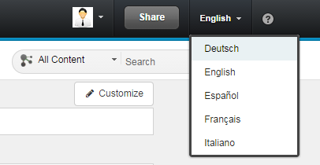

# Customize the language file {#Customiz .reference}

You can create a new language file, by downloading the template file and editing a copy of it or by using the Direct Edit button.

**The name of the language file needs to consist of the prefix "xcc-" and the abbreviation of the language it is intended for. You can find the language files in the ?Connections Engagement Center-Settings? tab of the admin panel. Here you can download and upload the language files. The file contents need to be of type JSON. This JSON format basically consists of key value pairs that define the String to be used in the language the file defines. If you omit a key-value-pair, the string denominated by that key will appear in its English default. If a language file for a chosen language is not available, the Messages used within Connections Engagement Center will remain in its English defaults. Messages presented exclusively to Page Editors or Admins will always be English.

You can switch the language in the IBM-Connections header. After uploading your edited language file, the changes take immediate effect, so reloading the page or changing your language to the just uploaded one will bring up the settings you have just uploaded.

You are able to rename each grid \`template\` with the language file. Therefore you have to use the label **grid\_name\_X**. X represents the ID of the grid layout.

## Update language files { .section}

If you want to reinitialize the language files, maybe because they are not up-to-date, you should to the following steps.

1.  Backup your language files by downloading them from the UI
2.  Delete the language files
3.  Go to the Admin Dashboard into the "Language Files" page and press the reInit button
4.  Download the updated language-files
5.  Compare if you did changes in the backup language files and move them to the updated language files

**Parent topic:**[Admin panel](../../connectors/icec/cec-admin_panel.md)

