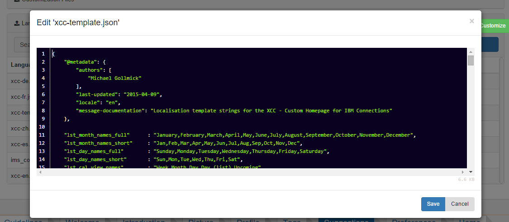

# Edit css, js, and json files {#id_name .reference}

The Direct Edit option allows you to edit stylesheets, Javascript, and language files without having to download the files, edit them, and upload the files again.

Direct Edit opens the **Code-Mirror Editor**, which features syntax highlighting.

**Parent topic:**[Admin panel](../../connectors/icec/cec-admin_panel.md)

