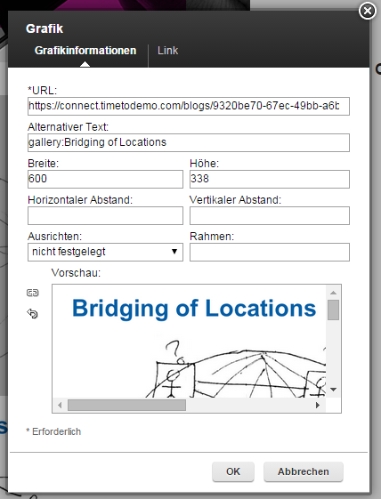

# Embedded experience {#id_name .reference}

The following widgets have an embedded experience:

-   Event
-   Ideation Blog
-   Forum
-   News
-   News Channel
-   News List
-   News Overview
-   News Slider
-   Navigation
-   Top News

If you want to have an image carousel in the embedded experience, you have to edit the alt-attribute for all of these images in the blog entry. The name of the alt-attribute should be **gallery**. Also, you can specify the title of the picture. Therefore, enter the title after **gallery**, separated by a space or colon. If you click on the images in the slider they will open in a lightbox.

In the Embedded Experience you can also like comments from blog entries, ideas or topics.

If you have a moderated Blog or another moderated community application, the Embedded Experience can post comments, but will not show comments, that are not approved. If you post a comment on a moderated community, it will display an information that the comment was sent to the moderator.

If comments are forbidden for a blog or another community application, the Embedded Experience will not show a text area to comment. If the blog or the community application has no comments and it is not allowed to comment, there will be no comment area in the Embedded Experience.

The Embedded Experience can be printed. Therefore you will find a small print icon on the right corner of the header, next to the close icon. If you want to customize the design of the printed content, you can upload a **print.css** file to the Connections Engagement Center Customization Files.

You can close the Embedded Experience alternatively by a double right-click into the Embedded Experience, or simply click outside of the Embedded Experience.

**Parent topic:**[Overview](../../connectors/icec/cec-introduction_top.md)

