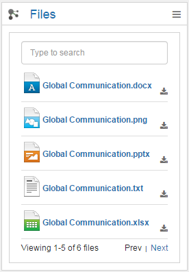
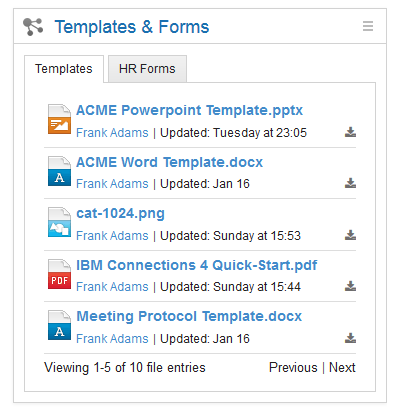

# Files List {#id_name .reference}

This widget shows uploaded files with information about the author and the uploaded date. The Files List widget can be downloaded with a single click. Each file type is represented by its own icon. If more than five files are in the selected Community, a page navigation appears on the bottom of the widget. A maximum of 100 files are displayed.

You can also select files from the community and display them in the order you want to have. Select a folder and all files of the selected folder will be shown.

Sort the files by name, updated, likes, comments, shared and downloads. If you don't want to show the uploader and date, simply deactivate the **Show details** checkbox in the edit area of this widget. Also you can have a search in the widget, to search for a specific file. This is helpful, if you are showing lots of files with or without paging.

By adding more channels, you are able to use more than one community as a content source. This offers you the option to categorize downloads, reachable by switching the tabs of the displayed widget.

You can get the Community-Title as Channel name by entering **%sourceName%** into the Channel name.

## Expected format { .section}

All uploaded files of a Community.

## Configuration options for Admin/Page Editor { .section}

Personalization

Channel name

Sort by

Number of Items

Number of Items per Page

Enable Search

Show details

**Other:**

If too many tabs are created regarding to the width of the widget, an arrow navigation appears as help. If you have only one Channel no tab will be displayed.

