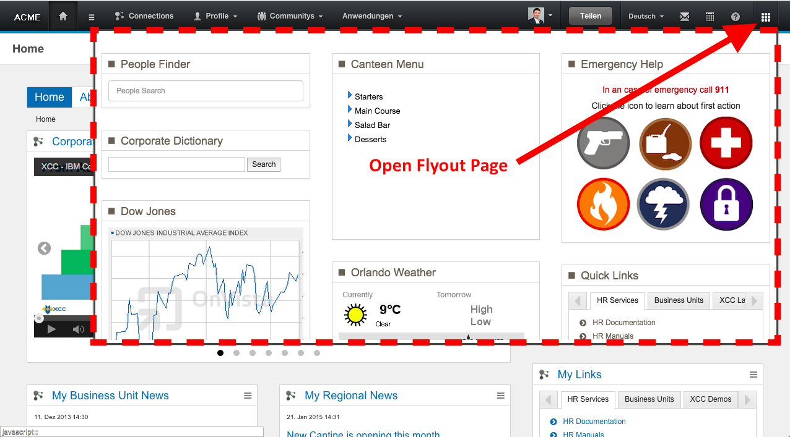

# FlyOut page {#id_name .reference}

The Connections Engagement Center FlyOut Page is managed by the admin or Page Editor. The FlyOut Page may contain any of the over 30 Connections Engagement Center widgets and is available anywhere in Connections. You only need to move your mouse over this icon.

The FlyOut Page can be easily set up: The FlyOut Page is a regular Connections Engagement Center Page and has the same customization and grid options. You only have to select it within the Connections Engagement Center Settings in the Admin panel.

**Note:** The FlyOut Page is not available in Cloud, Mobile or Anonymous Mode.

**Parent topic:**[Overview](../../connectors/icec/cec-introduction_top.md)

