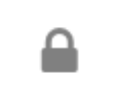
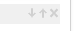

# Functions - fields - buttons {#id_name .reference}

There are different fields and buttons available in the configuration options.

The following chart describes the editing functions:

|Reading mode|Action|
|------------|------|
||Opens options for editing. By holding the Shift key and clicking, you can remove this widget. Hold Ctrl+Shift and click to remove all widgets.

|
||Locks the widget for editing by Page Editors. Only Admins of the Page will be able to drag and drop and edit this widget. The lock icon will indicate if the widget is locked or open.

|
|widget Title

|If the widget contains a title in the header, it can be changed here. If you enter **%sourceName%**, the Community-Title will be displayed if possible. If you enter no title, the widget header will be hidden.

|
|Height

|Height of the widget: if the height of a widget is chosen too low, content might be cut off or hidden.

|
|Add Content Stream

|Adding of a channel

|
|Personalize

|Activation of personalization

|
||Will show the widget editor in Fullscreen

|
|Style

|Choose List or Slider

|
|Attribute

|Technical name of the profile field, which is used in order to differentiate \(e.g. work\_location\)

|
|Value

|Value, which is expected in the profile field \(e.g. Munich\)

|
|Source

|Channel, for which the predefined value is supposed to be shown \(e.g. Munich cafeteria blog\)

|
|Show Likes and Comments

|Enable display of likes and comment next to the entries

|
|Layout

|Select default view for the events widget: Month, Week, Day, Day \(List\)

|
|Type

|Content source

|
|Channel Name

|Title of the channel

|
||Move Channel up, down or remove this Channel

|
|Source

|Selection of the source with a small icon to link to the selected community or Standalone Blog

|
|Show posts

|Latest: Entries of the channel are shown in chronological order. Selected: Individual entries of the channel can be selected and sorted.

|
|Search Latest Additions

|The default Connections Engagement Center search for posts or wikis uses the Connections Search API. Too found new posts or wikis, this API needs up to 15 minutes. If you want to find Additions, that are created only a few minutes ago, please click on **Search latest Additions** and try to find them again.

|
|\# Items

|Items to be shown in the widget

|
|\# per Page

|Items to be shown per Page in the widget

|
|Remove widget

|Hold Ctrl+Shift and click **Remove widget** to remove all widgets from the page.

|
|Save widget

|Save the widget-Configuration. You can also press Ctrl+S.

|
|Customize

|Open Connections Engagement Center administration

 

|

**Parent topic:**[Overview](../../connectors/icec/cec-introduction_top.md)

