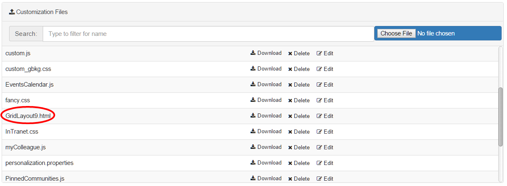

# Grid and layout {#AdminPanel .reference}

The Custom Homepage can either be displayed above the Activity Stream and with the Connections built-in Right-Column or as separate page. You have to choose a layout for your Custom Homepage. Default is Grid 1.

You can choose between 19 different layout grids. It is possible to activate Activity Stream and Right Column separately. If activated, Right Column and Activity Stream show up at the positions pointed out by the green and blue colors in the selected layout grid.

Depending on the chosen layout grid, it is possible to implement 1- to 4-column layouts. The width of the widgets will automatically adjust to the width of its containing "placeholder".

You can add widgets by clicking on them in the widgets tab. They will be moved to the first free position in the layout grid. After that you can move them around by dragging and dropping them to the desired position. As a visual helper during that operation, a green visualization appears if you drag a widget over a valid placeholder position.

It is also possible to swap widgets. Just drag and drop one widget into a filled placeholder to exchange the position of both affected widgets. Only the positions of the Right-Column and Activity Stream are disabled for drag and drop.

## Include Custom Grids { .section}

If you want to include your own grid, you can upload an html file in the **Connections Engagement Center Settings** tab. By using the filename GridLayout1.html you exchange the built-in grid 1 structure with your own. Since there are 22 pre-built grids, you are able to create 22 custom grids, while the built-in grids are being overwritten.

You activate the custom grid for a Connections Engagement Center Page by selecting the corresponding layout in the **Page Settings** tab.

We recommend you to use a template for creating custom grids.

## Include Custom CSS and Images { .section}

If you want to include your own CSS, you can upload a stylesheet file in the **Connections Engagement Center-Settings** tab. Please make sure not to use an already existing file-name, because the upload overwrites older versions without further inquiry. Images \(e.g. \*.jpg, \*.png\) requested by your CSS can be uploaded through the same upload-form.

After uploading your CSS, you can select the uploaded stylesheet file for the current page in the **Page Settings** tab under the **Layout** selector. To edit multiple pages you can go to the **Page-Management** tab and edit a page. Click on the wrench icon and it will open a dialog, allowing you to specify a CSS for each page.

## Create Custom CSS { .section}

The instruction given in this documentation demands basic CSS-Knowledge. A free online-guide can be found on [http://www.w3schools.com/css/](http://www.w3schools.com/css/).

You can customize the appearance of nearly every visible element of your Connections Engagement Center. CSS-language depends on order and specificity. To detect which selector you have to use to change an attribute \(color, size, etc.\) we recommend you to use either the Developer-Tools of Google Chrome \([https://developer.chrome.com/devtools](https://developers.google.com/web/tools/chrome-devtools)\) or the Developer-Toolbar of Mozilla Firefox \([https://developer.mozilla.org/docs/Tools](https://developer.mozilla.org/docs/Tools)\).

Your customized CSS is loaded last. This way using the same selector as the one that is applied should change the appearance of the element. If not and even an increased specificity does not result in the desired behavior the *important*-keyword will grant you access to the attribute.

Uploaded images are located in the same folder as the CSS. No path has to be specified.

## CSS for all Pages { .section}

If you are using one Connections Engagement Center page only or want all Connections Engagement Center pages to behave and appear in the same way, it is recommended to use CSS selectors starting with the *.xccstyle* body-class.

Example: \(setting up a red background\)

## CSS by Page-ID { .section}

Through the *.\{page-id\}*body-class you are able to set styles, which exclusively apply to the Connections Engagement Center page having the page-id. This way you can avoid uploading CSS files for each Connections Engagement Center page you want to appear different from the standard.

Example: \(setting up a green background exclusively for *my-special-page*\)

## CSS by Grid-Layout { .section}

If you want your pages to behave different depending on what grid-layout \(see 3.1\) is selected, we recommend to select by *.Layout\{\#\}* body-class in your CSS.

Example: \(setting up a blue background for all pages in grid-layout 17\)

## CSS for widgets { .section}

Customizing the widgets in general is possible through several classes. Connections Engagement Center-widgets have a standard structure:

Use CSS selectors similar to *.xccstyle .xccwidget .wheader .wtitle* if you want to customize the overall-appearance of your widgets.

**Type-Specific**: It is possible to apply styles to specific widget-types \(e.g Top-News-widget\). We recommend you to use a attribute selector on the *data-wtype*-attribute, because it allows to customize header/title and body of the widget, while *.\{widget-type\}*-class is limited to the body. For example, setting up a red font-color for the title of all Top-News-widgets\)

**Position-Specific**: By referring to the *position*-attribute you can style widgets placed on a specific grid-position. The top-left grid-position is always *position="0".* For example, setting up a red font-color for the title of the widget on grid-position 0\)

**Parent topic:**[Admin panel](../../connectors/icec/cec-admin_panel.md)

