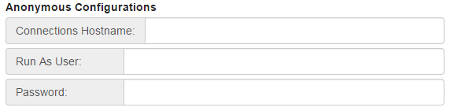

# Anonymous mode configuration {#id_name .reference}

If you want some HCL Connections™ Engagement Center pages to be accessed anonymously, configure those pages as public.

**Note:**

-   The user that is specified as the **Run As User** requires access to the content that is being made public; either that user must be a member of the communities, or the communities must be public.
-   Make sure that the **Connections Hostname** has the schema https://Your\_server/. <!--If you have changed context roots \(for example, /connections/API\_name\), then you have to use the new context root here as well. For example, https://Your\_server/connections/\).-->

Restart the Connections Engagement Center application after changing settings in **GlobalSettings** so these changes take effect.

**Parent topic:**[Mode configuration](../../connectors/icec/cec-inst-configure-modes.md)

