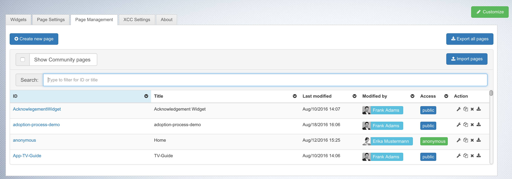

# Migrating a database {#id_name .reference}

You can migrate each supported database to another supported database. Sometimes you also want to have a new environment. For example, when you want to upgrade HCL Connections. Therefore, you don't need to work on the database, you only need to work with the user interface of Connections Engagement Center.

|Step|Instructions|
|----|------------|
|**1**

|**Connections Engagement Center pages:**

 1.  To migrate the Connections Engagement Center pages to another database, go into the Admin panel in the Connections Engagement Center Settings tab.
2.  Navigate to the **Page-Management** tab.
3.  Click **Export all pages** to export all pages as a ZIP file. The selected layouts \(CSS files\) of the pages will be exported as well.

4.  In your new environment, go to the **Page-Management** tab and click **Import pages**.
5.  When a modal dialog opens, drag and drop the ZIP file into the window. Wait while the server imports your pages to the database. After that the tab will refresh and will show all imported pages.

|
|**2**

|**Customization files:**

 1.  From the Connections Engagement Center Settings tab, open the Admin panel and find the customization files.
2.  Download each customization file manually.
3.  In the new environment, upload the customization files by dragging and dropping the files into the same place.

|

